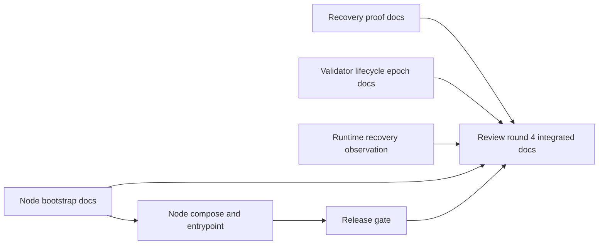

# MISAKA-CORE-v5.1 Docs

- Review docs for the current `v5.1` line live under [review-20260323](./review-20260323/README.md).
- Current share-oriented summary lives at [32_current_share_status_summary.ja.md](./review-20260323/32_current_share_status_summary.ja.md).
- `v5.1` is treated as the authoritative design line.
- Local `v4` work is reference material for stabilization patterns, not the source of truth for semantics.

## Bootstrap Paths

- Node onboarding lives in [node-bootstrap.md](./node-bootstrap.md).
- Relayer onboarding lives in the existing Docker/bootstrap notes under [scripts/relayer-bootstrap.sh](../scripts/relayer-bootstrap.sh).
- Round-3 ops notes live under [review-20260323](./review-20260323/README.md).
- Recovery and validator lifecycle round-3 notes also live under [review-20260323](./review-20260323/README.md).
- Round-4 recovery, release, and runtime observation notes also live under [review-20260323](./review-20260323/README.md).
- The strengthened `dag_release_gate.sh` now closes end to end, including the
  relayer release build. See [15_parallel_round_four_release_gate_green.md](./review-20260323/15_parallel_round_four_release_gate_green.md).

## Relayer Bootstrap

- Use [scripts/relayer.env.example](../scripts/relayer.env.example) as the starting point for local or host installs.
- Run [scripts/relayer-bootstrap.sh](../scripts/relayer-bootstrap.sh) to create a local env file and start the relayer via Docker Compose.
- The systemd unit expects `/etc/misaka/relayer.env` to provide the required RPC URLs, bridge program id, network mode, and chain id.
- The release gate referenced by `crates/misaka-node/src/main.rs` is implemented in [scripts/dag_release_gate.sh](../scripts/dag_release_gate.sh) and now includes node Compose config validation.
