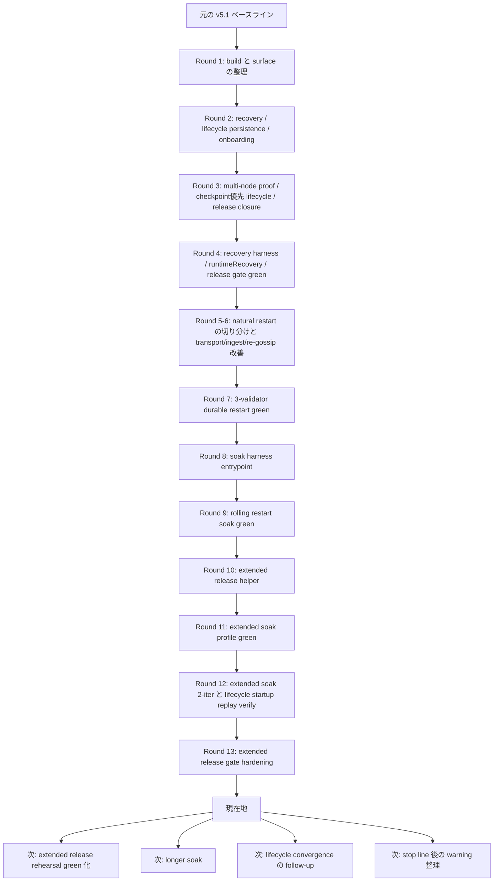
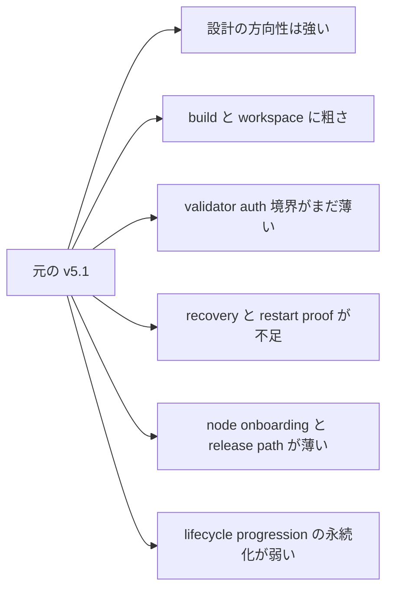
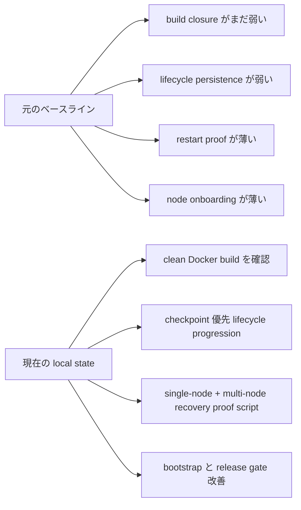
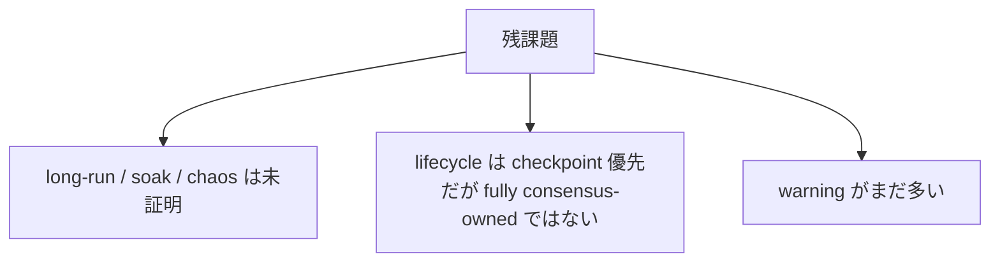

# MISAKA-CORE-v5.1 元のベースラインからの進捗と次の実行順

## 目的

この文書は、次の 2 点をできるだけ簡単に把握するためのものです。

1. 現在のローカル `v5.1` が、元の `v5.1` ベースラインからどれだけ前進したか
2. 次に何を進めようとしているか

各 round の詳細をすべて読まなくても、全体像をつかめる入口として使う想定です。

## 1ページ要約

## 元の `v5.1` ベースラインがどういう状態だったか

元の `v5.1` には、すでに**正本となる意味論**が入っていました。

- `UnifiedZKP`
- `CanonicalNullifier`
- `GhostDAG`
- validator lifecycle の方向性
- checkpoint / finality の方向性

ただし、運用に耐える状態まではまだ届いていませんでした。

## どれだけ前進したか

## Round 1

Round 1 では、主に source-level blocker と surface の不整合を整理しました。

- workspace / compile closure を改善
- validator auth 境界を明確化
- RPC / relay / transport surface を整理
- clean Docker で `misaka-node` build が green になるところまで確認

参照:
- [02_parallel_round_implementation_report.md](./02_parallel_round_implementation_report.md)

## Round 2

Round 2 では、operator readiness を前に進めました。

- recovery をより fail-closed に寄せた
- lifecycle state を disk に保存するようにした
- node Docker / Compose onboarding path を追加した

参照:
- [05_parallel_round_two_implementation_report.md](./05_parallel_round_two_implementation_report.md)

## Round 3

Round 3 では、`v5.1` の意味を変えずに運用面の残りを詰めました。

- restart proof を single-node と multi-node に分離
- validator lifecycle progression を wall-clock only から前進
- node bootstrap と release gate を operator 向けに強化
- lifecycle snapshot persistence を JSON-safe に修正

参照:
- [07_parallel_round_three_implementation_report.md](./07_parallel_round_three_implementation_report.md)
- [08_validator_lifecycle_checkpoint_epoch.md](./08_validator_lifecycle_checkpoint_epoch.md)
- [06_recovery_multinode_proof.md](./06_recovery_multinode_proof.md)

## Round 4

Round 4 では、意味論は変えずに operator 向けの証跡と rehearsal を強めました。

- multi-node recovery proof を operator 向けに強化
- release gate を rehearsal に近づけた
- DAG RPC に `runtimeRecovery` を追加
- local line で `multi_node_chaos` の obvious な API drift を止血
- relayer の release build を `--locked` で閉じた
- 強化済み release gate が end-to-end で通るようになった

参照:
- [10_parallel_round_four_recovery_report.md](./10_parallel_round_four_recovery_report.md)
- [11_parallel_round_four_release_report.md](./11_parallel_round_four_release_report.md)
- [12_parallel_round_four_runtime_report.md](./12_parallel_round_four_runtime_report.md)
- [14_parallel_round_four_implementation_report.md](./14_parallel_round_four_implementation_report.md)
- [15_parallel_round_four_release_gate_green.md](./15_parallel_round_four_release_gate_green.md)

## 現在地

```mermaid
flowchart TD
    A[現在の local v5.1]
    B[authoritative semantics は維持]
    C[clean Docker build が通る]
    D[validator API / lifecycle persistence test が通る]
    E[misaka-storage test が通る]
    F[restart proof script がある]
    G[multi-node deterministic recovery proof がある]
    H[node bootstrap と release gate がある]
    I[runtimeRecovery surface がある]
    J[release gate が green]
    K[2-node durable restart が green]
    L[3-validator durable restart も green]
    M[まだ long-run / soak と最終運用整備が残る]

    A --> B
    A --> C
    A --> D
    A --> E
    A --> F
    A --> G
    A --> H
    A --> I
    A --> J
    A --> K
    A --> L
    A --> M
```

平たく言うと、

- `v5.1` の設計側は引き続き正本です
- その上に、local 側で運用安定化の資産がかなり乗りました
- もう単なる設計枝ではなく、**部分的に実証された operator branch** になっています

## 元の `v5.1` より良くなった点

具体的には、次が入っています。

- `StakingRegistry` snapshot が JSON map key で壊れなくなった
- lifecycle snapshot に `epoch` と `epoch_progress` の両方が保存される
- finalized checkpoint を使って lifecycle progression を進められる
- recovery proof が single-node と multi-node に分かれた
- node operator 向けに `init / config / up / logs / down` の流れが明確になった
- release 前に node Compose の shape を確認できる
- DAG RPC から restart / checkpoint の証跡を `runtimeRecovery` として見られる
- release と recovery が単なる shell check ではなく rehearsal 寄りになった
- relayer release closure も同じ rehearsal path に入った
- `dag_release_gate.sh` が bootstrap から relayer release build まで通る

## まだ終わっていないもの

元の `v5.1` よりかなり前進していますが、まだ最終 stop line ではありません。

## 次に何を進めるのか

次の作業は、`v5.1` の意味を変えない範囲で、狭く進めるべきです。

### 1. Extended Release Rehearsal Green 化

今の直近 stop line は、
`dag_release_gate_extended.sh`
を **operator-safe profile で最後まで green にすること** です。

今は hardening と rerun までは進んでいますが、
full green はまだ確認中です。

参照:
- [30_parallel_round_thirteen_extended_release_gate_hardening.ja.md](./30_parallel_round_thirteen_extended_release_gate_hardening.ja.md)

### 2. Natural Multi-Node Durable Restart

この stop line は、現在は **2-node / 3-validator の operator proof として閉じた**
と整理できます。

最新の 3-validator harness では、operator proof 用の
`checkpoint_interval=12` profile を使い、

- pre-restart convergence
- post-restart convergence
- `allRestartReady=true`

まで live で確認できています。

参照:
- [23_parallel_round_seven_three_validator_restart_green.ja.md](./23_parallel_round_seven_three_validator_restart_green.ja.md)

### 3. Long-Run / Soak の入口と rolling baseline

最新 round で、
`long-run / soak / operator finish-up`
へ進むための入口として
[dag_soak_harness.sh](../../scripts/dag_soak_harness.sh)
を追加しました。

これは既に green の

- `2-node durable restart`
- `3-validator durable restart`

を反復実行する operator harness です。

参照:
- [24_parallel_round_eight_soak_entrypoint.ja.md](./24_parallel_round_eight_soak_entrypoint.ja.md)

さらに Round 13 では、

- `dag_release_gate.sh` から Docker 内 harness へ operator profile env を forward
- `dag_release_gate_extended.sh` を dedicated ports / relative harness path / wider operator profile に調整
- lifecycle の restored finality replay 後 snapshot を即 persist
- operator checklist を追加

まで進みました。

さらに今回、

- `3-validator rolling restart` 単体 harness が green
- `dag_soak_harness.sh` から rolling restart scenario を呼べる
- `2-node + rolling restart` の wrapper smoke が green
- `dag_soak_harness.sh` の `extended` profile も green
- `dag_soak_harness.sh` の `extended` profile を 2 iteration でも green
- lifecycle startup replay targeted test を clean Docker で確認

まで進みました。

参照:
- [25_parallel_round_nine_rolling_restart_soak_green.ja.md](./25_parallel_round_nine_rolling_restart_soak_green.ja.md)
- [27_parallel_round_eleven_extended_soak_profile_green.ja.md](./27_parallel_round_eleven_extended_soak_profile_green.ja.md)
- [28_parallel_round_twelve_extended_soak_and_lifecycle_followup.ja.md](./28_parallel_round_twelve_extended_soak_and_lifecycle_followup.ja.md)

### 4. Lifecycle の残りは、Finality Ownership がもっと明確になってから

目的:

- validator lifecycle を helper-driven からさらに前へ寄せる
- ただし checkpoint / finality semantics を壊さない範囲に限る

意味:

- ここで無理に意味論を作り込まない
- finality ownership line が十分明確になってから続ける

### 5. Warning 整理は最後

目的:

- runtime と operator stop line を閉じてから warning を減らす

意味:

- warning 整理は必要
- ただし restart proof や release rehearsal より先ではない

## 実行順

## 短い結論

現在の local `v5.1` は、元の `v5.1` ベースラインより**運用安定性の面で明確に前進**しています。

次にやるべきことは、新しい意味を作ることではありません。
いまの `v5.1` の意味が、

- natural restart
- multi-node operation
- release / onboarding flow

の中でも崩れないことを、
**長時間運用と operator workflow まで含めて証明すること**
です。

その stop line を閉じてから、cleanup を進めるのが正しい順番です。
