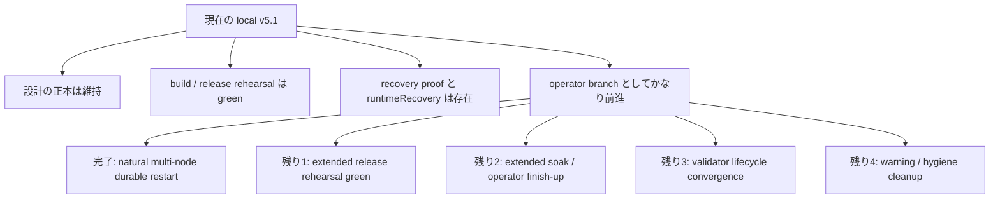
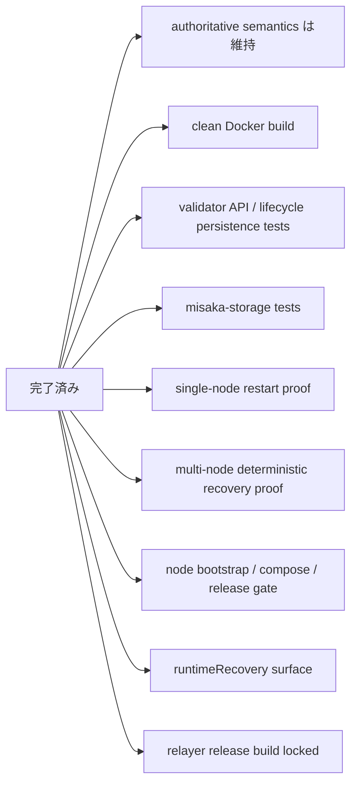
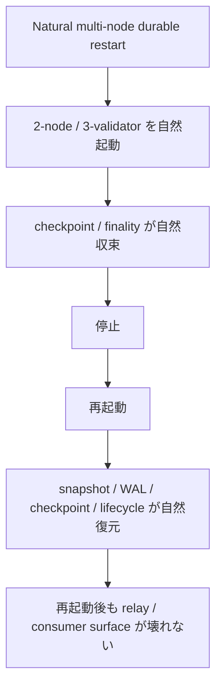
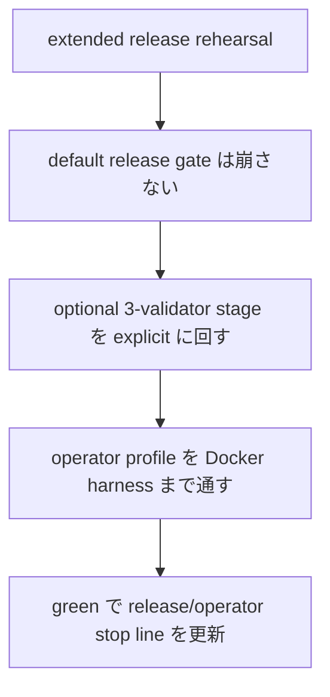
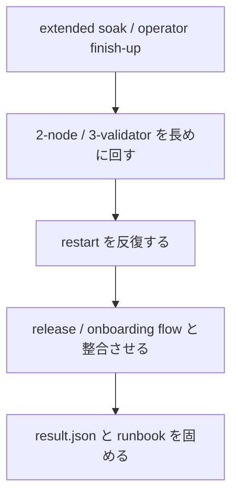
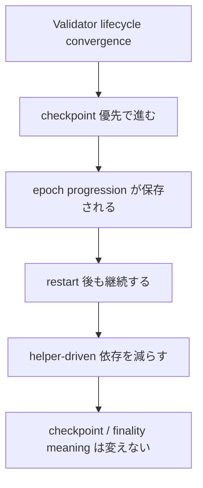
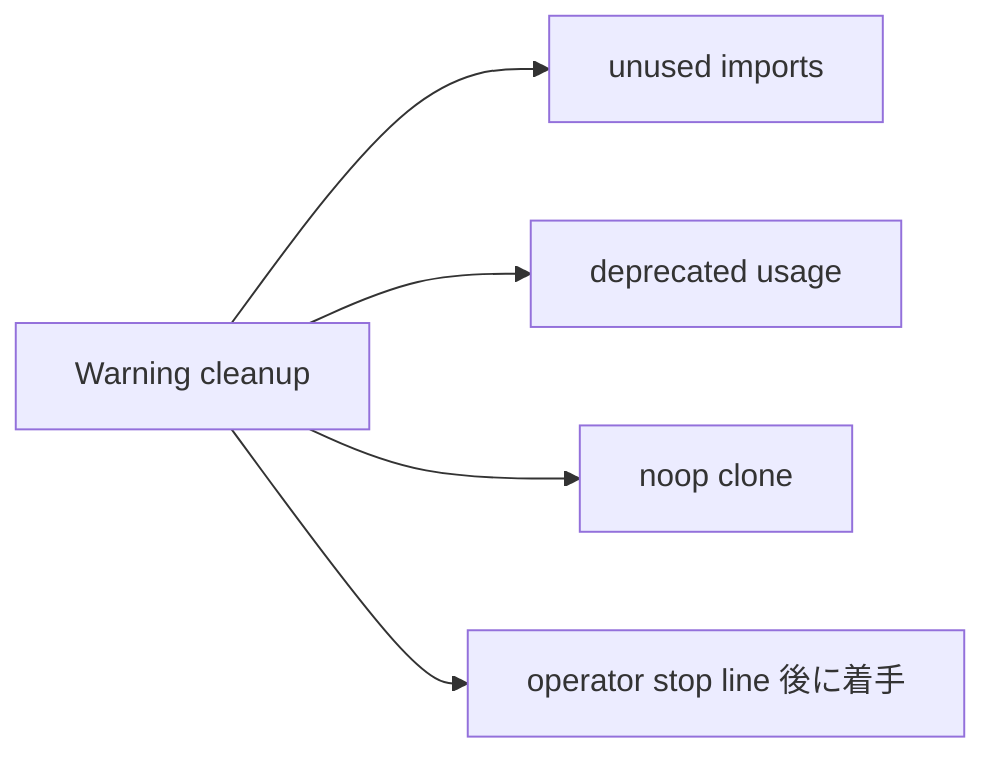
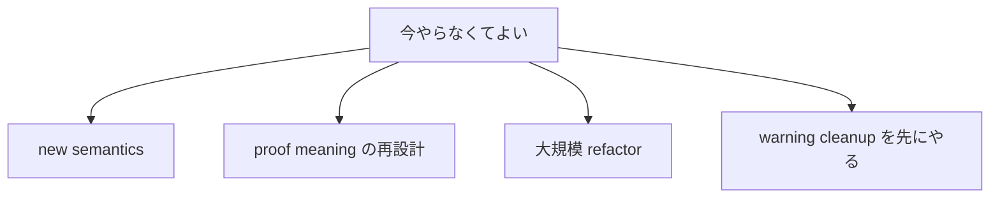

# MISAKA-CORE-v5.1 現状と残りで終わらせるべきもの

## 目的

この文書は、`v5.1` の現在地と、ここから本当に終わらせるべき残課題を
1 本にまとめたものです。

細かい round ごとの経緯ではなく、

- 何がもう終わっているか
- 何がまだ stop line として残っているか
- 何をどの順番で閉じるべきか
- 何は今やらなくてよいか

を見える形にすることが目的です。

## 1ページ要約

## 現在の判断

平たく言うと、今の `v5.1` は

- **設計枝** ではなく
- **部分的に運用実証が取れた operator branch**

です。

ただし、まだ **完全な運用完了** ではありません。

## すでに終わっているもの

### 1. 設計の正本は崩していない

次の意味論は維持されています。

- `UnifiedZKP`
- `CanonicalNullifier`
- `GhostDAG`
- checkpoint / finality の方向性
- validator lifecycle の方向性

### 2. Build / release rehearsal は閉じている

現時点では次が通っています。

- `misaka-node` の clean Docker build
- `relayer` の `--locked` release build
- 強化済み `dag_release_gate.sh`

つまり、

- bootstrap
- restart proof
- multi-node recovery proof
- Compose validation
- node release build
- relayer release build

が 1 本の release rehearsal として閉じています。

### 3. Recovery の証跡は取れる

次が入っています。

- single-node restart proof
- multi-node deterministic recovery proof
- DAG RPC 上の `runtimeRecovery`

つまり、再起動まわりを shell script だけでなく、
runtime 側の観測面でも追えます。

### 4. Operator 向けの入口はある

次が整っています。

- `node-bootstrap.sh`
- Docker / Compose の起動面
- release gate
- relayer bootstrap まわり

そのため、**ローカル運用の入口自体はある** 状態です。

## 完了した primary stop line

## 1. Natural Multi-Node Durable Restart

これは現在、**operator proof として完了扱い**にできます。

現時点で取れているもの:

- 2-node natural durable restart green
- 3-validator durable restart green
- `runtimeRecovery` / `validatorLifecycleRecovery` の live 観測
- relay / checkpoint / quorum / finality の post-restart 再収束

補足:

- 3-validator では operator proof 用に
  `checkpoint_interval=12` profile を使っています
- これは harness 側の安定化であり、`UnifiedZKP / CanonicalNullifier / GhostDAG`
  の意味は変えていません

参照:
- [22_parallel_round_six_natural_restart_closure.ja.md](./22_parallel_round_six_natural_restart_closure.ja.md)
- [23_parallel_round_seven_three_validator_restart_green.ja.md](./23_parallel_round_seven_three_validator_restart_green.ja.md)

## まだ終わっていない primary stop line

## 2. Extended Release Rehearsal Green

これが今の **最優先 stop line** です。

現時点の状況:

- `dag_release_gate_extended.sh` 自体は追加済み
- `dag_release_gate.sh` から Docker 内 harness へ operator profile env を forward する修正を landed
- `dag_release_gate_extended.sh` では dedicated ports / relative harness path / wider operator profile を landed
- full green は **確認中**

参照:
- [26_parallel_round_ten_extended_release_rehearsal.ja.md](./26_parallel_round_ten_extended_release_rehearsal.ja.md)
- [30_parallel_round_thirteen_extended_release_gate_hardening.ja.md](./30_parallel_round_thirteen_extended_release_gate_hardening.ja.md)

## 3. Extended Soak / Operator Finish-Up

これは release rehearsal の次の primary stop line です。

ここで確認すべきことは次です。

- `2-node / 3-validator` を長時間回しても checkpoint / finality が崩れないか
- restart を複数回繰り返しても recovery surface が壊れないか
- operator 向け runbook と harness の使い方が一貫しているか
- `dag_release_gate.sh` に optional 3-validator stage を入れた運用判断をどうするか

現時点の前進:

- [dag_soak_harness.sh](../../scripts/dag_soak_harness.sh) を追加済み
- `2-node` だけの smoke は通過済み
- `3-validator` は単体 harness として green
- `3-validator rolling restart` 単体 harness も green
- `dag_soak_harness.sh` から rolling restart scenario を呼ぶ smoke も green
- `./scripts/dag_soak_harness.sh extended` で、既存の smoke baseline より
  長い operator-facing soak を回せる
- extended profile は `MISAKA_ROLLING_RESTART_CYCLES=2` を使い、
  rolling restart を既定より重くするだけで既定 semantics は変えない
- `MISAKA_SOAK_PROFILE=extended` の 1 iteration run でも `allPassed=true` を確認済み
- `MISAKA_SOAK_PROFILE=extended` の 2 iteration run でも `allPassed=true` を確認済み

参照:
- [24_parallel_round_eight_soak_entrypoint.ja.md](./24_parallel_round_eight_soak_entrypoint.ja.md)
- [25_parallel_round_nine_rolling_restart_soak_green.ja.md](./25_parallel_round_nine_rolling_restart_soak_green.ja.md)
- [27_parallel_round_eleven_extended_soak_profile_green.ja.md](./27_parallel_round_eleven_extended_soak_profile_green.ja.md)
- [28_parallel_round_twelve_extended_soak_and_lifecycle_followup.ja.md](./28_parallel_round_twelve_extended_soak_and_lifecycle_followup.ja.md)

## 3. Validator Lifecycle Convergence

これは 2 番目の primary stop line です。

今は

- checkpoint 優先の progression
- lifecycle snapshot persistence
- JSON-safe な registry persistence

までは入っています。

ただし、まだ **fully consensus-owned** とは言い切れません。

ここでやるべきことは、

- checkpoint / finality の意味を変えず
- helper-driven な進行を減らし
- 再起動や multi-node の中でも epoch progression が自然に続く

ところまで寄せることです。

補足:
- startup 時に restored finality を即 replay する targeted test は
  clean Docker で pass 済みです
- replay した結果を同じ restart step の中で snapshot に即 persist する
  safe follow-up も landed しています
- ただし full lifecycle closure そのものはまだ残っています

## 3. Warning / Hygiene Cleanup

これは必要ですが、**最優先ではありません**。

warning はまだ多いです。  
ただし今の順番では、

- restart
- multi-node
- lifecycle

の stop line を閉じてからでよいです。

## secondary で残っているもの

以下は重要ですが、primary stop line の後ろに置いてよいです。

### 1. operator docs / runbook の最終磨き込み

- bootstrap 手順
- release 手順
- recovery 手順
- validator onboarding 手順

### 2. consumer 側の見え方の固定

- `runtimeRecovery`
- `validator surfaces`
- `relay surfaces`

の field を安定契約として扱うための最終整理

### 3. long-run / soak / chaos の追加

- 長時間運用
- 反復 restart
- relay / RPC の継続観測

## 今やらなくてよいもの

今の段階で後回しでよいものは次です。

つまり、今は

- 新しい意味を作る
- UnifiedZKP / CanonicalNullifier / GhostDAG の意味を再設計する
- 大きな整理リファクタ
- cleanup を stop line より先にやる

のは避けるべきです。

## 残課題の優先順位

## 短い結論

今の `v5.1` は、元のベースラインよりかなり前進しており、

- build
- release rehearsal
- recovery proof
- operator surface

まではかなり閉じています。

残りで本当に終わらせるべきものは、

1. `extended soak / long-run / operator finish-up`
2. `validator lifecycle convergence`
3. その後の `consumer/docs finalization / cleanup`

です。`natural multi-node durable restart` 自体は、
operator proof としては完了扱いに移せます。

したがって、次の本線は **restart closure の先にある運用継続性の証明** です。
