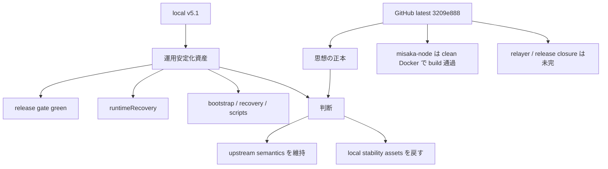
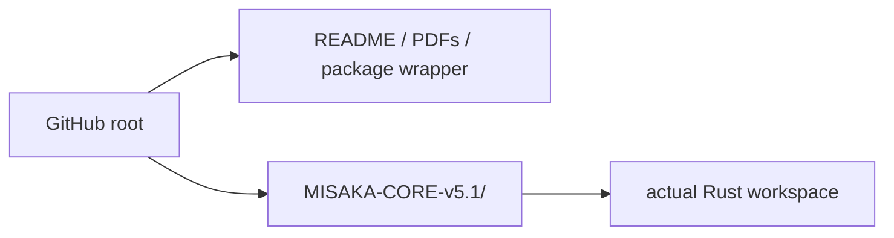
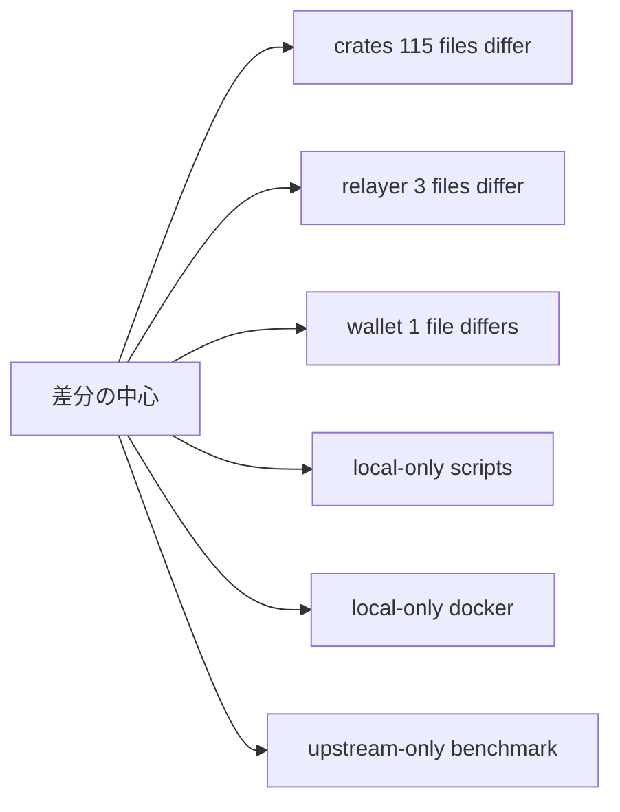
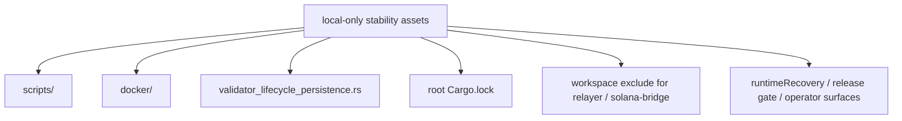
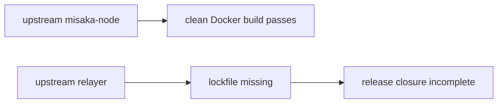
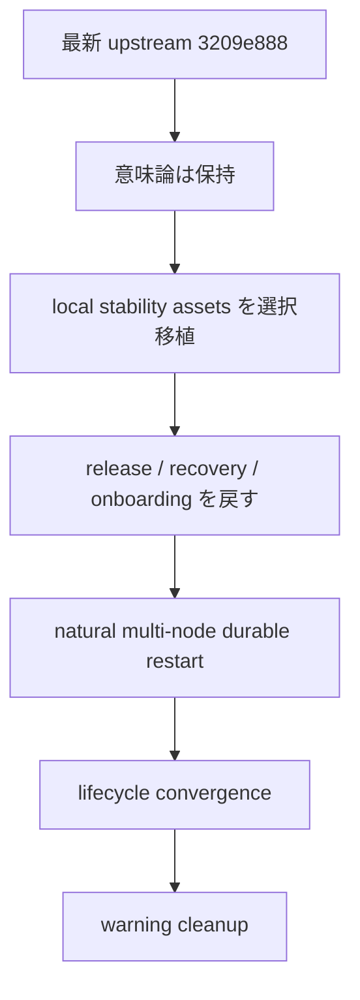

# 最新 GitHub 再確認 3209e888 と local v5.1 の比較

## 目的

この文書は、GitHub の最新 `MISAKA-BTC/MISAKA-CORE` を再確認し、
現在の local `MISAKA-CORE-v5.1` と比較して、

- どちらを正本として見るべきか
- どこは upstream が進んでいるか
- どこは local の安定化資産がまだ必要か
- これからどう進めるべきか

を整理するためのものです。

## 参照した upstream

- GitHub repo: https://github.com/MISAKA-BTC/MISAKA-CORE
- 最新 HEAD: `3209e888754afeceda7e53359c4863e419020b24`
- 取得日時ベースの commit 表示: `2026-03-23 03:30:40 +0900 Add files via upload`

## 結論

今回の再確認でも結論は変わりません。

- **思想 / 意味論の正本は upstream 側**
- **運用安定化の実装資産は local 側がかなり前進**

したがって、今後も

- `UnifiedZKP / CanonicalNullifier / GhostDAG` の意味は upstream を壊さない
- その上で `release / recovery / onboarding / observation` は local の資産を戻す

という方針が正しいです。

## 1ページ要約

## upstream の構成

今回の GitHub HEAD は、repo root がそのまま workspace ではなく、
root の下に `MISAKA-CORE-v5.1/` を持つ配布型の構成でした。

この点は local と少し感覚が違います。  
local は `MISAKA-CORE-v5.1` を直接作業対象にしているため、
運用・build・docs はそこに寄せてあります。

## 比較結果の要約

### 差分の規模

比較したところ、`docs` と `target` を除いても差分はかなり大きいです。

- `crates` 配下で差分あり: `115` ファイル
- `relayer` 配下で差分あり: `3` ファイル
- `wallet` 配下で差分あり: `1` ファイル
- local にしかない crate file: `1`
- upstream にしかない crate file: `1`
- local にしかない `scripts`: `7`
- local にしかない `docker`: `3`

### local にしかない主な資産

代表例:

- [scripts/dag_release_gate.sh](../../scripts/dag_release_gate.sh)
- [scripts/node-bootstrap.sh](../../scripts/node-bootstrap.sh)
- [scripts/recovery_restart_proof.sh](../../scripts/recovery_restart_proof.sh)
- [scripts/recovery_multinode_proof.sh](../../scripts/recovery_multinode_proof.sh)
- [docker/node.Dockerfile](../../docker/node.Dockerfile)
- [docker/node-compose.yml](../../docker/node-compose.yml)
- [crates/misaka-node/src/validator_lifecycle_persistence.rs](../../crates/misaka-node/src/validator_lifecycle_persistence.rs)

### upstream にしかないもの

今回の比較で upstream-only として目立ったのはこれです。

- [crates/misaka-pqc/tests/full_benchmark.rs](/tmp/misaka-core-upstream-kl7idX/MISAKA-CORE-v5.1/crates/misaka-pqc/tests/full_benchmark.rs)

つまり upstream は、意味論や proof 側の更新を含みつつ、
local のような operator 資産まではまだ戻っていない、という見方が自然です。

## build / 実行面の再確認

## 1. upstream `misaka-node`

host そのままでは `stdbool.h` 欠落で止まりました。  
これは環境依存です。

一方で、clean Docker では次が通りました。

- `cargo build -p misaka-node --features qdag_ct --quiet`

つまり、

- **upstream の node 本体は少なくとも clean Docker では build 可能**
- ただし **host 前提の hermetic 運用面はまだ別**

という整理です。

## 2. upstream `relayer`

こちらはまだ release closure が未完です。

確認したこと:

- upstream に [relayer/Cargo.lock](/tmp/misaka-core-upstream-kl7idX/MISAKA-CORE-v5.1/relayer) は存在しない
- `cargo build --manifest-path relayer/Cargo.toml --release --locked` はそのままでは閉じない
- local ではここを埋めて green にしている

## 今回の判断

### 1. upstream が正しい部分

- `UnifiedZKP`
- `CanonicalNullifier`
- `GhostDAG`
- validator / checkpoint / finality の意味
- wallet/core を含む設計の本線

ここは引き続き upstream を正本と見るべきです。

### 2. local がまだ必要な部分

- release gate
- node bootstrap
- recovery scripts
- runtime observation (`runtimeRecovery`)
- relayer release closure
- operator rehearsal path

ここは今のところ local 側が明確に前進しています。

## どう進めるべきか

### やるべきこと

1. 最新 upstream `3209e888` を正本として扱う  
2. local 側から次だけを戻す  
   - `scripts/`
   - `docker/`
   - `runtimeRecovery`
   - `validator_lifecycle_persistence`
   - relayer manifest / lockfile closure
3. その上で `natural multi-node durable restart` を閉じる  
4. その後に lifecycle と cleanup を進める  

### やってはいけないこと

- local の意味論を upstream に被せる
- `UnifiedZKP / CanonicalNullifier / GhostDAG` を local 都合で書き換える
- 115 file の crate 差分を雑に丸ごと戻す

## 短い結論

今回の GitHub 更新後も、

- **upstream = 正本**
- **local = 運用安定化資産**

という役割分担は still valid です。

変わったのは、「upstream も node build は clean Docker で閉じる」と確認できた点です。  
一方で、release / relayer / operator rehearsal はまだ local の方が進んでいます。

したがって次は、**最新 upstream に local の安定化資産を戻しながら、運用 stop line を閉じる** のが正しい進め方です。
