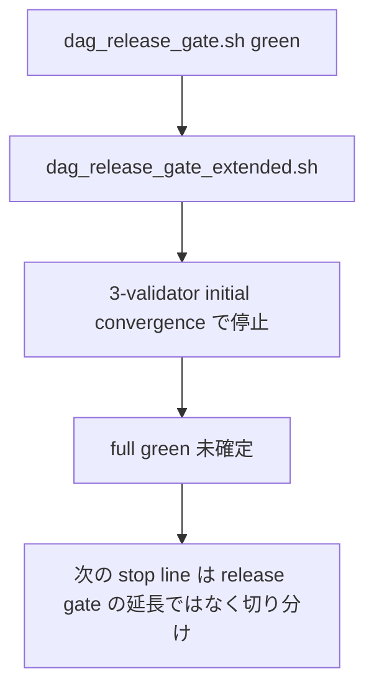
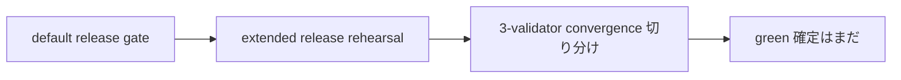

# MISAKA-CORE-v5.1 Extended Release Rehearsal Stop Line Draft

## 目的

今の `extended release rehearsal` stop line を、operator 向けに
短く整理した下書きです。

既定の release gate は green のままですが、
extended release rehearsal は **まだ full green 確定ではありません**。

## 現在地

## 今の stop line

- `dag_release_gate.sh` は release 基準として green
- `dag_release_gate_extended.sh` は optional 3-validator stage の入口だが、
  いまは **final green までは閉じていない**
- 失速点は `3-validator initial convergence` で、
  `voteCount=1` のまま進まず `currentCheckpointFinalized=false` のまま止まることがある
- したがって、ここは「release gate をそのまま延長したら green」ではなく、
  **3-validator convergence の切り分けが必要な stop line** です

## どこを見るか

- まず見るのは `dag_release_gate_extended.sh` の標準出力
- 3-validator stage が進んだ場合は、
  `MISAKA_HARNESS_DIR` 配下の `result.json` とログを確認する
- 参考になる既存 green の証跡は
  `dag_three_validator_recovery_harness.sh` と `dag_soak_harness.sh`
  ですが、これは extended release rehearsal 自体の green 証明ではありません

## ひとことで

`dag_release_gate.sh` は通る。  
`dag_release_gate_extended.sh` は今の stop line だが、まだ full green 確定ではない。
