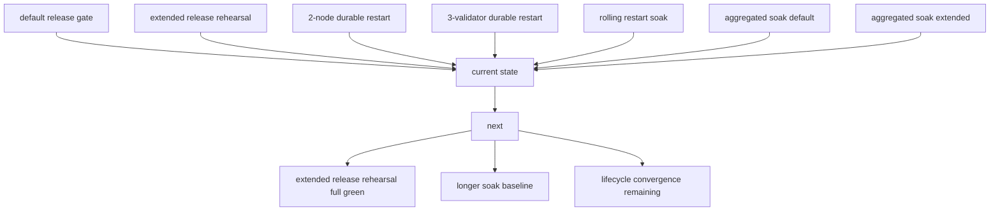
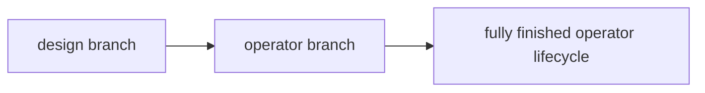

# MISAKA-CORE-v5.1 現状サマリ 2026-03-23

## 要点

現時点の `MISAKA-CORE-v5.1` は、

- default の release rehearsal はある
- optional な 3-validator release rehearsal の入口もある
- 2-node / 3-validator の durable restart proof はある
- rolling restart soak もある
- soak は default / extended の両 profile がある

という状態です。

つまり、`release -> restart -> soak` の operator 向け入口は揃っています。
一方で、最終的な stop line はまだ
**extended release rehearsal の full green 確定**、
**longer soak の運用基準化** と
**validator lifecycle convergence の残り整理**
です。

## 1ページ要約

## 何が揃っているか

### 1. Release

- `dag_release_gate.sh` で default の release rehearsal を回せる
- `dag_release_gate_extended.sh` で optional な 3-validator stage を明示的に回せる
- default path は重くしすぎず、extended path は intentional に分けられている
- ただし extended path は **helper / hardening はあるが full green は未確定**

### 2. Restart

- `dag_three_validator_recovery_harness.sh` で 3-validator durable restart を単独確認できる
- 2-node / 3-validator ともに checkpoint / quorum / finality / recovery surface を追える
- `runtimeRecovery` と `validatorLifecycleRecovery` が live surface として見える

### 3. Soak

- `dag_rolling_restart_soak_harness.sh` で rolling restart を単独確認できる
- `dag_soak_harness.sh` で aggregated soak を回せる
- `dag_soak_harness.sh extended` で extended operator proof を回せる
- extended soak は 2 iteration まで green 記録がある

## 現在の見方

今の位置は `A` ではなく `B` です。

- 設計だけの枝ではない
- 実際の operator proof はかなり進んでいる
- ただし `C` にはまだ到達していない

## 今 operator が見るべきもの

- 最短の実行順は [29_operator_release_restart_soak_checklist.ja.md](./29_operator_release_restart_soak_checklist.ja.md)
- 現状の大きい整理は [16_current_state_and_remaining_work.ja.md](./16_current_state_and_remaining_work.ja.md)
- extended soak の到達点は [28_parallel_round_twelve_extended_soak_and_lifecycle_followup.ja.md](./28_parallel_round_twelve_extended_soak_and_lifecycle_followup.ja.md)

## 残っているもの

### 1. Extended Release Rehearsal

- `dag_release_gate.sh` は green
- `dag_release_gate_extended.sh` は optional stage の入口
- ただし full green はまだ確定していない

### 2. Longer Soak Baseline

- extended soak が通ること自体は確認済み
- 次の論点は「通るか」ではなく「何 iteration / 何時間を baseline にするか」

### 3. Validator Lifecycle Convergence

- startup 直後の finality replay までは前進している
- ただし fully closed な lifecycle convergence はまだ残っている

### 3. Warning / Hygiene Cleanup

- 意味論や operator proof を壊さない範囲で最後に整理する段階

## 現在の結論

`MISAKA-CORE-v5.1` は、
**release / restart / soak の operator向け実行面が揃った状態**
です。

次にやるべきことは新しい意味論の追加ではなく、

- extended release rehearsal の full green 確定
- longer soak の基準化
- lifecycle convergence の残り整理
- 最後の hygiene cleanup

を順に閉じることです。

## 参照

- [16_current_state_and_remaining_work.ja.md](./16_current_state_and_remaining_work.ja.md)
- [26_parallel_round_ten_extended_release_rehearsal.ja.md](./26_parallel_round_ten_extended_release_rehearsal.ja.md)
- [27_parallel_round_eleven_extended_soak_profile_green.ja.md](./27_parallel_round_eleven_extended_soak_profile_green.ja.md)
- [28_parallel_round_twelve_extended_soak_and_lifecycle_followup.ja.md](./28_parallel_round_twelve_extended_soak_and_lifecycle_followup.ja.md)
- [29_operator_release_restart_soak_checklist.ja.md](./29_operator_release_restart_soak_checklist.ja.md)
