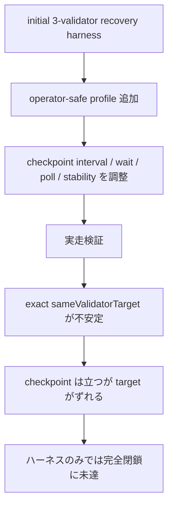
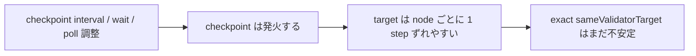

# MISAKA-CORE-v5.1 3-Validator Recovery Harness: Operator-Safe Initial Convergence Assessment

## 結論

`scripts/dag_three_validator_recovery_harness.sh` に対して、**operator-safe な初期収束プロファイル** を追加しました。
ただし、今回の観測では **`sameValidatorTarget=true` の exact convergence を安定して閉じ切るところまでは到達していません**。

つまり、

- ハーネス側の安全策は入れた
- しかし、初期 convergence の不安定要因はハーネスの待ち方だけでは吸収しきれなかった

という結果です。

`UnifiedZKP / CanonicalNullifier / GhostDAG / checkpoint / finality meaning` は変更していません。

## 1ページ要約



## 変更内容

`scripts/dag_three_validator_recovery_harness.sh` にのみ手を入れました。

追加したもの:

- `MISAKA_THREE_VALIDATOR_PROFILE=operator-safe`
- `MISAKA_CONVERGENCE_STABILIZATION_POLLS`
- operator-safe 既定値
  - `MISAKA_DAG_CHECKPOINT_INTERVAL=12`
  - `MISAKA_INITIAL_WAIT_ATTEMPTS=180`
  - `MISAKA_RESTART_WAIT_ATTEMPTS=180`
  - `MISAKA_POLL_INTERVAL_SECS=3`
  - `MISAKA_CONVERGENCE_STABILIZATION_POLLS=3`
- `legacy` profile も残し、比較できるようにした

加えた stabilization は、
単発の `same target` ではなく **連続した複数回の convergence 判定** を要求するものです。

## 何を試したか

実際に次の profile を試しました。

```text
operator-safe default:
  checkpoint_interval=12
  wait_attempts=180
  poll_cadence=3s
  stabilization_polls=3

manual override trials:
  checkpoint_interval=24
  block_time=10
  checkpoint_interval=24
  block_time=20
  checkpoint_interval=24
  block_time=40
```

## 観測結果

### 12 / 180 / 3 / 3

初期 convergence 待ち中に checkpoint は立つが、`nodeA/nodeB/nodeC` の `latestCheckpoint` が一致しませんでした。

観測例:

- `nodeA` target score `15`
- `nodeB` target score `16`
- `nodeC` target score `17`

### 24 / 360 / 3 / 3

checkpoint はより遅く出ましたが、依然として `24 / 25 / 26` のようにズレました。

### 24 / 360 / 3 / 3 + block_time=10

同様に exact same target には閉じず、`24 / 25 / 26` のズレが残りました。

### 24 / 360 / 3 / 3 + block_time=20

checkpoint の発火はさらに遅くなりましたが、観測時間内では exact same target convergence を確認できませんでした。

### 24 / 360 / 3 / 3 + block_time=40

checkpoint 発火はかなり遅くなりましたが、観測時間内では exact same target convergence を確認できませんでした。

## 実際に見えたもの



観測上の本質は、

- 3 validator それぞれが checkpoint を持つ
- ただし target blue score が 1 step ずれて見える
- そのため harness の exact convergence 条件が閉じない

という点でした。

## 解釈

今回の範囲では、**operator harness 側の wait budget / cadence / stabilization だけでは、初期 convergence を完全には安定化できませんでした**。

ハーネスの profile を保守的にすることは有効ですが、`sameValidatorTarget=true` の exact convergence については、現状の runtime の natural checkpoint selection timing 側にまだ揺れが残っています。

## 変更ファイル

- [scripts/dag_three_validator_recovery_harness.sh](../../scripts/dag_three_validator_recovery_harness.sh)

## 検証コマンド

- `bash -n scripts/dag_three_validator_recovery_harness.sh`
- `MISAKA_SKIP_BUILD=1 MISAKA_BIN=./target/debug/misaka-node ... ./scripts/dag_three_validator_recovery_harness.sh`
- `MISAKA_SKIP_BUILD=1 MISAKA_BIN=./target/debug/misaka-node ... MISAKA_DAG_CHECKPOINT_INTERVAL=24 ... MISAKA_BLOCK_TIME_SECS=10 ./scripts/dag_three_validator_recovery_harness.sh`
- `MISAKA_SKIP_BUILD=1 MISAKA_BIN=./target/debug/misaka-node ... MISAKA_DAG_CHECKPOINT_INTERVAL=24 ... MISAKA_BLOCK_TIME_SECS=20 ./scripts/dag_three_validator_recovery_harness.sh`
- `MISAKA_SKIP_BUILD=1 MISAKA_BIN=./target/debug/misaka-node ... MISAKA_DAG_CHECKPOINT_INTERVAL=24 ... MISAKA_BLOCK_TIME_SECS=40 ./scripts/dag_three_validator_recovery_harness.sh`

## まとめ

今回の bounded change でできたのは、

- operator-safe profile の導入
- stabilization poll の明示化
- wait cadence の保守化

までです。

ただし、**3-validator initial convergence を exact same target で安定閉鎖するところまでは未達**でした。
そのため、このハーネスだけで「完全に stabilized」とは言えません。
