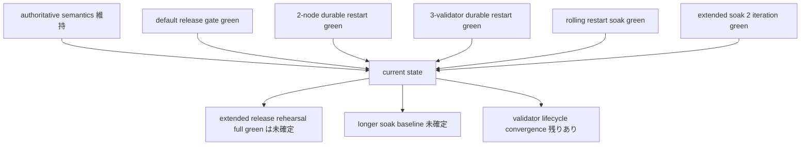
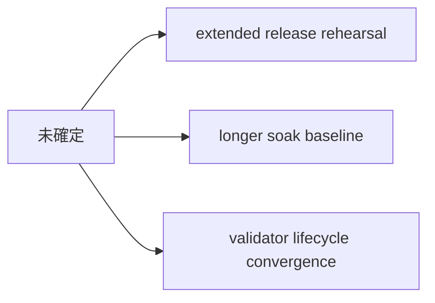
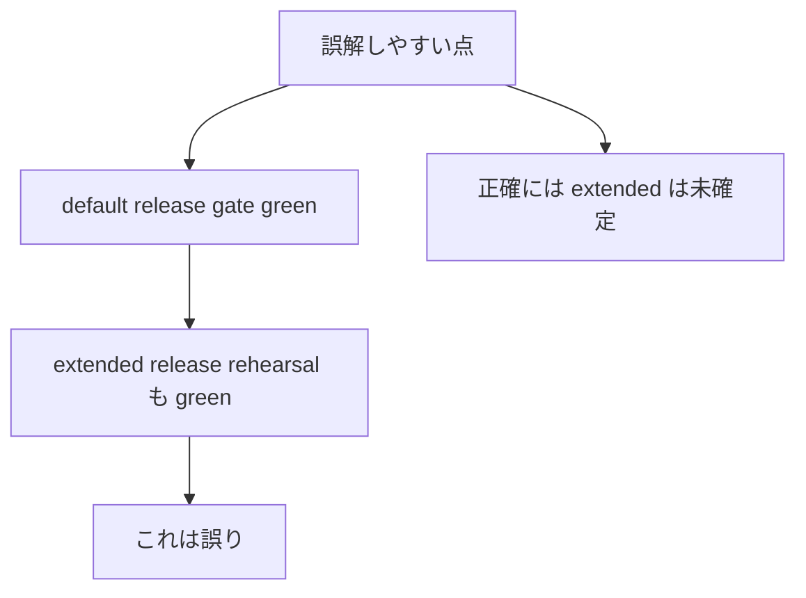
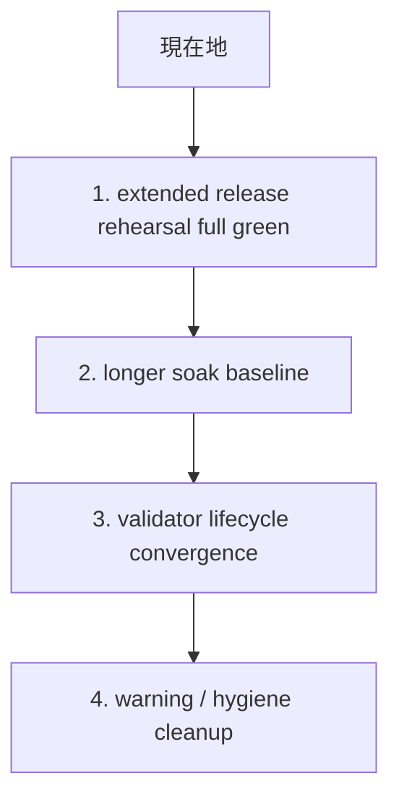

# MISAKA-CORE-v5.1 現状共有サマリ 2026-03-23

## 目的

この文書は、現時点の `MISAKA-CORE-v5.1` を第三者へ共有するときに、
細かい round 記録を読まなくても

- どこまで進んでいるか
- 何が確認済みか
- 何がまだ未確定か
- 次に何を閉じるべきか

が 1 本で分かるようにするための要約です。

## 結論

現時点の `MISAKA-CORE-v5.1` は、

- `UnifiedZKP / CanonicalNullifier / GhostDAG / validator lifecycle`
  の思想は維持したまま
- `release / restart / soak / operator observation`
  の実運用寄りの面がかなり前進している

状態です。

ただし、まだ **完全完了** ではありません。
いま本当に残っている主課題は、

- `extended release rehearsal` の full green 確定
- longer soak の基準化
- validator lifecycle convergence の残り整理

です。

## 1ページ要約

## すでに確認できているもの

### 1. 意味論の軸は崩していない

- `UnifiedZKP`
- `CanonicalNullifier`
- `GhostDAG`
- checkpoint / finality の方向性
- validator lifecycle の方向性

これらを local の運用安定化変更で壊していません。

### 2. Default の release 側は成立している

- `dag_release_gate.sh` は green
- `relayer` の `--locked` release build も rehearsal に入っている
- node bootstrap / Compose / runtime observation までつながっている

### 3. Restart proof は実証済み

- `2-node durable restart` は green
- `3-validator durable restart` も green
- restart 後の `checkpoint / quorum / finality / runtimeRecovery`
  を live surface で確認できる

### 4. Soak の入口はある

- `rolling restart soak` は green
- `extended soak` も 2 iteration まで green 記録がある
- operator が回すべき harness と result の見方は整理済み

## まだ未確定のもの

### 1. Extended Release Rehearsal

ここは **helper と hardening は入っているが、full green 確定はまだ** です。

重要なのは、

- `dag_release_gate.sh` は green
- `dag_release_gate_extended.sh` は optional な 3-validator operator stage
- この 2 つは同じではない

という点です。

### 2. Longer Soak Baseline

`extended soak` 自体は通っていますが、

- 何 iteration を基準にするか
- 何時間を operator baseline にするか

はまだ決め切っていません。

### 3. Validator Lifecycle Convergence

checkpoint 優先の progression と restart replay はかなり前進していますが、
fully closed と言い切るには、まだ残り整理があります。

## 今の共有で誤解しない方がよい点

いま共有時に最も注意すべきなのは、
**「default release gate が通る」ことと
「extended release rehearsal まで全部 green」 は同義ではない**
という点です。

## 次に閉じるべき順番

## いま最初に見るべき docs

- [09_v51_progress_and_next_execution.ja.md](./09_v51_progress_and_next_execution.ja.md)
- [16_current_state_and_remaining_work.ja.md](./16_current_state_and_remaining_work.ja.md)
- [29_operator_release_restart_soak_checklist.ja.md](./29_operator_release_restart_soak_checklist.ja.md)
- [30_parallel_round_thirteen_extended_release_gate_hardening.ja.md](../review-20260323/30_parallel_round_thirteen_extended_release_gate_hardening.ja.md)
- [31_three_validator_operator_safe_initial_convergence.md](./31_three_validator_operator_safe_initial_convergence.md)

## ひとことで

`MISAKA-CORE-v5.1` は、
**設計枝ではなく operator branch としてかなり前進しているが、
extended release rehearsal と longer soak の最終確定がまだ残っている**
という状態です。
