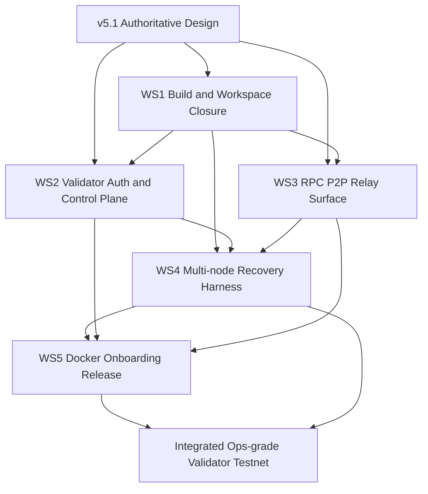
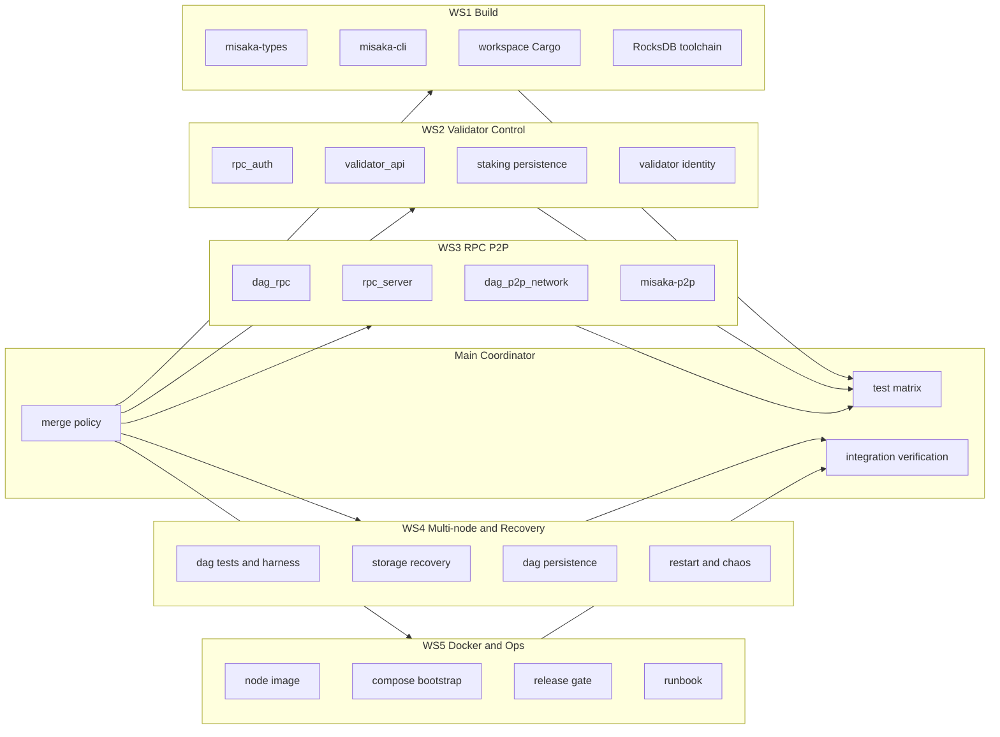
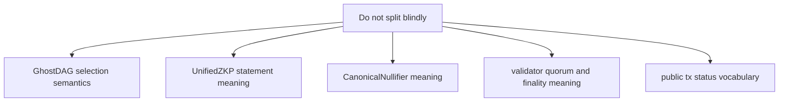
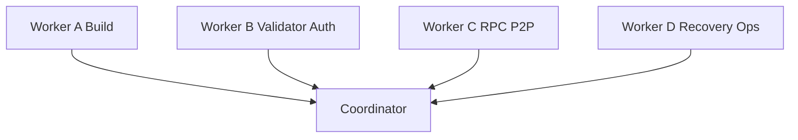

# MISAKA-CORE-v5.1 Parallel AI Workstream Map

## Goal

`v5.1` is the authoritative line for design and runtime meaning.

- Keep: `UnifiedZKP`, `CanonicalNullifier`, `GhostDAG`, validator lifecycle direction.
- Do not revert `v5.1` semantics back to local `v4`.
- Use parallel AI only where the write scope and semantics are cleanly separable.

This document answers:

1. What can be worked on at the same time
2. What depends on what
3. What should not be changed independently
4. What order is safest for merge and validation

## Current Read

- `v5.1` has the right design direction, but is not yet fully green for build, security, or operations.
- The most important split is:
  - `build / workspace closure`
  - `validator auth / control plane`
  - `RPC / P2P / relay transport`
  - `multi-node / recovery / harness`
  - `Docker / onboarding / release`

## Safe Parallel Split

## Workstream Detail

### WS1 Build And Workspace Closure

Status:
- Start immediately
- Highest priority blocker
- Lowest semantic risk

Scope:
- [Cargo.toml](../../Cargo.toml)
- [crates/misaka-types/Cargo.toml](../../crates/misaka-types/Cargo.toml)
- [crates/misaka-types/src/utxo.rs](../../crates/misaka-types/src/utxo.rs)
- [crates/misaka-cli/src/confidential_transfer.rs](../../crates/misaka-cli/src/confidential_transfer.rs)
- [crates/misaka-storage/Cargo.toml](../../crates/misaka-storage/Cargo.toml)
- [relayer/Cargo.toml](../../relayer/Cargo.toml)
- [solana-bridge/programs/misaka-bridge/Cargo.toml](../../solana-bridge/programs/misaka-bridge/Cargo.toml)

Known blockers:
- RocksDB native toolchain closure blocks `storage`, `consensus`, `execution`, `mempool`, `dag`, `node`.
- `misaka-cli` has an ownership error around `balance_proof`.
- `relayer` and `solana-bridge` are under the repo but not correctly represented at workspace root.

Output:
- `cargo check --workspace --all-targets` can run in a known environment
- manifest layout is explicit
- single-crate red blockers are isolated

Can run in parallel with:
- WS2
- WS3

But:
- WS4 and WS5 become much more credible after this is green

### WS2 Validator Auth And Control Plane

Status:
- Start immediately
- Security-sensitive
- Do not change staking semantics casually

Scope:
- [crates/misaka-node/src/rpc_auth.rs](../../crates/misaka-node/src/rpc_auth.rs)
- [crates/misaka-node/src/dag_rpc.rs](../../crates/misaka-node/src/dag_rpc.rs)
- [crates/misaka-node/src/validator_api.rs](../../crates/misaka-node/src/validator_api.rs)
- [crates/misaka-consensus/src/staking.rs](../../crates/misaka-consensus/src/staking.rs)
- [crates/misaka-types/src/validator.rs](../../crates/misaka-types/src/validator.rs)
- [crates/misaka-crypto/src/validator_sig.rs](../../crates/misaka-crypto/src/validator_sig.rs)

Current issues:
- Write auth is router-composed, not intrinsically safe-by-default.
- If `MISAKA_RPC_API_KEY` is absent, writes are effectively open by deployment choice.
- Validator lifecycle mutates local in-memory registry and still uses placeholder registration material.
- Validator IDs are inconsistent with PQ canonical identity guidance.
- Vote gossip and auth are not cleanly aligned.

Output:
- safe-by-default validator write boundary
- explicit internal-vs-public vote submission path
- persisted registry plan
- validator identity migration plan

Can run in parallel with:
- WS1
- WS3

Depends on:
- real epoch / slashing / active-set semantics before final closure

### WS3 RPC P2P And Relay Surface

Status:
- Start immediately
- Good parallel stream
- High leverage for observation and operability

Scope:
- [crates/misaka-node/src/rpc_server.rs](../../crates/misaka-node/src/rpc_server.rs)
- [crates/misaka-node/src/dag_rpc.rs](../../crates/misaka-node/src/dag_rpc.rs)
- [crates/misaka-node/src/p2p_network.rs](../../crates/misaka-node/src/p2p_network.rs)
- [crates/misaka-node/src/dag_p2p_network.rs](../../crates/misaka-node/src/dag_p2p_network.rs)
- [crates/misaka-node/src/dag_p2p_transport.rs](../../crates/misaka-node/src/dag_p2p_transport.rs)
- [crates/misaka-node/src/dag_p2p_surface.rs](../../crates/misaka-node/src/dag_p2p_surface.rs)
- [crates/misaka-p2p/src/lib.rs](../../crates/misaka-p2p/src/lib.rs)
- [crates/misaka-rpc/src/lib.rs](../../crates/misaka-rpc/src/lib.rs)

Current issues:
- `dag` and `experimental_dag` story is not fully normalized.
- Shared `misaka-p2p` and `misaka-rpc` are only partially integrated.
- Consumer-visible vocabulary exists, but final contracts are not fully fixed.
- Relay transport is usable, but semantics must stay aligned with DAG/finality.

Output:
- stable consumer surfaces
- typed relay vocabulary
- better observability
- cleaner transport seams

Can run in parallel with:
- WS1
- WS2

Depends on:
- DAG semantics staying authoritative elsewhere

### WS4 Multi-node Recovery And Harness

Status:
- Start in parallel, but final closure is downstream
- Best used for repeated verification

Scope:
- [crates/misaka-dag/tests/multi_node_chaos.rs](../../crates/misaka-dag/tests/multi_node_chaos.rs)
- [crates/misaka-dag/tests/local_e2e.rs](../../crates/misaka-dag/tests/local_e2e.rs)
- [crates/misaka-dag/tests/stress_tests.rs](../../crates/misaka-dag/tests/stress_tests.rs)
- [crates/misaka-storage/src/recovery.rs](../../crates/misaka-storage/src/recovery.rs)
- [crates/misaka-storage/src/dag_recovery.rs](../../crates/misaka-storage/src/dag_recovery.rs)
- [crates/misaka-storage/src/wal.rs](../../crates/misaka-storage/src/wal.rs)
- [crates/misaka-dag/src/dag_persistence.rs](../../crates/misaka-dag/src/dag_persistence.rs)
- [crates/misaka-node/src/main.rs](../../crates/misaka-node/src/main.rs)

Current issues:
- recovery path is thinner than comments imply
- checkpoint/restart coverage is still test-heavy, not operator-ready
- snapshot durability and WAL lifecycle need hardening
- natural multi-node and IBD-grade recovery are not fully closed

Output:
- real restart and crash harness
- durable multi-node recovery proof
- stable chaos / soak entrypoint

Can run in parallel with:
- WS3

Depends on:
- WS1 for credible build
- WS2 for final validator behavior
- DAG/P2P closure for believable end state

### WS5 Docker Onboarding And Release

Status:
- Start design now
- Implementation after WS1 and WS4 move enough

Scope:
- [relayer/Dockerfile](../../relayer/Dockerfile)
- [relayer/docker-compose.yml](../../relayer/docker-compose.yml)
- [relayer/misaka-relayer.service](../../relayer/misaka-relayer.service)
- [configs/testnet.toml](../../configs/testnet.toml)
- [configs/mainnet.toml](../../configs/mainnet.toml)
- [crates/misaka-node/src/main.rs](../../crates/misaka-node/src/main.rs)

Current issues:
- only relayer has Docker/systemd artifacts
- node has no operator-grade image/bootstrap path
- TOML configs are not the real runtime entrypoint
- release gate / SBOM / signing / runbook are missing or incomplete

Output:
- supported validator bootstrap path
- node Docker image and compose
- release gate and operator runbook

Can run in parallel with:
- WS4 design work

Depends on:
- WS1 for build closure
- WS4 for realistic restart and network behavior
- WS2/WS3 for exposed config and auth surfaces

## What Must Not Be Split Blindly

These should remain semantically centralized.

- Do not let one AI change checkpoint meaning while another changes RPC wording.
- Do not let one AI change validator identity length while another changes attestation format.
- Do not let Docker/onboarding define a runtime path that the node binary does not actually support.

## Recommended AI Assignment

Suggested split:
- Worker A: WS1 Build and workspace closure
- Worker B: WS2 Validator auth and control plane
- Worker C: WS3 RPC/P2P/relay surface
- Worker D: WS4 Recovery/harness and WS5 scaffolding design
- Coordinator: merge policy, shared vocabulary, validation matrix

## Practical Merge Order

1. WS1: unblock build and workspace shape
2. WS2 + WS3: harden control plane and consumer transport surfaces in parallel
3. WS4: run multi-node/recovery once build and surfaces are stable enough
4. WS5: package Docker/onboarding/release around the behavior already proven by WS4
5. Final integration: full validator bootstrap, restart, quorum, observation, and load runs

## Recommended Immediate Start Set

Start now:
- WS1 build closure
- WS2 auth boundary hardening
- WS3 RPC/P2P surface cleanup
- WS4 recovery/harness gap analysis and scripted harness preparation

Wait until the first round lands:
- node Docker image
- public validator onboarding flow
- release signing/SBOM policy

## Short Conclusion

The safest way to use multiple AI workers is:

- keep `v5.1` semantics authoritative
- split by dependency boundary, not by vague component names
- let build, auth, transport, and recovery move in parallel
- keep DAG/ZKP/finality meaning centralized

That gives maximum concurrency without silently forking the protocol.
