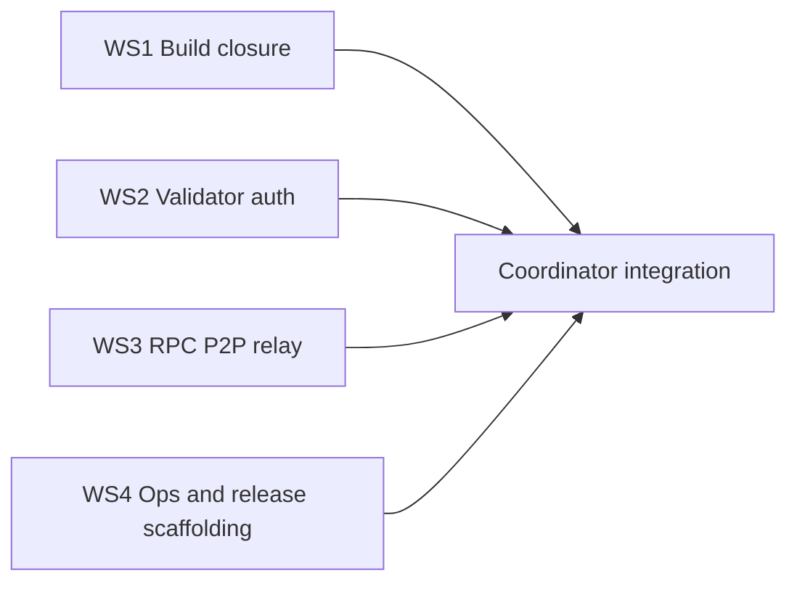
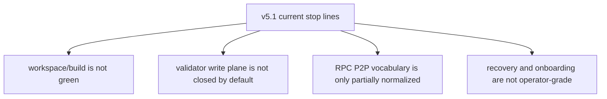
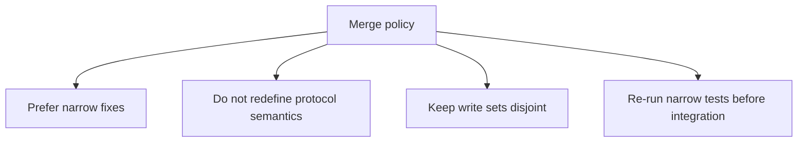

# MISAKA-CORE-v5.1 Parallel Round Status

## Purpose

This file tracks the current parallel implementation round.

- Authoritative repo: `MISAKA-CORE-v5.1`
- Current mode: multiple independent workstreams, one integration coordinator
- Constraint: keep `v5.1` semantics authoritative

## Active Parallel Round

## Current Known Stop Lines

## Fresh Coordinator Check

From the current local validation pass:

- `misaka-types --lib` no longer stops on the earlier source-level blocker, but test execution inside the Docker image hit a host/target `glibc` mismatch because the mounted `target/` already contains binaries built against a newer host libc.
- `misaka-node --features qdag_ct` now moves past the earlier `misaka-types` blocker and stops later in `misaka-consensus` and `misaka-dag`.

Current concrete compile blockers seen by the coordinator:

- [crates/misaka-consensus/src/reward_epoch.rs](../../crates/misaka-consensus/src/reward_epoch.rs)
  - wrong import path for `ValidatorId`
- [crates/misaka-consensus/src/staking.rs](../../crates/misaka-consensus/src/staking.rs)
  - mutable/immutable borrow conflict in `activate`
- [crates/misaka-dag/src/atomic_pipeline.rs](../../crates/misaka-dag/src/atomic_pipeline.rs)
  - `SpentUtxo` not imported into scope
- [crates/misaka-dag/src/dag_block_producer.rs](../../crates/misaka-dag/src/dag_block_producer.rs)
  - `insert_block_atomic` call requires the right backend trait path / implementation visibility

## Merge Policy For This Round

## Expected Outputs

- WS1:
  - fewer compile blockers
  - explicit workspace shape
- WS2:
  - safer validator write boundary
  - clearer auth behavior
- WS3:
  - cleaner transport and consumer-facing surface
- WS4:
  - better release/onboarding scaffolding

## Integration After Workers Return

1. Apply returned patches in dependency order.
2. Re-run narrow cargo checks/tests.
3. Update [00_parallel_ai_workstream_map.md](./00_parallel_ai_workstream_map.md) with completed items.
4. Record new remaining blockers.

## Current Outcome

See [02_parallel_round_implementation_report.md](./02_parallel_round_implementation_report.md).

- The first parallel round has landed.
- `misaka-node` now builds in a clean Docker environment with `qdag_ct`.
- Remaining work has shifted from early compile closure to recovery, onboarding, and lifecycle semantics.
