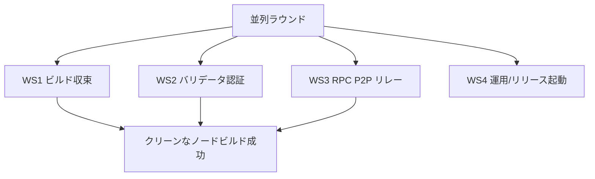
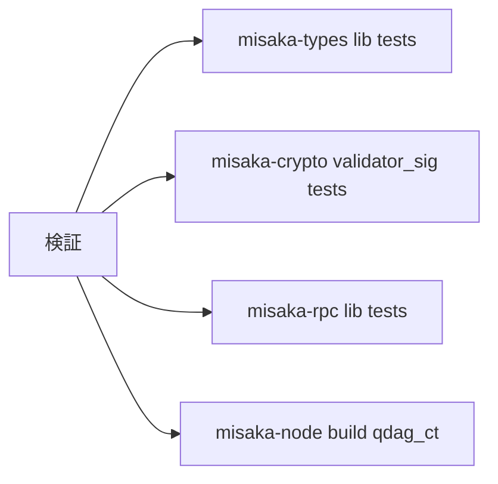
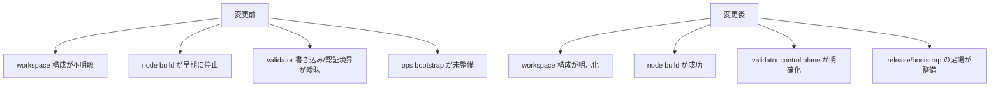

# MISAKA-CORE-v5.1 並列ラウンド実装レポート

## 結果

最初の並列実装ラウンドは、ソースコードレベルで成功裏に完了しました。

- `v5.1` のセマンティクスは正本として維持されました。
- `UnifiedZKP`、`CanonicalNullifier`、`GhostDAG`、およびバリデータ最終性の意味を再定義することなく、複数の独立したワークストリームが取り込まれました。
- クリーンな Docker ビルドで `misaka-node` まで正常に到達するようになりました。

## 反映された内容

## ストリーム別変更

### WS1 ビルド収束

対象ファイル:
- [Cargo.toml](../../Cargo.toml)
- [crates/misaka-cli/src/confidential_transfer.rs](../../crates/misaka-cli/src/confidential_transfer.rs)
- [crates/misaka-consensus/src/reward_epoch.rs](../../crates/misaka-consensus/src/reward_epoch.rs)
- [crates/misaka-consensus/src/staking.rs](../../crates/misaka-consensus/src/staking.rs)
- [crates/misaka-dag/src/atomic_pipeline.rs](../../crates/misaka-dag/src/atomic_pipeline.rs)
- [crates/misaka-dag/src/dag_block_producer.rs](../../crates/misaka-dag/src/dag_block_producer.rs)

変更点:
- ルートワークスペースは `relayer` と `solana-bridge` を明示的に除外するようになりました
- `misaka-cli` の confidential transfer は `balance_proof` を誤って move しなくなりました
- `reward_epoch.rs` は正しい `ValidatorId` パスを使うようになりました
- `staking.rs` の activation は borrow checker に引っかからなくなりました
- `atomic_pipeline.rs` は `SpentUtxo` を正しく import するようになりました
- `dag_block_producer.rs` は RocksDB write-through を実際の `rocksdb` feature で制御するようになりました

### WS2 バリデータ認証とコントロールプレーン

対象ファイル:
- [crates/misaka-node/src/rpc_auth.rs](../../crates/misaka-node/src/rpc_auth.rs)
- [crates/misaka-node/src/validator_api.rs](../../crates/misaka-node/src/validator_api.rs)
- [crates/misaka-node/src/dag_rpc.rs](../../crates/misaka-node/src/dag_rpc.rs)
- [crates/misaka-types/src/validator.rs](../../crates/misaka-types/src/validator.rs)
- [crates/misaka-crypto/src/validator_sig.rs](../../crates/misaka-crypto/src/validator_sig.rs)

変更点:
- バリデータ書き込み系ルートは、ルータ境界でより明示的になりました
- `submit_tx` は引き続き API キーで保護されています
- `submit_checkpoint_vote` は、暫定的な公開 signed-gossip 受入口として明示的に扱われます
- バリデータ公開鍵長、stake、commission の検証がより厳密になりました
- バリデータ補助型と legacy-ID 互換パスの安全性が向上しました
- 現行の Axum ミドルウェアシグネチャと router state typing に合わせたローカルコンパイル修正が適用されました

### WS3 RPC P2P リレーインターフェース

対象ファイル:
- [crates/misaka-node/Cargo.toml](../../crates/misaka-node/Cargo.toml)
- [crates/misaka-node/src/dag_p2p_transport.rs](../../crates/misaka-node/src/dag_p2p_transport.rs)
- [crates/misaka-node/src/dag_p2p_network.rs](../../crates/misaka-node/src/dag_p2p_network.rs)
- [crates/misaka-node/src/p2p_network.rs](../../crates/misaka-node/src/p2p_network.rs)
- [crates/misaka-node/src/sync_relay_transport.rs](../../crates/misaka-node/src/sync_relay_transport.rs)
- [crates/misaka-rpc/src/lib.rs](../../crates/misaka-rpc/src/lib.rs)

変更点:
- `experimental_dag` は canonical な `dag` へ素直に解決されるようになりました
- DAG transport guard は canonical な feature path と整合するようになりました
- relay observation はより構造化されました
- `misaka-rpc` の consumer surface の既定値は、より明確で整理されたものになりました
- `dag_p2p_network` の borrow と relay-transport のコンパイル問題は、統合作業中に修正されました
- `dag_p2p_transport` は move 済みの handshake state を borrow しなくなりました

### WS4 運用とリリース起動

対象ファイル:
- [scripts/dag_release_gate.sh](../../scripts/dag_release_gate.sh)
- [scripts/relayer.env.example](../../scripts/relayer.env.example)
- [scripts/relayer-bootstrap.sh](../../scripts/relayer-bootstrap.sh)
- [relayer/docker-compose.yml](../../relayer/docker-compose.yml)
- [relayer/misaka-relayer.service](../../relayer/misaka-relayer.service)
- [docs/README.md](../README.md)

変更点:
- 不足していた release gate スクリプトが追加されました
- relayer bootstrap 環境を再現可能にしました
- relayer の compose/service は、古いホスト固有パス前提をハードコードしなくなりました
- docs は運用者を bootstrap スクリプトと release スクリプトへ案内するようになりました

## 検証

検証はクリーンな Docker 環境で実行されました。

- イメージ: `rust:1.89-bookworm`
- 追加パッケージ: `clang`, `libclang-dev`, `build-essential`, `cmake`, `pkg-config`
- 環境変数:
  - `CARGO_TARGET_DIR=/tmp/...`
  - `BINDGEN_EXTRA_CLANG_ARGS=-isystem $(gcc -print-file-name=include)`

確認結果:
- `cargo test -p misaka-types --lib --quiet` → `42 passed`
- `cargo test -p misaka-crypto validator_sig --lib --quiet` → `9 passed`
- `cargo test -p misaka-rpc --lib --quiet` → `11 passed`
- `cargo build -p misaka-node --features qdag_ct --quiet` → passed

## 改善された点

## まだ完了していないこと

このラウンドは、`v5.1` が本番運用可能な完成状態になったことを意味するわけではありません。

主な残課題:
- recovery path は依然として運用者水準の期待より薄いままです
- マルチノードのクラッシュ/再起動検証はまだ閉じていません
- node の Docker/Compose オンボーディングはまだ不完全です
- バリデータライフサイクルは、完全にコンセンサスで裏付けられた永続ライフサイクルというより、依然としてローカルコントロールプレーン寄りです
- `misaka-pqc`、`misaka-dag`、`misaka-node`、および関連 crate 全体に多数の warning が残っています

## 次ラウンド

1. マルチノード recovery の強化
2. 自然なマルチノード harness と再起動検証
3. node の Docker/Compose オンボーディング
4. バリデータライフサイクル永続化と epoch advancement の収束
5. ランタイム停止線を閉じた後の warning 削減
