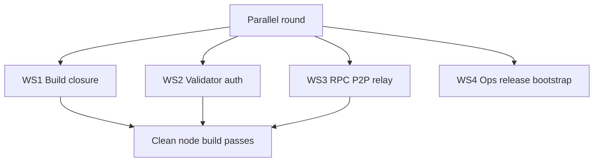
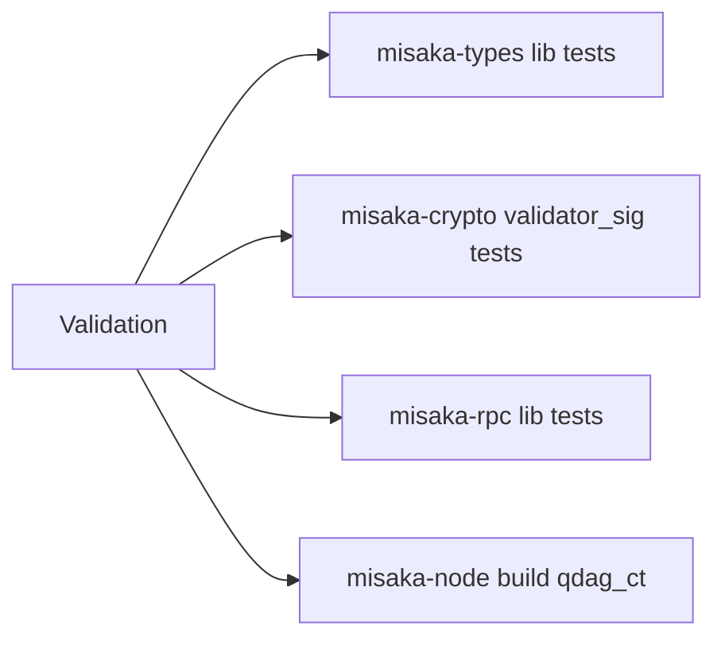
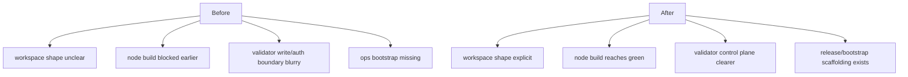

# MISAKA-CORE-v5.1 Parallel Round Implementation Report

## Result

The first parallel implementation round completed successfully at the source level.

- `v5.1` semantics were kept authoritative.
- Multiple independent workstreams landed without redefining `UnifiedZKP`, `CanonicalNullifier`, `GhostDAG`, or validator finality meaning.
- A clean Docker build now reaches `misaka-node` successfully.

## What Landed

## Stream-by-Stream Changes

### WS1 Build Closure

Files:
- [Cargo.toml](../../Cargo.toml)
- [crates/misaka-cli/src/confidential_transfer.rs](../../crates/misaka-cli/src/confidential_transfer.rs)
- [crates/misaka-consensus/src/reward_epoch.rs](../../crates/misaka-consensus/src/reward_epoch.rs)
- [crates/misaka-consensus/src/staking.rs](../../crates/misaka-consensus/src/staking.rs)
- [crates/misaka-dag/src/atomic_pipeline.rs](../../crates/misaka-dag/src/atomic_pipeline.rs)
- [crates/misaka-dag/src/dag_block_producer.rs](../../crates/misaka-dag/src/dag_block_producer.rs)

Changes:
- root workspace now explicitly excludes `relayer` and `solana-bridge`
- `misaka-cli` confidential transfer no longer moves `balance_proof` incorrectly
- `reward_epoch.rs` uses the correct `ValidatorId` path
- `staking.rs` activation no longer trips the borrow checker
- `atomic_pipeline.rs` imports `SpentUtxo` correctly
- `dag_block_producer.rs` gates RocksDB write-through on the actual `rocksdb` feature

### WS2 Validator Auth And Control Plane

Files:
- [crates/misaka-node/src/rpc_auth.rs](../../crates/misaka-node/src/rpc_auth.rs)
- [crates/misaka-node/src/validator_api.rs](../../crates/misaka-node/src/validator_api.rs)
- [crates/misaka-node/src/dag_rpc.rs](../../crates/misaka-node/src/dag_rpc.rs)
- [crates/misaka-types/src/validator.rs](../../crates/misaka-types/src/validator.rs)
- [crates/misaka-crypto/src/validator_sig.rs](../../crates/misaka-crypto/src/validator_sig.rs)

Changes:
- validator write routes are now more explicit at the router boundary
- `submit_tx` stays API-key protected
- `submit_checkpoint_vote` is explicitly treated as interim public signed-gossip ingress
- validator public key length / stake / commission validation is stricter
- validator helper types and legacy-ID compatibility paths are safer
- local compile fixes were applied for the current Axum middleware signature and router state typing

### WS3 RPC P2P Relay Surface

Files:
- [crates/misaka-node/Cargo.toml](../../crates/misaka-node/Cargo.toml)
- [crates/misaka-node/src/dag_p2p_transport.rs](../../crates/misaka-node/src/dag_p2p_transport.rs)
- [crates/misaka-node/src/dag_p2p_network.rs](../../crates/misaka-node/src/dag_p2p_network.rs)
- [crates/misaka-node/src/p2p_network.rs](../../crates/misaka-node/src/p2p_network.rs)
- [crates/misaka-node/src/sync_relay_transport.rs](../../crates/misaka-node/src/sync_relay_transport.rs)
- [crates/misaka-rpc/src/lib.rs](../../crates/misaka-rpc/src/lib.rs)

Changes:
- `experimental_dag` now resolves cleanly to canonical `dag`
- DAG transport guards align with the canonical feature path
- relay observation is more structured
- consumer surface defaults in `misaka-rpc` are cleaner and more explicit
- `dag_p2p_network` borrow and relay-transport compile issues were fixed during integration
- `dag_p2p_transport` no longer borrows moved handshake state

### WS4 Ops And Release Bootstrap

Files:
- [scripts/dag_release_gate.sh](../../scripts/dag_release_gate.sh)
- [scripts/relayer.env.example](../../scripts/relayer.env.example)
- [scripts/relayer-bootstrap.sh](../../scripts/relayer-bootstrap.sh)
- [relayer/docker-compose.yml](../../relayer/docker-compose.yml)
- [relayer/misaka-relayer.service](../../relayer/misaka-relayer.service)
- [docs/README.md](../README.md)

Changes:
- missing release gate script now exists
- relayer bootstrap env is reproducible
- relayer compose/service no longer hardcode the old host-specific path assumptions
- docs now point operators to the bootstrap and release scripts

## Validation

Validation was run in a clean Docker environment:

- image: `rust:1.89-bookworm`
- extra packages: `clang`, `libclang-dev`, `build-essential`, `cmake`, `pkg-config`
- env:
  - `CARGO_TARGET_DIR=/tmp/...`
  - `BINDGEN_EXTRA_CLANG_ARGS=-isystem $(gcc -print-file-name=include)`

Observed results:
- `cargo test -p misaka-types --lib --quiet` → `42 passed`
- `cargo test -p misaka-crypto validator_sig --lib --quiet` → `9 passed`
- `cargo test -p misaka-rpc --lib --quiet` → `11 passed`
- `cargo build -p misaka-node --features qdag_ct --quiet` → passed

## What Is Better Now

## What Is Still Not Done

This round does **not** mean `v5.1` is production-complete.

Major remaining items:
- recovery path is still thinner than operator-grade expectations
- multi-node crash/restart proof is not yet closed
- node Docker/Compose onboarding is still incomplete
- validator lifecycle is still closer to a local control plane than fully consensus-backed persistent lifecycle
- many warnings remain across `misaka-pqc`, `misaka-dag`, `misaka-node`, and related crates

## Next Round

1. Multi-node recovery hardening
2. Natural multi-node harness and restart proof
3. Node Docker/Compose onboarding
4. Validator lifecycle persistence and epoch advancement closure
5. Warning reduction after the runtime stop lines are closed
