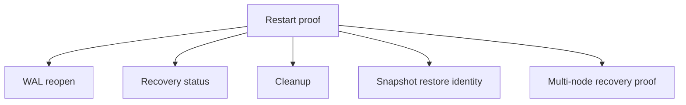

# Recovery Restart Proof

This note captures the operator-facing restart hardening added for `v5.1`.

## What Changed

- WAL recovery now reports full status instead of only a block-hash list.
- Startup recovery fails closed on unrecoverable WAL open/read errors.
- WAL compaction now triggers on committed-entry count or journal size.
- Restart cleanup removes both `dag_wal.journal` and stale `dag_wal.journal.tmp`.
- DAG snapshot restore identity is now checked as part of the restart proof.



## How To Verify

Run the recovery harness:

```bash
./scripts/recovery_restart_proof.sh
```

The harness checks:

- WAL reopen across restart.
- Compaction trigger conditions.
- Recovery status reporting.
- Post-restart artifact cleanup.
- Virtual state snapshot restore identity.

For the multi-node catch-up proof, run
[06_recovery_multinode_proof.md](./06_recovery_multinode_proof.md).

## Scope

This is recovery hardening only. It does not change DAG meaning, ZKP semantics, RPC vocabulary, or validator behavior.
