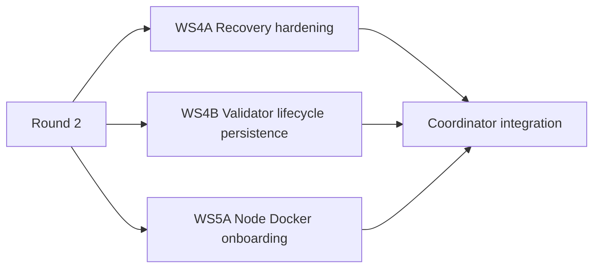
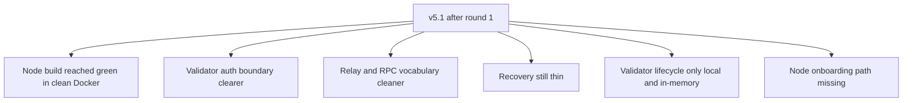
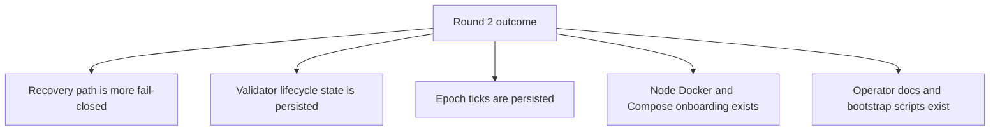
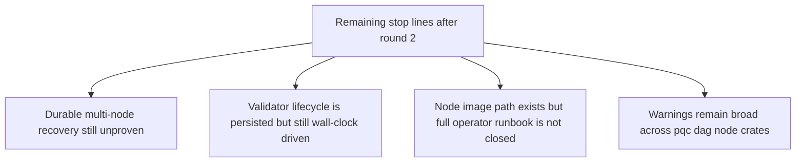

# MISAKA-CORE-v5.1 Parallel Round Two Status

## Purpose

This file tracks the second parallel implementation round on top of the
authoritative `v5.1` line.

- Keep `UnifiedZKP`, `CanonicalNullifier`, `GhostDAG`, and validator meaning unchanged
- Improve operator readiness around restart, validator lifecycle persistence, and onboarding

## Round Two Scope

## Before Round Two

## Current Outcome

## What Improved

- Recovery now reports fuller WAL status and clears stale recovery artifacts after startup.
- Validator lifecycle state is now saved to disk and restored on startup.
- A minimal epoch progression loop exists so lifecycle snapshots do not remain frozen forever.
- The repo now has a node Dockerfile, node Compose file, env example, and bootstrap script.

## What Did Not Change

- `UnifiedZKP`, `CanonicalNullifier`, `GhostDAG`, and checkpoint semantics
- DAG transport meaning
- validator quorum meaning
- consumer-facing consensus meaning

## New Stop Lines

## Validation Snapshot

- `cargo test -p misaka-storage --lib --quiet` in clean Docker → `41 passed`
- `cargo test -p misaka-node --bin misaka-node validator_api --features qdag_ct --quiet` in clean Docker → `3 passed`
- `bash -n scripts/node-bootstrap.sh` → passed
- `sh -n docker/node-entrypoint.sh` → passed
- `bash -n scripts/recovery_restart_proof.sh` → passed

## Follow-up

1. Close durable restart proof on a natural multi-node network.
2. Move validator epoch advancement from wall-clock helper toward consensus-owned progression.
3. Add operator-grade node Compose/runbook verification and release-gate coverage.
4. Reduce warning volume after runtime stop lines are closed.
