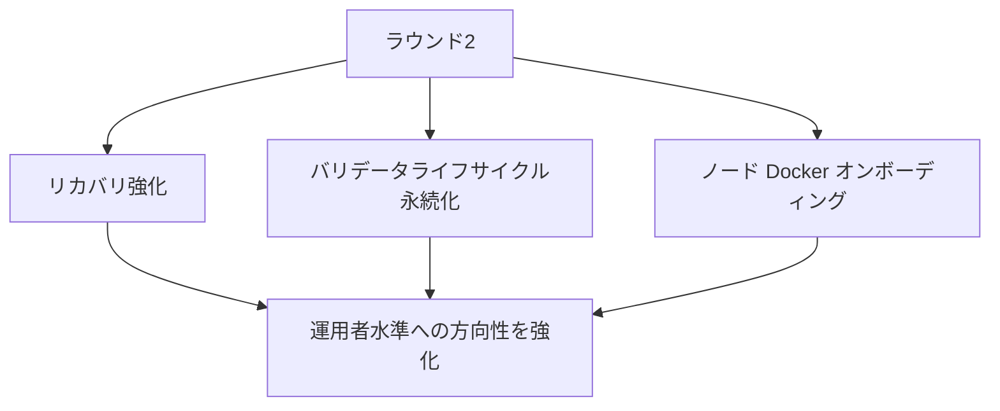
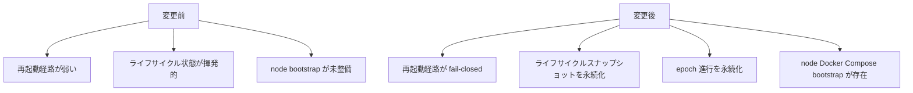

# MISAKA-CORE-v5.1 並列ラウンド2実装レポート

## 結果

第2回の並列実装ラウンドは、正本プロトコルセマンティクスを再定義することなく `v5.1` に反映されました。

## ストリーム別変更

### WS4A リカバリ強化

対象ファイル:
- [crates/misaka-storage/src/wal.rs](../../crates/misaka-storage/src/wal.rs)
- [crates/misaka-storage/src/dag_recovery.rs](../../crates/misaka-storage/src/dag_recovery.rs)
- [crates/misaka-storage/src/recovery.rs](../../crates/misaka-storage/src/recovery.rs)
- [crates/misaka-node/src/main.rs](../../crates/misaka-node/src/main.rs)
- [scripts/recovery_restart_proof.sh](../../scripts/recovery_restart_proof.sh)
- [03_recovery_restart_proof.md](./03_recovery_restart_proof.md)

変更点:
- WAL リカバリは、ブロックハッシュだけでなく、より完全なリカバリ状態を公開するようになりました。
- DAG 起動時リカバリは、回復不能な WAL の open/read 失敗に対して fail-closed するようになりました。
- WAL compaction のトリガーは、コミット済みエントリ数と journal サイズの両方を対象にするようになりました。
- 起動時クリーンアップで、古い `dag_wal.journal` と `dag_wal.journal.tmp` を削除するようになりました。
- 運用者向け検証のための restart-proof harness が追加されました。

### WS4B バリデータライフサイクル永続化

対象ファイル:
- [crates/misaka-node/src/validator_lifecycle_persistence.rs](../../crates/misaka-node/src/validator_lifecycle_persistence.rs)
- [crates/misaka-node/src/main.rs](../../crates/misaka-node/src/main.rs)
- [crates/misaka-node/src/validator_api.rs](../../crates/misaka-node/src/validator_api.rs)

変更点:
- `StakingRegistry + current_epoch` を対象とするファイルベースのライフサイクルスナップショットを追加しました。
- 起動時に、存在する場合はディスクからバリデータライフサイクル状態を復元するようになりました。
- 新規起動時には、ライフサイクルスナップショットファイルを明示的に初期化するようになりました。
- register / activate / exit / unlock は、変更後にライフサイクル状態を永続化するようになりました。
- 最小限の epoch advancement ループにより、`MISAKA_VALIDATOR_EPOCH_SECONDS` を使った定期的な epoch 進行を永続化するようになりました。

### WS5A ノード Docker オンボーディング

対象ファイル:
- [docker/node.Dockerfile](../../docker/node.Dockerfile)
- [docker/node-compose.yml](../../docker/node-compose.yml)
- [docker/node-entrypoint.sh](../../docker/node-entrypoint.sh)
- [scripts/node.env.example](../../scripts/node.env.example)
- [scripts/node-bootstrap.sh](../../scripts/node-bootstrap.sh)
- [docs/node-bootstrap.md](../node-bootstrap.md)
- [docs/README.md](../README.md)

変更点:
- `misaka-node` をパッケージングするノード向け Docker イメージ経路を追加しました。
- validator/full-node 起動用の Compose ファイルを追加しました。
- 環境変数を既存 CLI にマッピングする entrypoint を追加しました。
- bootstrap 用の env サンプルと bootstrap スクリプトを追加しました。
- 運用者向けの node bootstrap ドキュメントを追加しました。

## コーディネータ統合修正

ワーカーパッチ反映後に、小さな統合修正が1件必要でした。

対象ファイル:
- [crates/misaka-node/src/validator_api.rs](../../crates/misaka-node/src/validator_api.rs)

## 検証

検証はクリーンな Docker 環境で、以下の条件で実行されました。

- イメージ: `rust:1.89-bookworm`
- パッケージ: `clang`, `libclang-dev`, `build-essential`, `cmake`, `pkg-config`
- 環境変数:
  - `CARGO_TARGET_DIR=/tmp/misaka-target`
  - `BINDGEN_EXTRA_CLANG_ARGS=-isystem $(gcc -print-file-name=include)`

確認結果:
- `cargo test -p misaka-storage --lib --quiet` → `41 passed`
- `cargo test -p misaka-node --bin misaka-node validator_api --features qdag_ct --quiet` → `3 passed`
- `bash -n scripts/node-bootstrap.sh` → passed
- `sh -n docker/node-entrypoint.sh` → passed
- `bash -n scripts/recovery_restart_proof.sh` → passed
- `docker compose --env-file <sample> -f docker/node-compose.yml config` → ワーカー検証時に passed

## 改善された点

## まだ完了していないこと

- 自然なマルチノードリカバリは、運用者水準の検証としてはまだ完了していません。
- バリデータライフサイクル永続化は存在しますが、epoch 進行は依然としてコンセンサス主体ではなく補助ロジック主導です。
- node Docker オンボーディングは存在しますが、完全な運用 runbook と release-gate 統合は未完了です。
- PQC、DAG、node、storage crate 全体で warning 数は依然として多いままです。

## 次ラウンド

1. `v5.1` 上で、耐久性のあるマルチノード再起動と catch-up を証明する。
2. コンセンサス主体の epoch advancement に向けてバリデータライフサイクルを収束させる。
3. 既存の relayer bootstrap フローに隣接する形で、node の release/runbook チェックを追加する。
4. runtime と ops の停止線を閉じた後でのみ、warning ノイズを削減する。
