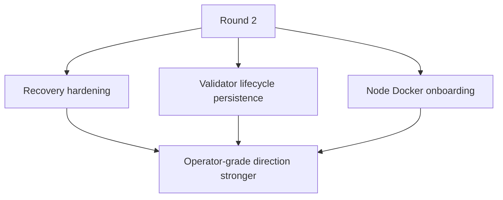
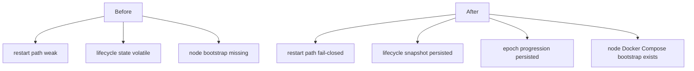

# MISAKA-CORE-v5.1 Parallel Round Two Implementation Report

## Result

The second parallel implementation round landed on `v5.1` without redefining
the authoritative protocol semantics.

## Stream-by-Stream Changes

### WS4A Recovery Hardening

Files:
- [crates/misaka-storage/src/wal.rs](../../crates/misaka-storage/src/wal.rs)
- [crates/misaka-storage/src/dag_recovery.rs](../../crates/misaka-storage/src/dag_recovery.rs)
- [crates/misaka-storage/src/recovery.rs](../../crates/misaka-storage/src/recovery.rs)
- [crates/misaka-node/src/main.rs](../../crates/misaka-node/src/main.rs)
- [scripts/recovery_restart_proof.sh](../../scripts/recovery_restart_proof.sh)
- [03_recovery_restart_proof.md](./03_recovery_restart_proof.md)

Changes:
- WAL recovery now exposes a fuller recovery status instead of only block hashes.
- DAG startup recovery now fails closed on unrecoverable WAL open/read failures.
- WAL compaction trigger covers both committed-entry count and journal size.
- Startup cleanup clears stale `dag_wal.journal` and `dag_wal.journal.tmp`.
- A restart-proof harness now exists for operator-facing validation.

### WS4B Validator Lifecycle Persistence

Files:
- [crates/misaka-node/src/validator_lifecycle_persistence.rs](../../crates/misaka-node/src/validator_lifecycle_persistence.rs)
- [crates/misaka-node/src/main.rs](../../crates/misaka-node/src/main.rs)
- [crates/misaka-node/src/validator_api.rs](../../crates/misaka-node/src/validator_api.rs)

Changes:
- Added a file-backed lifecycle snapshot for `StakingRegistry + current_epoch`.
- Startup now restores validator lifecycle state from disk if present.
- Fresh startup seeds the lifecycle snapshot file explicitly.
- Register / activate / exit / unlock now persist lifecycle state after mutation.
- A minimal epoch advancement loop persists periodic epoch movement using
  `MISAKA_VALIDATOR_EPOCH_SECONDS`.

### WS5A Node Docker Onboarding

Files:
- [docker/node.Dockerfile](../../docker/node.Dockerfile)
- [docker/node-compose.yml](../../docker/node-compose.yml)
- [docker/node-entrypoint.sh](../../docker/node-entrypoint.sh)
- [scripts/node.env.example](../../scripts/node.env.example)
- [scripts/node-bootstrap.sh](../../scripts/node-bootstrap.sh)
- [docs/node-bootstrap.md](../node-bootstrap.md)
- [docs/README.md](../README.md)

Changes:
- Added a node Docker image path that packages `misaka-node`.
- Added a Compose file for validator/full-node startup.
- Added an entrypoint that maps environment variables into the existing CLI.
- Added bootstrap env example and bootstrap script.
- Added operator-facing node bootstrap docs.

## Coordinator Integration Fix

One small integration fix was required after the worker patches landed.

File:
- [crates/misaka-node/src/validator_api.rs](../../crates/misaka-node/src/validator_api.rs)

## Validation

Validation was run in a clean Docker environment using:

- image: `rust:1.89-bookworm`
- packages: `clang`, `libclang-dev`, `build-essential`, `cmake`, `pkg-config`
- env:
  - `CARGO_TARGET_DIR=/tmp/misaka-target`
  - `BINDGEN_EXTRA_CLANG_ARGS=-isystem $(gcc -print-file-name=include)`

Observed results:
- `cargo test -p misaka-storage --lib --quiet` → `41 passed`
- `cargo test -p misaka-node --bin misaka-node validator_api --features qdag_ct --quiet` → `3 passed`
- `bash -n scripts/node-bootstrap.sh` → passed
- `sh -n docker/node-entrypoint.sh` → passed
- `bash -n scripts/recovery_restart_proof.sh` → passed
- `docker compose --env-file <sample> -f docker/node-compose.yml config` → passed during worker validation

## What Is Better Now

## What Is Still Not Done

- Natural multi-node recovery is not yet closed as an operator-grade proof.
- Validator lifecycle persistence exists, but epoch movement is still helper-driven rather than consensus-owned.
- Node Docker onboarding exists, but full operator runbook and release-gate integration remain incomplete.
- Warning volume remains high across PQC, DAG, node, and storage crates.

## Next Round

1. Prove durable multi-node restart and catch-up on `v5.1`.
2. Close validator lifecycle around consensus-owned epoch advancement.
3. Add node release/runbook checks next to the existing relayer bootstrap flow.
4. Reduce warning noise only after the runtime and ops stop lines are closed.
