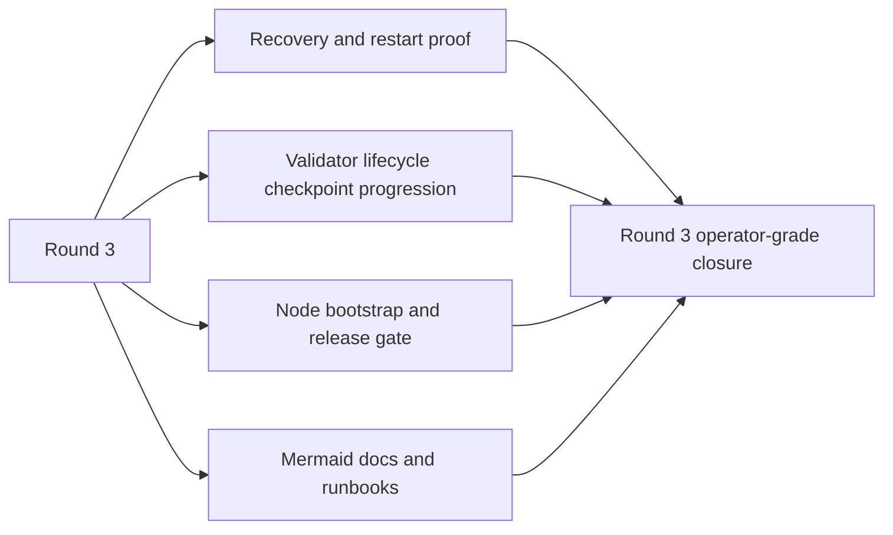
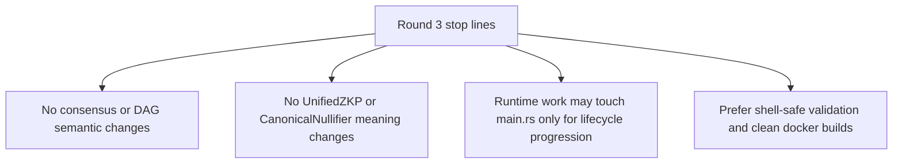

# MISAKA-CORE-v5.1 Parallel Round Three Status

## Purpose

This file tracks the third parallel implementation round on the authoritative
`v5.1` line.

- Keep consensus meaning unchanged
- tighten durable recovery and restart proof
- move validator lifecycle one step closer to checkpoint-driven progression
- tighten node onboarding and release validation around the Docker surface

## Round Three Scope

## Current Read

- Recovery had operator-facing proof scripts, but not yet a separate multi-node proof path.
- Validator lifecycle persistence existed, but epoch advancement was still wall-clock only.
- The node Docker path already existed, but the operator loop and release checks were still too thin.

## Stop Lines

## Expected Outcome

- Restart proof covers both single-node and scripted multi-node recovery surfaces
- Validator lifecycle persists epoch progress and prefers finalized checkpoints over fallback clock
- Node onboarding supports init, config, up, logs, and down flows
- Compose config is validated before startup
- Release gate checks the node Compose surface in addition to DAG tests
- Docs show the operator flow with Mermaid diagrams
