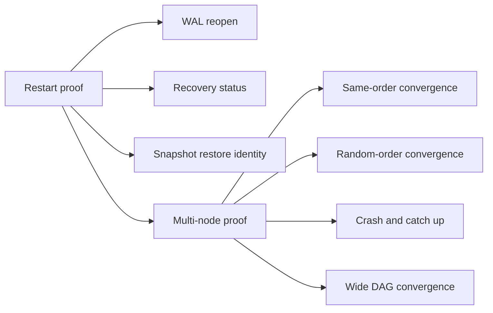

# Multi-Node Recovery Proof

This note extends the restart proof into a natural multi-node recovery story.
It stays within existing `v5.1` semantics: no ZKP, DAG, or validator meaning changes.

## Proof Shape



## What The Harness Proves

- A node can reopen its WAL after restart and preserve recovery metadata.
- A DAG snapshot can be restored without changing the computed state root.
- A node that falls behind mid-sync can rejoin and catch up to the same final state.
- Multiple proposers can build a wide DAG and still converge deterministically after recovery.
- The multi-node restart proof is now run as an ordered operator flow:
  restart prerequisite first, then deterministic chaos cases, with per-step logs and a summary file.

## How To Run

```bash
./scripts/recovery_restart_proof.sh
./scripts/recovery_multinode_proof.sh
```

The second script uses the deterministic in-memory chaos suite in
`crates/misaka-dag/tests/multi_node_chaos.rs` so the recovery proof stays
reproducible without introducing new runtime semantics.

It now writes logs under `.tmp/recovery-multinode-proof/` by default:

- `summary.txt`
- one log file per chaos case

If `MISAKA_RECOVERY_HARNESS_DIR` is set, the logs are written there instead.

The harness also checks the native `clang`/`stdbool.h` toolchain up front so
the operator sees a direct environment error before `librocksdb-sys` starts
failing deeper in the build.

Prerequisite: a working Rust/C build environment for `librocksdb-sys`.
If the native C headers are missing, the cargo step will fail before the
recovery tests start.

## Scope

This is operator proofing only. It does not redefine GhostDAG, checkpointing,
ZKP statements, or validator identity rules.
