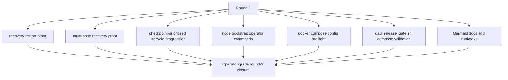
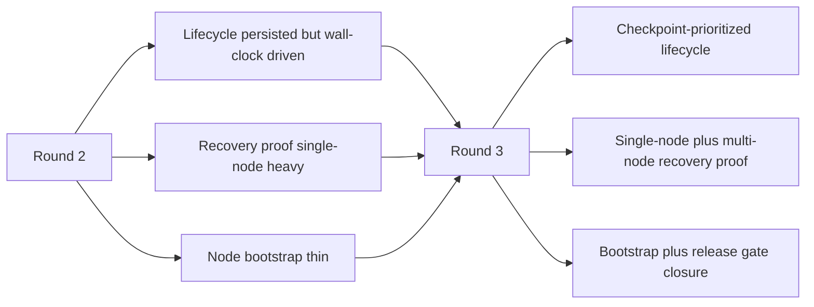

# MISAKA-CORE-v5.1 Parallel Round Three Implementation Report

## Result

Round 3 landed as a three-part operator hardening pass on top of the
authoritative `v5.1` line. It tightened recovery proof, moved validator
lifecycle progression closer to finalized-checkpoint signals, and strengthened
node onboarding and release checks without changing ZKP or DAG semantics.

## Files Changed

- [crates/misaka-consensus/src/staking.rs](../../crates/misaka-consensus/src/staking.rs)
- [crates/misaka-node/src/main.rs](../../crates/misaka-node/src/main.rs)
- [crates/misaka-node/src/dag_rpc.rs](../../crates/misaka-node/src/dag_rpc.rs)
- [crates/misaka-node/src/validator_api.rs](../../crates/misaka-node/src/validator_api.rs)
- [crates/misaka-node/src/validator_lifecycle_persistence.rs](../../crates/misaka-node/src/validator_lifecycle_persistence.rs)
- [scripts/recovery_restart_proof.sh](../../scripts/recovery_restart_proof.sh)
- [scripts/recovery_multinode_proof.sh](../../scripts/recovery_multinode_proof.sh)
- [scripts/node-bootstrap.sh](../../scripts/node-bootstrap.sh)
- [scripts/dag_release_gate.sh](../../scripts/dag_release_gate.sh)
- [scripts/node.env.example](../../scripts/node.env.example)
- [docs/node-bootstrap.md](../node-bootstrap.md)
- [docs/review-20260323/03_recovery_restart_proof.md](./03_recovery_restart_proof.md)
- [docs/review-20260323/06_recovery_multinode_proof.md](./06_recovery_multinode_proof.md)
- [docs/review-20260323/08_validator_lifecycle_checkpoint_epoch.md](./08_validator_lifecycle_checkpoint_epoch.md)
- [docs/README.md](../README.md)
- [docs/review-20260323/README.md](./README.md)

## What Changed

- `StakingRegistry` JSON serialization is now snapshot-safe.
  The validator lifecycle snapshot had a latent `serde_json` failure because
  validator ids were stored as non-string map keys. Round 3 normalizes them to
  hex at the serialization boundary.
- Validator lifecycle snapshots now persist `epoch_progress`.
  This includes `checkpoints_in_epoch` and the last finalized checkpoint score.
- Validator lifecycle progression is now checkpoint-prioritized.
  The node keeps the existing wall-clock fallback, but it stops using that
  fallback once finalized checkpoints are observed and begins advancing the
  lifecycle via the existing consensus `EpochManager`.
- A new multi-node recovery proof harness exists next to the single-node restart
  proof.
  This gives operators a clean split between local restart proof and deterministic
  multi-node recovery proof.
- The node bootstrap script now supports `init`, `config`, `up`, `down`, and
  `logs`.
- `up` now validates the effective Compose config before starting the stack.
- The release gate now validates the node Compose surface before building the
  release binaries.
- The node env example explains the `public`, `hidden`, `seed`, and `validator`
  launch roles more clearly.
- The node bootstrap docs now include a Mermaid workflow for the operator loop.

## What Stayed Fixed

- `UnifiedZKP`, `CanonicalNullifier`, `GhostDAG`, and checkpoint semantics
- validator role meaning
- the existing `misaka-node` CLI contract
- the existing relayer bootstrap path
- the existing validator control-plane route semantics

## Validation

Observed checks for the landed round:

- `bash -n scripts/recovery_restart_proof.sh`
- `bash -n scripts/recovery_multinode_proof.sh`
- `bash -n scripts/node-bootstrap.sh`
- `bash -n scripts/dag_release_gate.sh`
- `sh -n docker/node-entrypoint.sh`
- `docker compose --env-file scripts/node.env.example -f docker/node-compose.yml config`
- clean Docker:
  - `cargo test -p misaka-node --bin misaka-node validator_lifecycle_persistence --features qdag_ct --quiet`
  - `cargo test -p misaka-node --bin misaka-node validator_api --features qdag_ct --quiet`
  - `cargo test -p misaka-storage --lib --quiet`
  - `cargo build -p misaka-node --features qdag_ct --quiet`

## Current Read

## Remaining Work

- Prove durable restart on a natural multi-node network, not only deterministic
  scripted proof.
- Move validator lifecycle further toward consensus-owned progression once the
  canonical checkpoint/finality ownership is ready.
- Run the full DAG release gate as part of a tagged release rehearsal.
- Keep the operator docs aligned if the node CLI gains new flags in later rounds.
