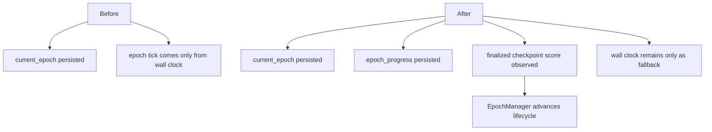
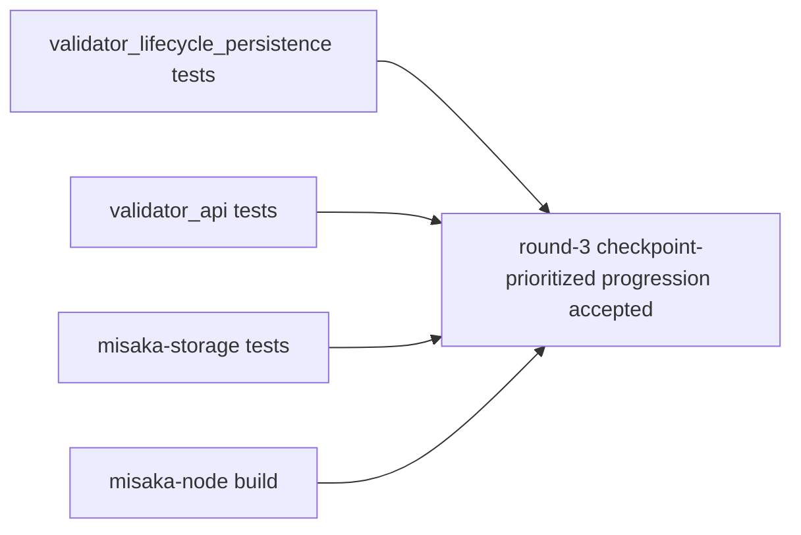

# Validator Lifecycle Checkpoint-Prioritized Epoch Progression

## Purpose

This note captures the round-3 validator lifecycle change on top of `v5.1`.

- Keep validator lifecycle persistence
- keep the existing fallback clock
- prefer finalized checkpoints once they exist
- avoid redefining `UnifiedZKP`, `CanonicalNullifier`, `GhostDAG`, or validator semantics

## Why This Change Was Needed

Before this round, validator lifecycle state was persisted, but epoch progression
was still driven only by `MISAKA_VALIDATOR_EPOCH_SECONDS`.

That was enough for a local operator loop, but it was still too far from
consensus-owned progression.

## What Changed

- The lifecycle snapshot now includes:
  - `checkpoints_in_epoch`
  - `last_finalized_checkpoint_score`
- `ValidatorEpochProgress` now decides whether the node should:
  - keep using the fallback clock
  - or switch to finalized-checkpoint-driven progression
- The node now watches `latest_checkpoint_finality`.
- Once finalized checkpoints are observed, epoch progression is advanced using
  the existing `misaka_consensus::epoch::EpochManager`.
- On startup, restored finality is replayed immediately so lifecycle progress
  does not wait for the periodic finality ticker after restart.
- The runtime recovery observation is also marked immediately from restored
  finality so the lifecycle view and recovery view start aligned.
- The replayed startup state is persisted immediately so restart recovery does
  not leave the snapshot one tick behind the in-memory lifecycle view.

## Files

- [crates/misaka-node/src/validator_lifecycle_persistence.rs](../../crates/misaka-node/src/validator_lifecycle_persistence.rs)
- [crates/misaka-node/src/validator_api.rs](../../crates/misaka-node/src/validator_api.rs)
- [crates/misaka-node/src/dag_rpc.rs](../../crates/misaka-node/src/dag_rpc.rs)
- [crates/misaka-node/src/main.rs](../../crates/misaka-node/src/main.rs)
- [crates/misaka-consensus/src/staking.rs](../../crates/misaka-consensus/src/staking.rs)

## Important Side Effect Fixed At The Same Time

The lifecycle snapshot path exposed a latent issue:

- `StakingRegistry` used a `HashMap<[u8; 20], ValidatorAccount>`
- direct `serde_json` persistence fails for non-string map keys

Round 3 fixed that by normalizing validator ids to hex at the JSON boundary.

## Validation

Confirmed in clean Docker:

- `cargo test -p misaka-node --bin misaka-node validator_lifecycle_persistence --features qdag_ct --quiet`
- `cargo test -p misaka-node --bin misaka-node validator_api --features qdag_ct --quiet`
- `cargo test -p misaka-storage --lib --quiet`
- `cargo build -p misaka-node --features qdag_ct --quiet`

## Current Boundary

This is still not full consensus-owned lifecycle closure.

It is one step closer:

- before: persisted state plus wall-clock only
- now: persisted state plus finalized-checkpoint-prioritized progression
- startup replay now applies restored finality immediately instead of waiting
  for the next ticker interval
- startup recovery observation is synchronized immediately from restored finality
- startup replay is persisted immediately so the snapshot matches the live view

The remaining closure is to connect validator lifecycle more directly to the
authoritative finality/epoch ownership once that layer is finalized on `v5.1`.
