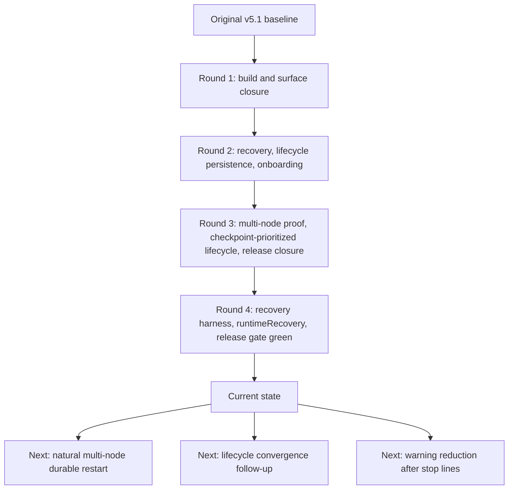
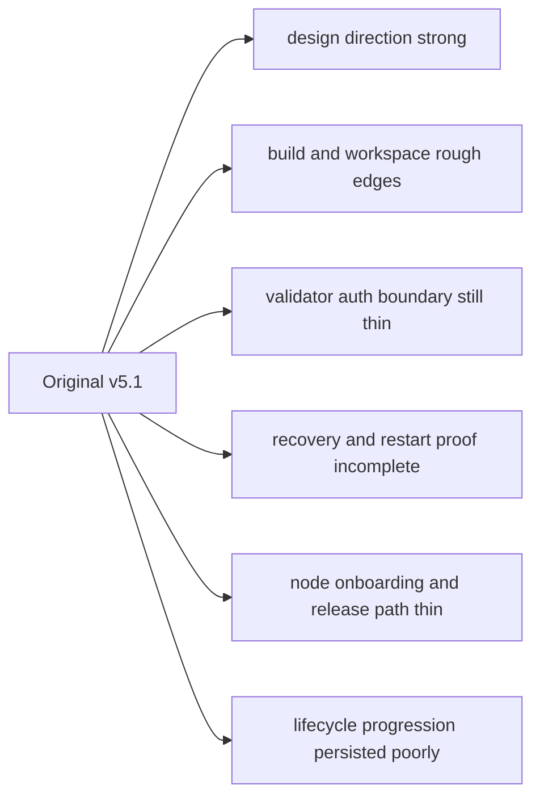
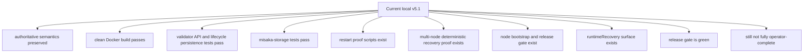
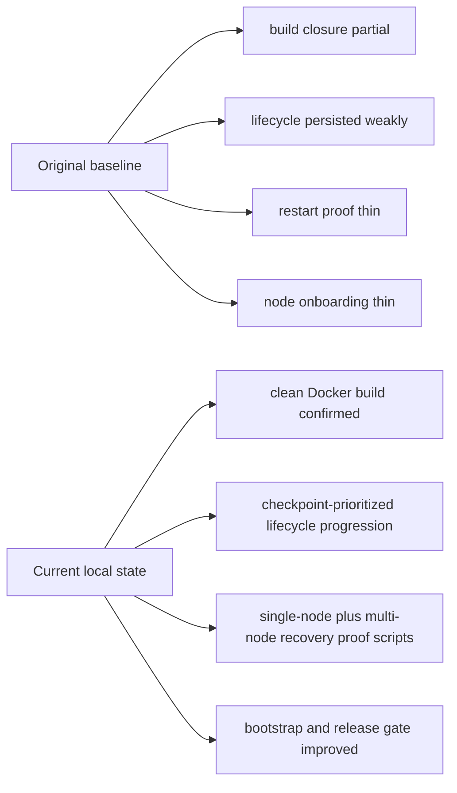
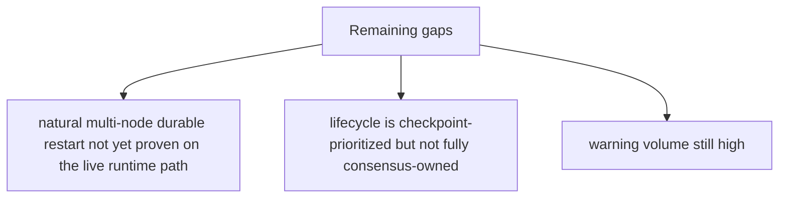

# MISAKA-CORE-v5.1 Progress From Original Baseline

## Purpose

This document answers two simple questions:

1. How far the current local `v5.1` line has advanced from the original `v5.1` baseline
2. What is intended to be advanced next

It is meant to be the easiest entry point for someone who does **not** want to
read every round report.

## One-Page Read

## What The Original `v5.1` Baseline Was

The original `v5.1` codebase already had the **authoritative semantics**:

- `UnifiedZKP`
- `CanonicalNullifier`
- `GhostDAG`
- validator lifecycle direction
- checkpoint / finality direction

But it was not yet operator-ready.

## How Far It Has Advanced

## Round 1

Round 1 mainly closed source-level blockers and surface inconsistencies.

- workspace / compile closure improved
- validator auth boundary became clearer
- RPC / relay / transport surface became more explicit
- `misaka-node` build reached green in clean Docker

Reference:
- [02_parallel_round_implementation_report.md](./02_parallel_round_implementation_report.md)

## Round 2

Round 2 moved the codebase toward operator readiness.

- recovery became more fail-closed
- lifecycle state started persisting to disk
- node Docker / Compose onboarding path was added

Reference:
- [05_parallel_round_two_implementation_report.md](./05_parallel_round_two_implementation_report.md)

## Round 3

Round 3 tightened the remaining operational seams without changing `v5.1` meaning.

- restart proof now has a separate multi-node proof path
- validator lifecycle progression is no longer wall-clock only
- node bootstrap and release gate became more operator-grade
- lifecycle snapshot persistence is now actually JSON-safe

Reference:
- [07_parallel_round_three_implementation_report.md](./07_parallel_round_three_implementation_report.md)
- [08_validator_lifecycle_checkpoint_epoch.md](./08_validator_lifecycle_checkpoint_epoch.md)
- [06_recovery_multinode_proof.md](./06_recovery_multinode_proof.md)

## Round 4

Round 4 kept the same semantics and tightened the operator-facing proof path.

- multi-node recovery proof became more operator-facing
- the release gate became closer to a true rehearsal
- DAG RPC gained `runtimeRecovery`
- the local line closed the obvious `multi_node_chaos` API drift
- the relayer release build now closes under `--locked`
- the strengthened release gate now passes end to end

Reference:
- [10_parallel_round_four_recovery_report.md](./10_parallel_round_four_recovery_report.md)
- [11_parallel_round_four_release_report.md](./11_parallel_round_four_release_report.md)
- [12_parallel_round_four_runtime_report.md](./12_parallel_round_four_runtime_report.md)
- [14_parallel_round_four_implementation_report.md](./14_parallel_round_four_implementation_report.md)
- [15_parallel_round_four_release_gate_green.md](./15_parallel_round_four_release_gate_green.md)

## Current State

In plain terms:

- The design side of `v5.1` is still the source of truth.
- The local line has now added meaningful operational stability on top of that.
- This is no longer just a design branch; it is now a partly proven operator branch.

## What Is Better Than The Original `v5.1`

Concrete improvements now present:

- `StakingRegistry` snapshot serialization no longer breaks on JSON map keys
- lifecycle snapshots persist both epoch and epoch progress
- finalized checkpoints can drive lifecycle progression
- recovery proof is split into single-node and multi-node paths
- node operators have a clearer `init / config / up / logs / down` flow
- release checks validate node Compose shape before shipping
- `runtimeRecovery` exposes restart and checkpoint evidence over DAG RPC
- release and recovery paths are closer to an operator rehearsal than to
  disconnected shell checks
- relayer release closure is part of the same rehearsal path
- `dag_release_gate.sh` now passes from bootstrap through relayer release build

## What Is Still Not Done

The code is meaningfully ahead of the original `v5.1`, but it is still not the
final stop line.

## What Will Be Advanced Next

The next work should stay narrow and should not redefine `v5.1` semantics.

### 1. Natural Multi-Node Durable Restart

Goal:

- move from proof scripts and read-only evidence surfaces
- to natural multi-node restart proof on the live runtime path

Meaning:

- this is the next true operator-grade stop line

### 2. Lifecycle Convergence, But Only After Finality Ownership Is Clearer

Goal:

- move validator lifecycle further from helper-driven behavior
- but only if it can be done without redefining checkpoint/finality semantics

Meaning:

- do not force semantics here
- only continue when the finality ownership line is explicit enough

### 3. Warning Reduction Last

Goal:

- reduce warning noise only after runtime and operator stop lines are closed

Meaning:

- warnings are real cleanup work
- but they are not ahead of restart proof and release rehearsal

## Execution Order

## Short Answer

The current local `v5.1` line is **materially ahead** of the original `v5.1`
baseline in operator stability.

The next work is **not** to invent new meaning.
It is to prove that the current `v5.1` meaning survives:

- natural restart
- multi-node operation
- release/onboarding flow

Once those stop lines are closed, cleanup work becomes worth doing.
