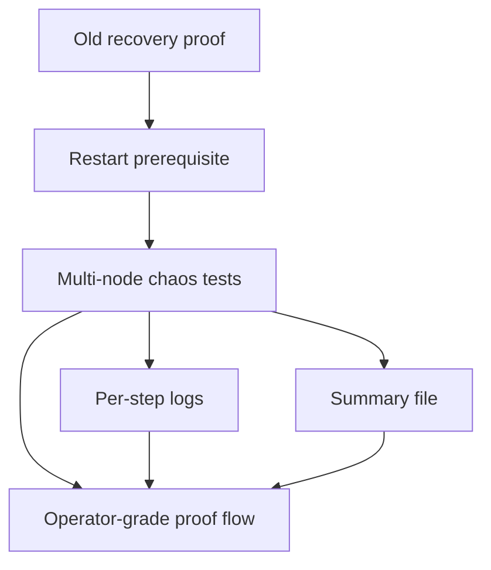

# Parallel Round 4 Recovery Report

This report captures the operator-facing multi-node restart proof for `v5.1`.
It keeps the existing DAG and validator semantics unchanged while making the
proof path more explicit and more operable.

## What Changed



- The multi-node recovery script now runs the single-node restart proof first.
- Each chaos case is run as a named step with its own log file.
- A summary file records repo metadata and step results.

## Why This Helps

- Operators can see whether the failure happened before or after restart.
- The restart prerequisite stays visible instead of being implied.
- The recovery proof is easier to rerun and audit without changing semantics.

## Where Logs Go

By default the harness writes to:

```text
.tmp/recovery-multinode-proof/
```

The directory contains:

- `summary.txt`
- `restart_proof.log`
- `same_order_convergence.log`
- `random_order_convergence.log`
- `crash_and_catchup.log`
- `wide_dag_convergence.log`

Set `MISAKA_RECOVERY_HARNESS_DIR` to override the location.

## How To Run

```bash
./scripts/recovery_multinode_proof.sh
```

The script first calls `./scripts/recovery_restart_proof.sh`, then runs the
deterministic `multi_node_chaos` cases in sequence.

It now fails early if the native `clang`/`stdbool.h` toolchain required by
`librocksdb-sys` is missing, so the operator gets a clearer preflight error
before the Rust tests start compiling.

## Scope

This is an operator proofing change only. It does not change GhostDAG,
checkpointing, ZKP semantics, validator identity, or relay meaning.
