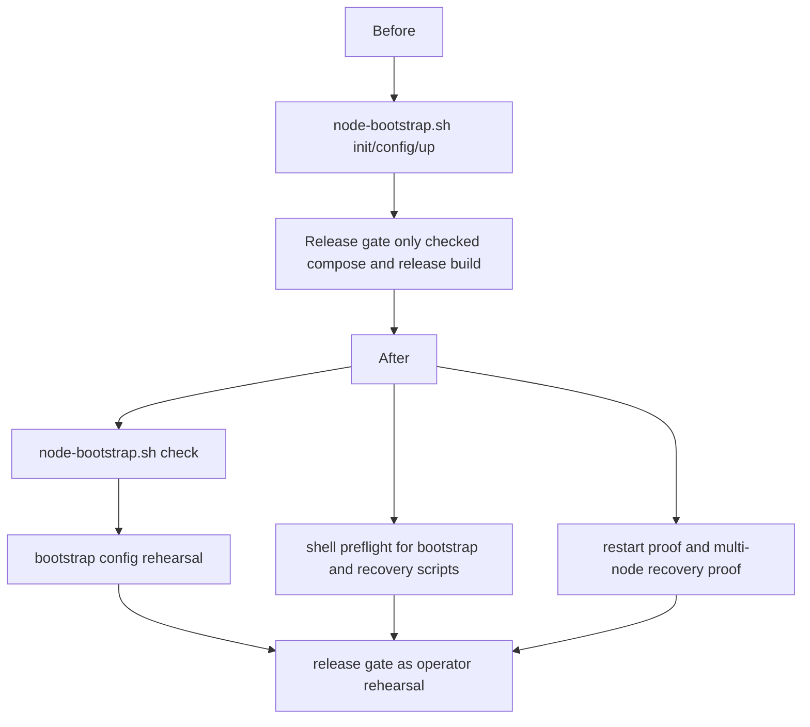

# Parallel Round 4 Release Rehearsal Report

This note captures the operator-gate strengthening for `v5.1`.
The change keeps `UnifiedZKP`, `GhostDAG`, and validator semantics unchanged,
while making the release path more rehearsal-like and less shell-ad-hoc.

## What Changed

- `scripts/node-bootstrap.sh` now has a `check` command.
- `check` validates that the chosen env file can still render a Compose plan.
- `scripts/dag_release_gate.sh` now performs shell preflight for the bootstrap,
  recovery, and entrypoint scripts before the release build.
- The release gate now rehearses the node bootstrap config with a temporary
  env file before running the restart and multi-node recovery proofs.
- `docs/node-bootstrap.md` now documents `check` as the earliest operator
  rehearsal step.

## Files Changed

- [scripts/node-bootstrap.sh](../../scripts/node-bootstrap.sh)
- [scripts/dag_release_gate.sh](../../scripts/dag_release_gate.sh)
- [docs/node-bootstrap.md](../node-bootstrap.md)
- [docs/review-20260323/README.md](./README.md)

## Validation

- `bash -n scripts/node-bootstrap.sh`
- `bash -n scripts/dag_release_gate.sh`
- `sh -n docker/node-entrypoint.sh`
- `scripts/node-bootstrap.sh check`
- `cargo build --manifest-path relayer/Cargo.toml --release --locked`
- `scripts/dag_release_gate.sh` now passes end to end, including:
  - bootstrap rehearsal
  - restart proof
  - multi-node recovery proof
  - node Compose validation
  - `misaka-node` release build
  - `misaka-relayer` release build

## Remaining Work

- Keep the operator docs aligned if the bootstrap or compose surface gains new
  flags later.
- Continue natural multi-node durable restart work without changing consensus
  meaning.
- Move from release-rehearsal closure to operator-grade restart and recovery
  closure on the live runtime path.

Reference:

- [15_parallel_round_four_release_gate_green.md](./15_parallel_round_four_release_gate_green.md)
