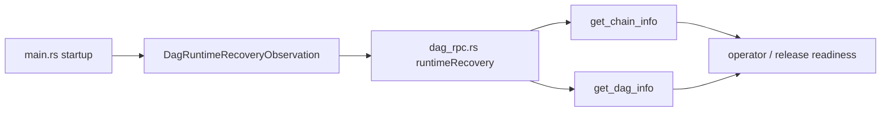
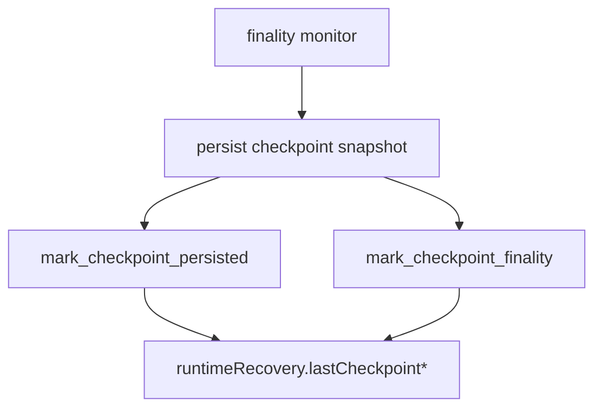
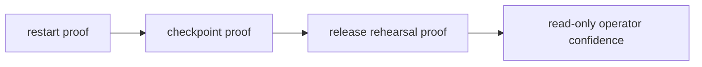

# Parallel Round 4 Runtime Report

## Scope

This report covers the runtime recovery / observation glue work for `MISAKA-CORE-v5.1`.

Only these files were modified:

- [`crates/misaka-node/src/main.rs`](../../crates/misaka-node/src/main.rs)
- [`crates/misaka-node/src/dag_rpc.rs`](../../crates/misaka-node/src/dag_rpc.rs)

The goal was to strengthen the read-only recovery surface that supports durable restart and release rehearsal, without changing the meaning of:

- `UnifiedZKP`
- `CanonicalNullifier`
- `GhostDAG`

The emphasis stayed on evidence surfaces for natural multi-node restart, not on consensus semantics changes.

## What Changed

### 1. Runtime recovery observation was added to DAG RPC

`dag_rpc.rs` now exposes a new read-only observation object:

- snapshot path
- validator lifecycle path
- WAL journal path
- WAL temp path
- whether startup snapshot restore happened
- startup WAL recovery state
- number of WAL-rolled-back blocks at startup
- last checkpoint persistence metadata
- last checkpoint finality metadata

This object is surfaced through `get_chain_info` and `get_dag_info` as `runtimeRecovery`.



### 2. Startup recovery state is now tracked explicitly

`main.rs` now records:

- whether a snapshot was restored at startup
- whether WAL recovery was fresh, recovered, or failed
- how many blocks were rolled back during WAL recovery

This is pushed into the shared runtime recovery observation as soon as startup state is known.

### 3. Checkpoint persistence / finality updates are wired into the observation

When the finality monitor persists a checkpoint snapshot, the observation is updated with:

- checkpoint blue score
- checkpoint block hash
- checkpoint persistence timestamp
- checkpoint finality blue score

That gives a read-only proof trail for:

- operator restart readiness
- release rehearsal readiness



### 4. Consumer surface expectations were aligned

`dag_rpc.rs` consumer-surface JSON test expectations were updated to match the current runtime output:

- `bridgeReadiness = waitCheckpoint` when no checkpoint exists yet
- `txStatusVocabulary` includes the full read-only vocabulary exposed by the node

## Why This Matters

This round is not a consensus change. It is an operational visibility change.

The runtime recovery surface now makes it easier to verify:

- a node restarted from a valid snapshot
- WAL recovery actually happened
- the latest checkpoint was persisted
- the finality checkpoint survived restart
- the node is suitable for an operator restart rehearsal
- the node is suitable for a release rehearsal

In other words:



## Validation

Confirmed with Docker-based validation using the repo root mounted into a Rust image.

Commands run:

```bash
docker run --rm -v .:/work -w /work rust:1.89-bookworm bash -lc '
  set -euo pipefail
  export PATH=/usr/local/cargo/bin:$PATH
  apt-get update >/tmp/apt.log && apt-get install -y clang libclang-dev build-essential cmake pkg-config >/tmp/apt.log
  export CARGO_TARGET_DIR=/tmp/misaka-target
  export BINDGEN_EXTRA_CLANG_ARGS="-isystem /usr/lib/gcc/x86_64-linux-gnu/12/include"
  cargo test -p misaka-node --bin misaka-node dag_rpc --features experimental_dag,qdag_ct --quiet
  cargo build -p misaka-node --features experimental_dag,qdag_ct --quiet
'
```

Observed result:

- `cargo test -p misaka-node --bin misaka-node dag_rpc --features experimental_dag,qdag_ct --quiet`
  - passed
- `cargo build -p misaka-node --features experimental_dag,qdag_ct --quiet`
  - passed

## Remaining Work

What remains is still aligned with the same direction:

- natural multi-node restart proof
- release rehearsal baselines for 2-node / 3-validator setups
- broader recovery / observation harnesses
- long-run load / soak verification

This round only strengthened the recovery evidence surface and the read-only runtime visibility.

## Files Changed

- [`crates/misaka-node/src/main.rs`](../../crates/misaka-node/src/main.rs)
- [`crates/misaka-node/src/dag_rpc.rs`](../../crates/misaka-node/src/dag_rpc.rs)

