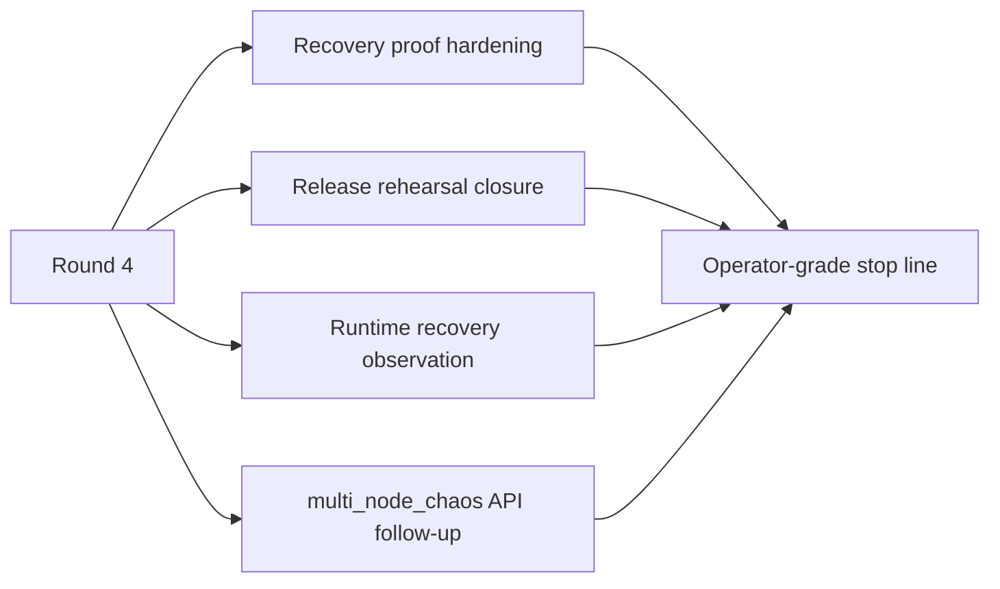
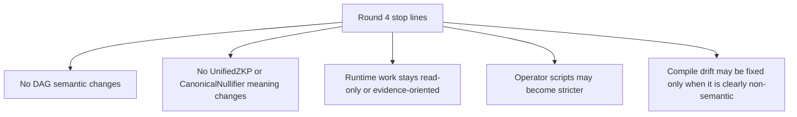
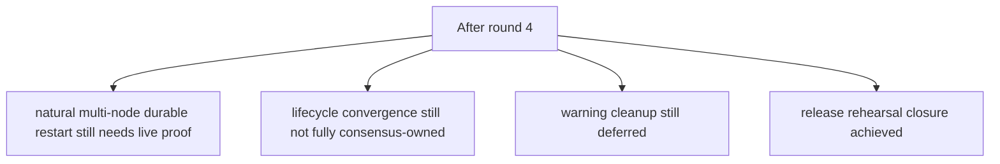

# MISAKA-CORE-v5.1 Parallel Round Four Status

## Purpose

This file tracks the fourth parallel implementation round on the authoritative
`v5.1` line.

- keep `UnifiedZKP / CanonicalNullifier / GhostDAG` meaning unchanged
- harden operator-facing durable restart proof
- strengthen full DAG release rehearsal
- expose runtime recovery evidence through DAG RPC
- close obvious API drift that blocks the rehearsal path

## Round Four Scope

## Current Read

- Round 3 already had restart proof scripts, bootstrap, and a release gate.
- The remaining gap was that the proof path was still split across scripts,
  shell checks, and runtime state with no single operator-facing evidence line.
- Round 4 closed the old `multi_node_chaos` API mismatch, relayer lockfile
  gap, and relayer manifest dependency closure.
- The strengthened release gate now passes end to end.

## Stop Lines

## Expected Outcome

- `recovery_multinode_proof.sh` behaves like an operator proof harness, not a
  bare test runner
- `dag_release_gate.sh` behaves more like a release rehearsal
- `node-bootstrap.sh check` becomes the earliest low-risk operator gate
- `runtimeRecovery` exposes restart / WAL / checkpoint evidence over DAG RPC
- `multi_node_chaos` no longer blocks the rehearsal path on obvious API drift
- relayer release build closes under `--locked`

## What Still Remains After Round 4

