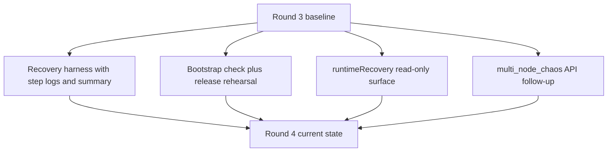
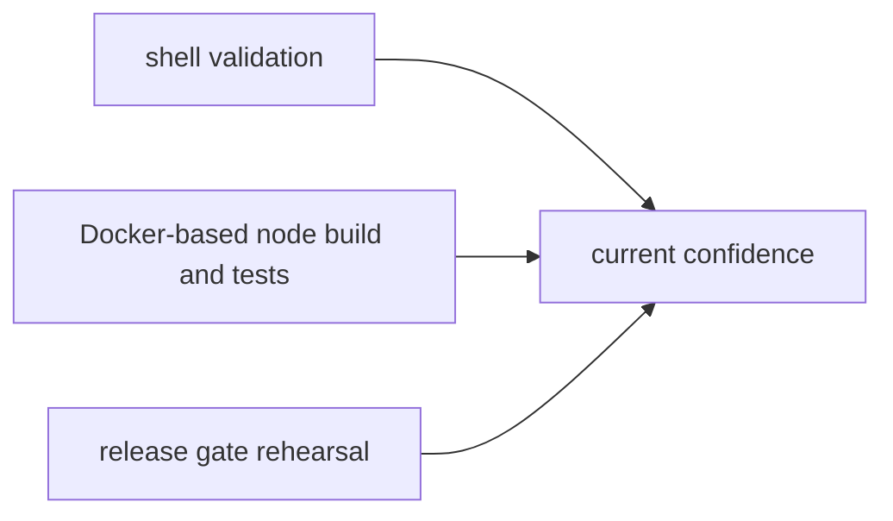
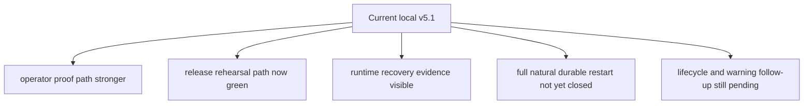

# MISAKA-CORE-v5.1 Parallel Round 4 実装レポート

## 要約

Round 4 では、`v5.1` の正本となる意味論を変えずに、次の 5 点を前に進めました。

- multi-node recovery proof を operator 向けに強化
- release gate を実運用に近い rehearsal に寄せた
- DAG RPC に read-only の `runtimeRecovery` 観測面を追加
- `multi_node_chaos` の obvious な API drift を local 側で止血
- relayer release build を強化済み release gate に合わせて閉じた

## 1ページ要約

## 実際に入ったもの

### 1. Recovery Harness 強化

対象:

- [scripts/recovery_multinode_proof.sh](../../scripts/recovery_multinode_proof.sh)
- [06_recovery_multinode_proof.md](./06_recovery_multinode_proof.md)
- [10_parallel_round_four_recovery_report.md](./10_parallel_round_four_recovery_report.md)

内容:

- restart proof を前提ステップとして明示
- chaos 各 step ごとに個別 log を保存
- `summary.txt` に pass/fail と failed step を記録
- native toolchain 不足を、RocksDB 深部の失敗ではなく preflight で出す

### 2. Release Rehearsal 強化

対象:

- [scripts/dag_release_gate.sh](../../scripts/dag_release_gate.sh)
- [scripts/node-bootstrap.sh](../../scripts/node-bootstrap.sh)
- [docs/node-bootstrap.md](../node-bootstrap.md)
- [11_parallel_round_four_release_report.md](./11_parallel_round_four_release_report.md)

内容:

- `node-bootstrap.sh` に `check` を追加
- release gate が次を一続きで実行するようになった
  - shell preflight
  - bootstrap rehearsal
  - restart proof
  - multi-node recovery proof
  - Compose validation
  - release build
- host に native C toolchain が無い場合は Docker fallback を使う

### 3. Runtime Recovery Observation

対象:

- [crates/misaka-node/src/main.rs](../../crates/misaka-node/src/main.rs)
- [crates/misaka-node/src/dag_rpc.rs](../../crates/misaka-node/src/dag_rpc.rs)
- [12_parallel_round_four_runtime_report.md](./12_parallel_round_four_runtime_report.md)

内容:

- DAG RPC に `runtimeRecovery` を追加
- snapshot restore、WAL recovery、rolled-back blocks、
  checkpoint persistence、checkpoint finality を read-only で見られる
- operator と release rehearsal の両方で使える証跡面になった

### 4. Local API Drift Follow-Up

対象:

- [crates/misaka-dag/tests/multi_node_chaos.rs](../../crates/misaka-dag/tests/multi_node_chaos.rs)

内容:

- `GhostDagEngine::try_calculate(...)` を `&snapshot` へ修正
- reachability 更新を `ReachabilityStore::add_child(...)` に追従

これは意味論の変更ではなく、release rehearsal path を obvious な test drift
で止めないための local fix です。

### 5. Relayer Release Closure

対象:

- [relayer/Cargo.toml](../../relayer/Cargo.toml)
- [relayer/Cargo.lock](../../relayer/Cargo.lock)
- [15_parallel_round_four_release_gate_green.md](./15_parallel_round_four_release_gate_green.md)

内容:

- relayer lockfile を追加し、`--locked` release build を通るようにした
- source 側ですでに使っていた依存を manifest に追加した
  - `base64`
  - `sha2`
  - `bs58`
  - `reqwest`
- 強化済み release gate が relayer release build まで閉じるようになった

## 検証の見取り図

確認したもの:

- `bash -n scripts/recovery_multinode_proof.sh`
- `bash -n scripts/dag_release_gate.sh`
- `bash -n scripts/node-bootstrap.sh`
- `scripts/node-bootstrap.sh check`
- `cargo build --manifest-path relayer/Cargo.toml --release --locked`

clean Docker で確認済み:

- `cargo test -p misaka-node --bin misaka-node dag_rpc --features experimental_dag,qdag_ct --quiet`
- `cargo build -p misaka-node --features experimental_dag,qdag_ct --quiet`

最終 rerun 後に確認できたこと:

- `scripts/dag_release_gate.sh` が end-to-end で通過
- restart proof、multi-node recovery proof、Compose validation、
  node release build、relayer release build が 1 本の rehearsal path で閉じた

## 現在地

## 次の実行順

1. `runtimeRecovery` を natural multi-node restart、2-node / 3-validator baseline に使う
2. scripted proof だけでなく、live runtime path で durable multi-node restart を閉じる
3. その stop line を閉じてから lifecycle convergence follow-up へ進む
4. warning 整理は最後
