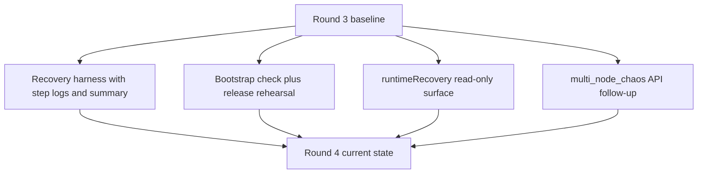
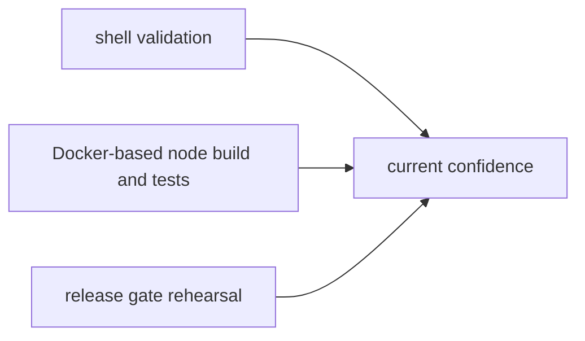
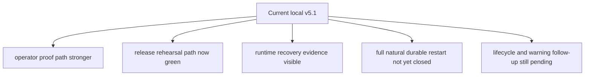

# MISAKA-CORE-v5.1 Parallel Round Four Implementation Report

## Summary

Round 4 advanced the `v5.1` line in four narrow ways without changing
authoritative semantics:

- durable multi-node recovery proof became more operator-facing
- the release gate moved closer to a real rehearsal
- DAG RPC gained a read-only `runtimeRecovery` evidence surface
- the obvious `multi_node_chaos` API drift was closed on the local line
- relayer release closure now matches the strengthened release gate

## One-Page Read

## What Landed

### 1. Recovery Harness Hardening

Files:

- [scripts/recovery_multinode_proof.sh](../../scripts/recovery_multinode_proof.sh)
- [06_recovery_multinode_proof.md](./06_recovery_multinode_proof.md)
- [10_parallel_round_four_recovery_report.md](./10_parallel_round_four_recovery_report.md)

What changed:

- restart proof is now an explicit prerequisite
- each chaos step gets its own log
- a `summary.txt` file records pass/fail and failed step
- missing native toolchain surfaces as a preflight error instead of a deeper
  RocksDB failure

### 2. Release Rehearsal Tightening

Files:

- [scripts/dag_release_gate.sh](../../scripts/dag_release_gate.sh)
- [scripts/node-bootstrap.sh](../../scripts/node-bootstrap.sh)
- [docs/node-bootstrap.md](../node-bootstrap.md)
- [11_parallel_round_four_release_report.md](./11_parallel_round_four_release_report.md)

What changed:

- `node-bootstrap.sh` now has `check`
- the release gate now runs shell preflight, bootstrap rehearsal, restart proof,
  multi-node recovery proof, Compose validation, and release builds
- the release gate falls back to Docker for cargo steps when the host lacks
  the native C toolchain

### 3. Runtime Recovery Observation

Files:

- [crates/misaka-node/src/main.rs](../../crates/misaka-node/src/main.rs)
- [crates/misaka-node/src/dag_rpc.rs](../../crates/misaka-node/src/dag_rpc.rs)
- [12_parallel_round_four_runtime_report.md](./12_parallel_round_four_runtime_report.md)

What changed:

- `runtimeRecovery` is now exposed through DAG RPC
- it records snapshot restore state, WAL recovery state, rolled-back blocks,
  checkpoint persistence, and checkpoint finality
- it gives operator and release rehearsal flows a read-only evidence surface

### 4. Local API Drift Follow-Up

File:

- [crates/misaka-dag/tests/multi_node_chaos.rs](../../crates/misaka-dag/tests/multi_node_chaos.rs)

What changed:

- `GhostDagEngine::try_calculate(...)` now uses `&snapshot` instead of the old
  deref form
- reachability update now uses `ReachabilityStore::add_child(...)` instead of
  the removed `add_block(...)`

This is a local non-semantic follow-up so the release-rehearsal path does not
stay blocked on obvious test API drift.

### 5. Relayer Release Closure

Files:

- [relayer/Cargo.toml](../../relayer/Cargo.toml)
- [relayer/Cargo.lock](../../relayer/Cargo.lock)
- [15_parallel_round_four_release_gate_green.md](./15_parallel_round_four_release_gate_green.md)

What changed:

- relayer lockfile is now present for `--locked` release builds
- relayer manifest now declares the crates already used by source:
  - `base64`
  - `sha2`
  - `bs58`
  - `reqwest`
- the strengthened release gate now closes all the way through relayer release
  build instead of stopping at release-closure drift

## Validation Snapshot

Confirmed in this round:

- `bash -n scripts/recovery_multinode_proof.sh`
- `bash -n scripts/dag_release_gate.sh`
- `bash -n scripts/node-bootstrap.sh`
- `scripts/node-bootstrap.sh check`
- `cargo build --manifest-path relayer/Cargo.toml --release --locked`

Confirmed by worker validation in clean Docker:

- `cargo test -p misaka-node --bin misaka-node dag_rpc --features experimental_dag,qdag_ct --quiet`
- `cargo build -p misaka-node --features experimental_dag,qdag_ct --quiet`

Confirmed after final rerun:

- `scripts/dag_release_gate.sh` passes end to end
- restart proof, multi-node recovery proof, Compose validation, node release
  build, and relayer release build all close in one rehearsal path

## Current Position

## Next Execution Order

1. Use `runtimeRecovery` in natural multi-node restart and 2-node / 3-validator
   operator baselines.
2. Close durable multi-node restart with live evidence, not only scripted proof.
3. Continue into lifecycle convergence follow-up only after that stop line.
4. Reduce warning noise last.
