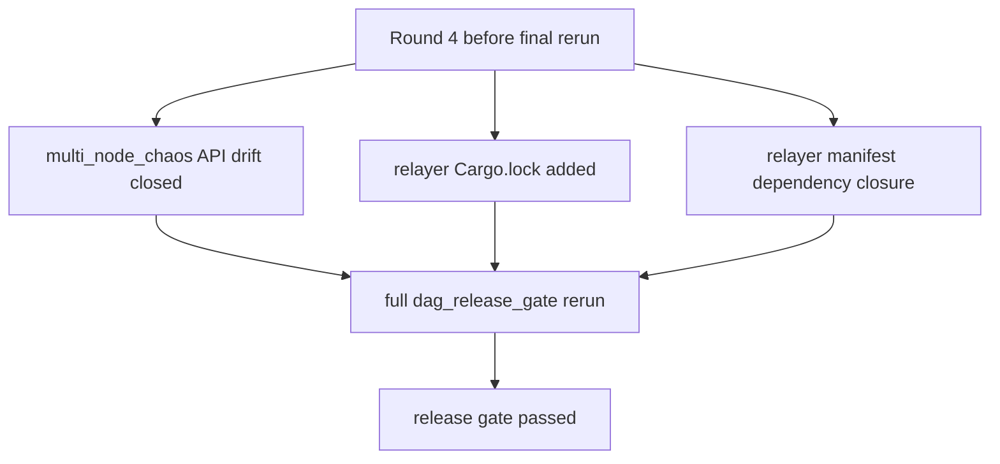
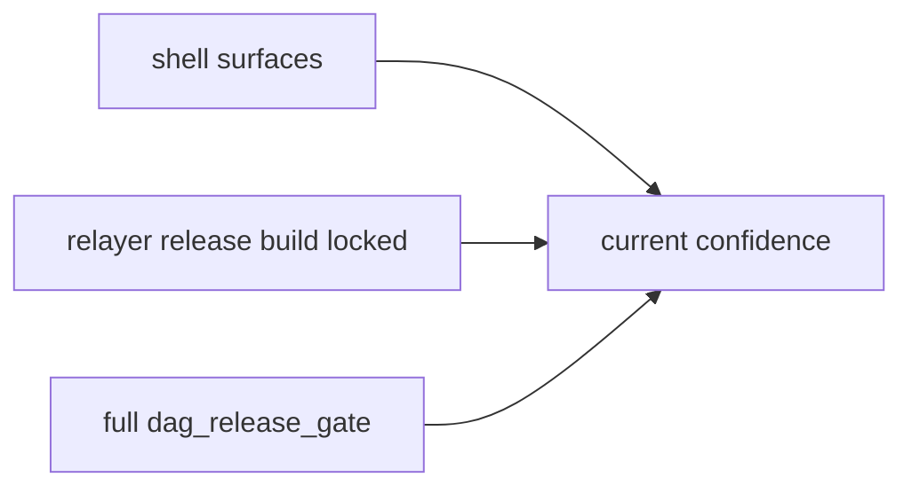
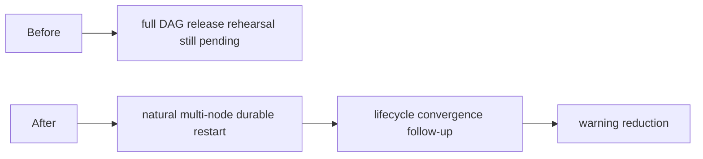

# Parallel Round 4 Release Gate Green 日本語版

## 目的

この文書は、最後に残っていた release-closure blocker を解消し、
強化済み `v5.1` release gate が clean に通るところまで到達した時点を記録するものです。

## 何が gate を閉じたか

- [crates/misaka-dag/tests/multi_node_chaos.rs](../../crates/misaka-dag/tests/multi_node_chaos.rs)
  を current DAG store / reachability API に合わせ、recovery proof が
  obvious な test drift で止まらないようにした
- [relayer/Cargo.lock](../../relayer/Cargo.lock) を生成し、
  relayer release build を `--locked` で回せるようにした
- [relayer/Cargo.toml](../../relayer/Cargo.toml) に、source 側ですでに使っていた依存を追加した
  - `base64`
  - `sha2`
  - `bs58`
  - `reqwest`

## 検証

確認したもの:

- `bash -n scripts/recovery_multinode_proof.sh`
- `bash -n scripts/dag_release_gate.sh`
- `bash -n scripts/node-bootstrap.sh`
- `scripts/node-bootstrap.sh check`
- `cargo build --manifest-path relayer/Cargo.toml --release --locked`
- `bash scripts/dag_release_gate.sh`

gate の中で end-to-end に確認できたもの:

- restart proof passed
- multi-node recovery proof passed
- node Docker Compose config validated
- `misaka-node` release build passed
- `misaka-relayer` release build passed
- 最後に `release gate passed` で終了

## この意味

これは **`v5.1` が完全に production-complete になった** という意味ではありません。  
ただし、少なくとも operator rehearsal path は次を 1 本の flow として通せる段階に来ています。

- bootstrap
- restart proof
- multi-node recovery proof
- compose validation
- release build

## 実行順への影響

次の primary stop line は release rehearsal closure ではなく、  
`natural multi-node durable restart` です。
