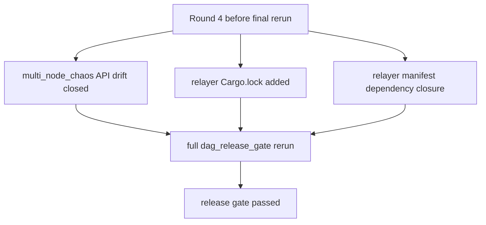
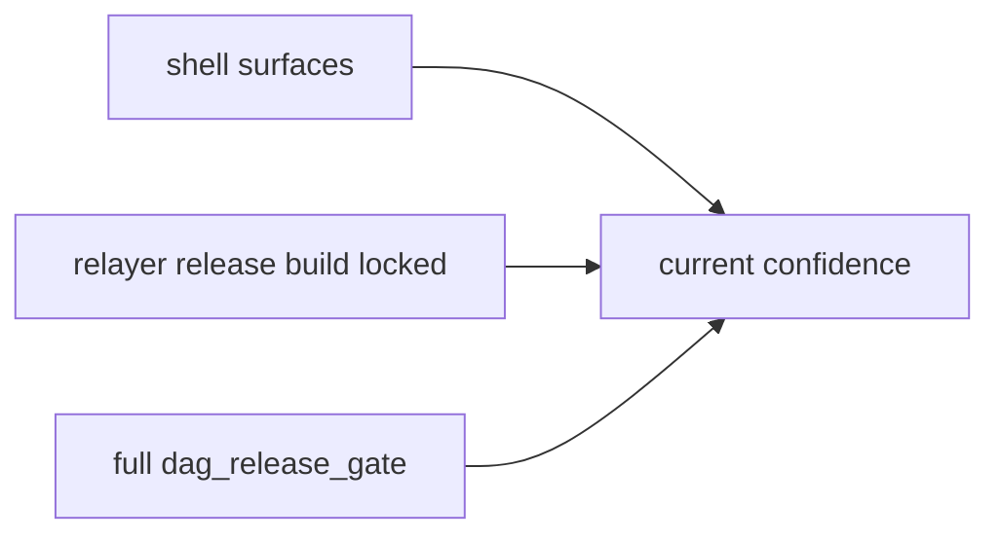
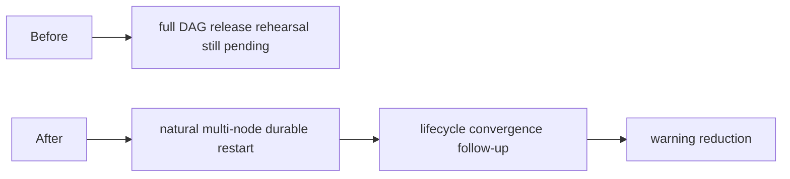

# Parallel Round 4 Release Gate Green

## Purpose

This note captures the point where the strengthened `v5.1` release gate
finished cleanly after the last release-closure blockers were removed.

## What Closed The Gate

- `crates/misaka-dag/tests/multi_node_chaos.rs` was aligned to the current DAG
  store / reachability API so the recovery proof no longer failed on obvious
  test drift.
- `relayer/Cargo.lock` was generated so the relayer release build could run
  under `--locked`.
- `relayer/Cargo.toml` was updated to declare the runtime crates already used
  by source:
  - `base64`
  - `sha2`
  - `bs58`
  - `reqwest`

## Validation

Confirmed:

- `bash -n scripts/recovery_multinode_proof.sh`
- `bash -n scripts/dag_release_gate.sh`
- `bash -n scripts/node-bootstrap.sh`
- `scripts/node-bootstrap.sh check`
- `cargo build --manifest-path relayer/Cargo.toml --release --locked`
- `bash scripts/dag_release_gate.sh`

Observed end-to-end inside the gate:

- restart proof passed
- multi-node recovery proof passed
- node Docker Compose config validated
- `misaka-node` release build passed
- `misaka-relayer` release build passed
- gate ended with `release gate passed`

## Meaning

This does **not** mean `v5.1` is fully production-complete.
It means the operator rehearsal path is now closed enough that:

- bootstrap
- restart proof
- multi-node recovery proof
- compose validation
- release builds

can be exercised as one release flow.

## What This Changes In The Execution Order

The next primary stop line is no longer release rehearsal closure.
It is now `natural multi-node durable restart`.
