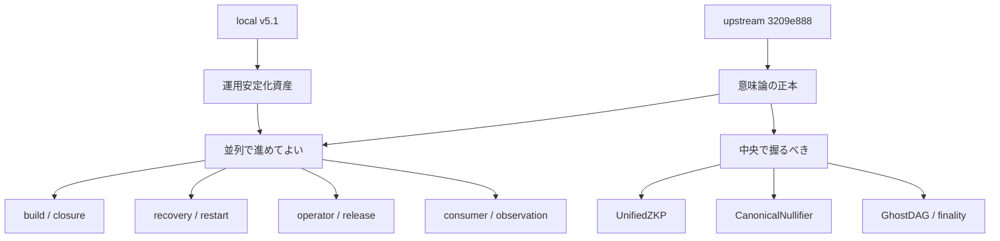
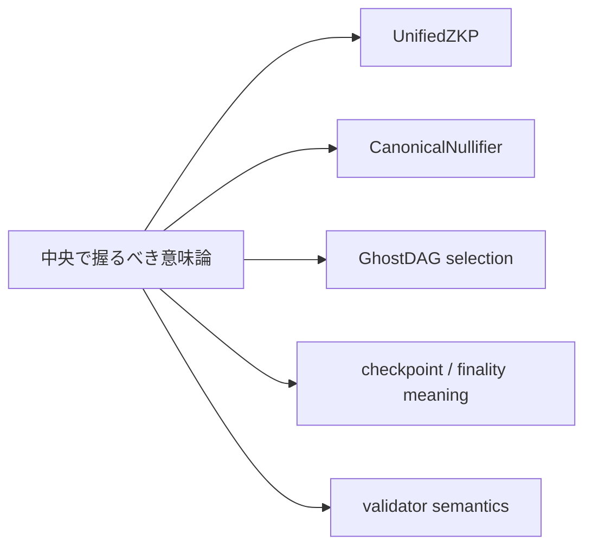
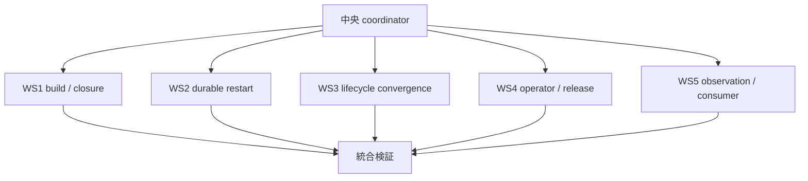
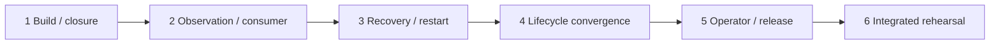
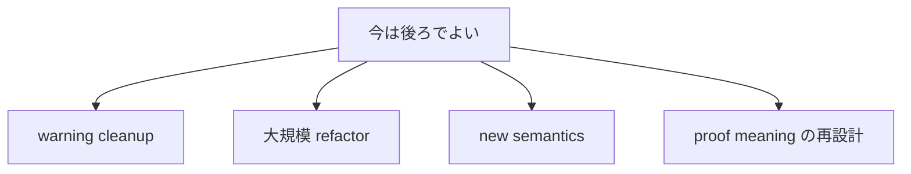

# MISAKA-CORE-v5.1 並列実装の再整理

## 目的

この文書は、最新 upstream `3209e888` の再確認後に、
`MISAKA-CORE-v5.1` を **どこまで並列で安全に進められるか** を
日本語で整理し直したものです。

見るべきことは次の 4 点です。

1. いまの正本は何か
2. 並列で進めてよい作業は何か
3. 並列にすると危ない作業は何か
4. 次の merge 順と stop line は何か

## 結論

結論は明確です。

- **意味論の正本は upstream**
- **運用安定化の資産は local**
- したがって、並列で進めるのは
  - build / closure
  - restart / recovery
  - operator / release / onboarding
  - 観測面 / consumer surface
  のような、意味論を壊しにくい層です

一方で、

- `UnifiedZKP`
- `CanonicalNullifier`
- `GhostDAG`
- checkpoint / finality / validator meaning

は、並列 worker が別々に意味を書き換えない方が安全です。

## 1ページ要約

## 現在地

いまの `v5.1` は、元の `v5.1` よりかなり進んでいます。

- `misaka-node` build は clean Docker で通る
- release gate は green
- relayer release build は local 側で閉じている
- recovery proof と runtime observation はある
- operator bootstrap の入口もある

ただし、まだ stop line は残っています。

- natural multi-node durable restart
- validator lifecycle convergence
- 長時間運用の確認
- warning / hygiene cleanup

## 並列で進めてよい workstream

### WS1 Build / Workspace Closure

目的:
- build を壊さずに進める基盤を維持する

対象:
- workspace manifest
- relayer closure
- lockfile / exclude / build script まわり

完了条件:
- clean Docker で `misaka-node`
- relayer release build
- release gate
  が継続して green

### WS2 Natural Multi-Node Durable Restart

目的:
- 2〜3 validator の自然起動系を stop line まで閉じる

対象:
- restart proof
- multi-node recovery proof
- WAL / snapshot / runtimeRecovery
- natural checkpoint / quorum / finality の再起動後継続

完了条件:
- stop
- restart
- checkpoint / relay / consumer surfaces の継続

### WS3 Validator Lifecycle Convergence

目的:
- validator lifecycle を helper 依存から減らし、
  checkpoint / finality と自然に噛み合うようにする

対象:
- lifecycle persistence
- epoch progression
- staking registry snapshot

完了条件:
- restart 後も lifecycle が継続
- multi-node の中でも progression が自然

### WS4 Operator / Release / Onboarding

目的:
- validator を運用する入口を固める

対象:
- Docker / Compose
- bootstrap script
- runbook
- release gate

完了条件:
- operator が Docker/Compose で起動できる
- runbook に沿って最低限の起動 / 復旧ができる

### WS5 Consumer / Observation Surface

目的:
- runtime / relay / validator 状態を観測可能に保つ

対象:
- `runtimeRecovery`
- `validatorAttestation`
- `relaySurfaces`
- consumer-facing JSON

完了条件:
- harness が結果を採取できる
- field の意味がぶれない

## 並列で進めてはいけない中心領域

ここは、別 worker が同時に勝手に変えない方が安全です。

理由:
- 一見 independent に見えても、
  `proof meaning`
  `spent semantics`
  `finality`
  `validator lifecycle`
  がすぐに衝突するためです。

## 今の推奨並列構成

この構成なら、

- 中央で意味論を保持しながら
- 周辺の stop line を並列に前進

できます。

## merge 順

理由:

- build が崩れていると他が信用できない
- observation が弱いと recovery の失敗原因が追えない
- restart が閉じないと onboarding を広げられない
- lifecycle は recovery の上で詰める方が安全
- operator / release は最後に runbook として閉じる

## いま並列で進めるべき具体項目

### 1. durable restart の live 実証

- natural 2-node / 3-validator restart
- checkpoint / finality / relay の復元確認
- `runtimeRecovery` の整合確認

### 2. lifecycle の multi-node 継続確認

- restart を跨いだ epoch progression
- snapshot 復元後の validator state
- checkpoint 依存の自然進行

### 3. operator onboarding の最終整備

- Docker/Compose 起動
- bootstrap 変数整理
- runbook の最終化

### 4. consumer surface の固定

- `runtimeRecovery`
- `validatorAttestation`
- `relaySurfaces`
- harness 出力 JSON

## 今は後ろでよいもの

今は stop line を閉じる方が優先です。

## 短い結論

いま並列で正しく進めるなら、

- **意味論は upstream に固定**
- **運用安定化は local asset を使って並列化**
- **durable restart / lifecycle / onboarding / observation を先に閉じる**

が最も筋が良いです。

つまり、並列化してよいのは
**「どう安定して動かすか」**
であって、
**「何を意味するか」**
は中央で握るべきです。
