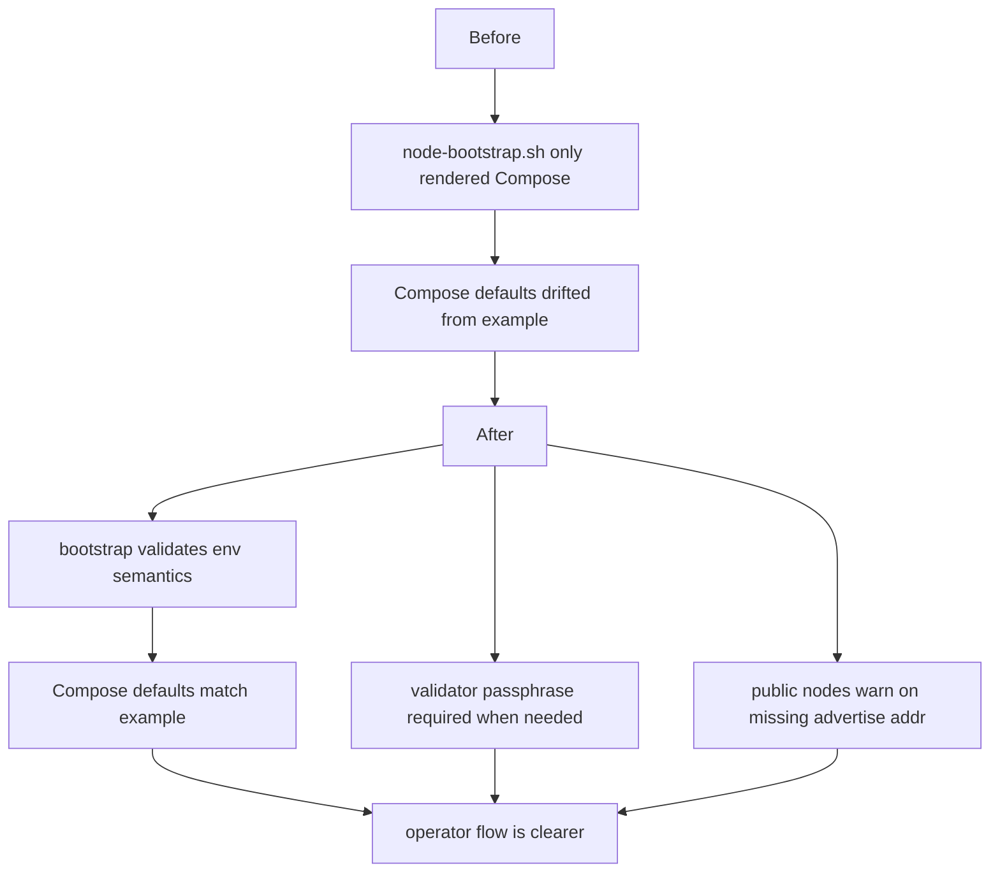
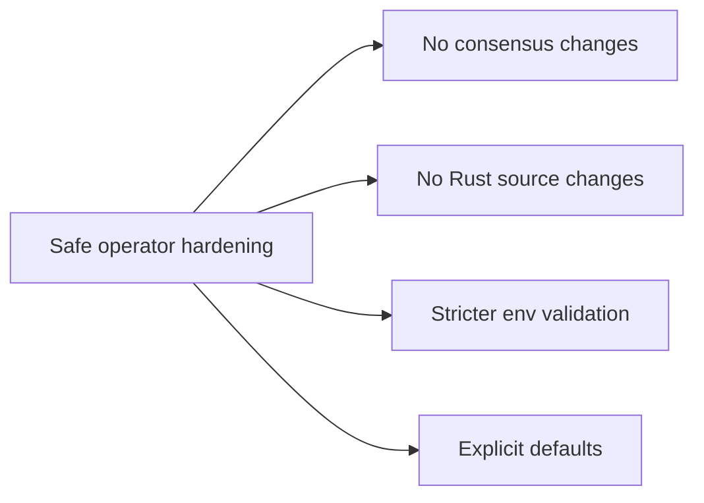

# Operator Onboarding Hardening

This note records the small, safe changes that make validator onboarding more
predictable without changing `v5.1` semantics.

## What Changed

- `scripts/node-bootstrap.sh`
  - validates `NODE_MODE`
  - validates numeric port and DAG settings
  - requires `MISAKA_VALIDATOR_PASSPHRASE` for validator mode
  - warns when a public or validator node has no `NODE_ADVERTISE_ADDR`
- `docker/node-compose.yml`
  - aligns `NODE_DAG_K`, inbound peers, and outbound peers with the example
  - keeps restart-friendly defaults explicit
- `scripts/node.env.example`
  - documents the validation rules
  - notes the Compose defaults alignment
- `docs/node-bootstrap.md`
  - explains the new preflight and warning behavior

## Why This Is Safe

- The node runtime flags are unchanged.
- The P2P and consensus semantics are unchanged.
- The changes only make invalid operator inputs fail earlier.

## Validation

- `bash -n scripts/node-bootstrap.sh`
- `docker compose --env-file scripts/node.env.example -f docker/node-compose.yml config`
- `scripts/node-bootstrap.sh check`

## Files Touched

- [scripts/node-bootstrap.sh](../../scripts/node-bootstrap.sh)
- [scripts/node.env.example](../../scripts/node.env.example)
- [docker/node-compose.yml](../../docker/node-compose.yml)
- [docs/node-bootstrap.md](../node-bootstrap.md)
- [docs/review-20260323/README.md](./README.md)
