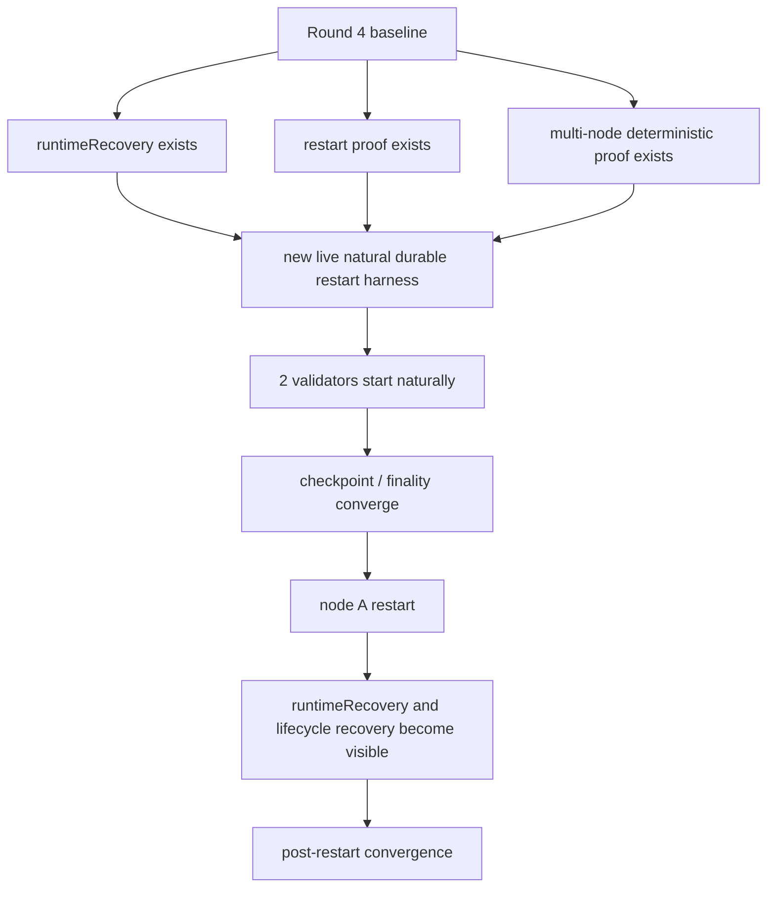
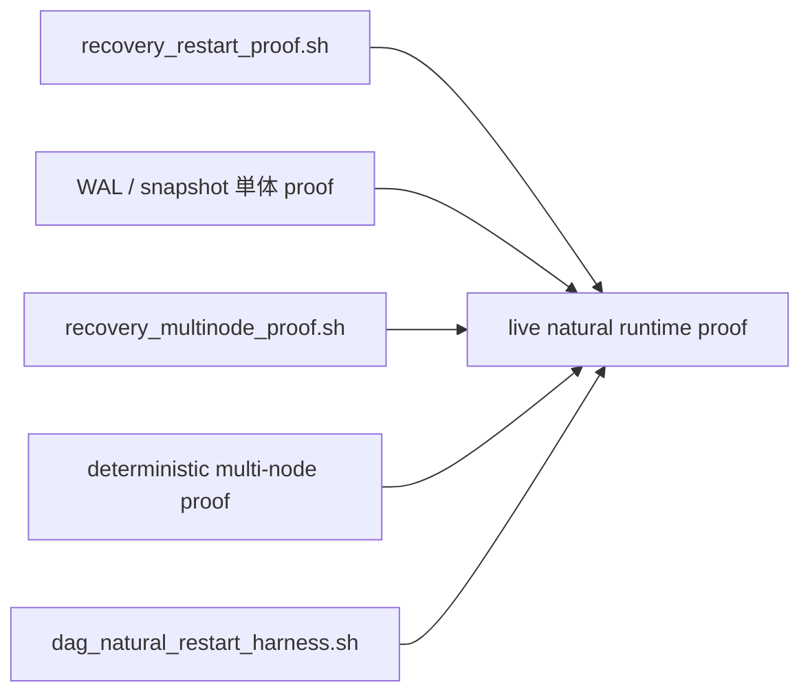
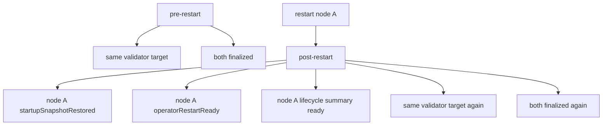

# MISAKA-CORE-v5.1 Parallel Round 5: Natural Durable Restart Harness

## 要約

Round 5 では、`natural multi-node durable restart` の stop line に直接つながる
live harness を追加しました。

今回やったことは、

- 2 validator の自然起動
- checkpoint / finality の自然収束確認
- 片側 validator の stop / restart
- 再起動後の `runtimeRecovery` / `validatorLifecycleRecovery`
- 再収束後の finality 確認
- lifecycle の finalized score replay を restart 向けに正規化

を 1 本の script で閉じたことです。

## 1ページ要約



## 追加したもの

対象:

- [scripts/dag_natural_restart_harness.sh](../../scripts/dag_natural_restart_harness.sh)

内容:

- `misaka-node` を 2 validator で自然起動
- `latestCheckpoint` と `currentCheckpointFinalized` を使って収束判定
- node A を同じ data dir のまま再起動
- 再起動後に
  - `runtimeRecovery.operatorRestartReady`
  - `runtimeRecovery.startupSnapshotRestored`
  - `validatorLifecycleRecovery.summary`
  を確認
- before / after の結果を `result.json` に保存

## harness の役割



つまり今回の harness は、

- unit / deterministic proof
- operator proof

の間をつなぐ **live runtime の stop line 用 script** です。

## 使い方

```bash
./scripts/dag_natural_restart_harness.sh
./scripts/dag_natural_restart_harness.sh status
./scripts/dag_natural_restart_harness.sh stop
```

主な env:

- `MISAKA_BIN`
- `MISAKA_SKIP_BUILD=1`
- `MISAKA_HARNESS_DIR`
- `MISAKA_CARGO_TARGET_DIR`
- `MISAKA_BLOCK_TIME_SECS`
- `MISAKA_DAG_CHECKPOINT_INTERVAL`
- `MISAKA_INITIAL_WAIT_ATTEMPTS`
- `MISAKA_RESTART_WAIT_ATTEMPTS`

## 判定するもの



## 現在地の意味

今回の追加で、`v5.1` は

- deterministic proof だけでなく
- live runtime の durable restart を閉じにいく入口

を持ちました。

さらに、validator lifecycle 側では restart 後に読み戻した finalized score 群を
順不同で replay しても、helper が正規化して安定に追従できるようにしています。
consensus meaning は変えず、recovery validation の見通しだけを上げる補強です。

まだこれだけで `public validator ready` ではありませんが、
少なくとも次の最重要 stop line に対して
**operator が実行できる検証 script** が入りました。

## 次の順番

1. この harness を実行して baseline を採る
2. 必要なら restart 後 divergence を切る
3. その次に `3 validators durable restart`
4. 最後に release / onboarding / long-run に戻る
