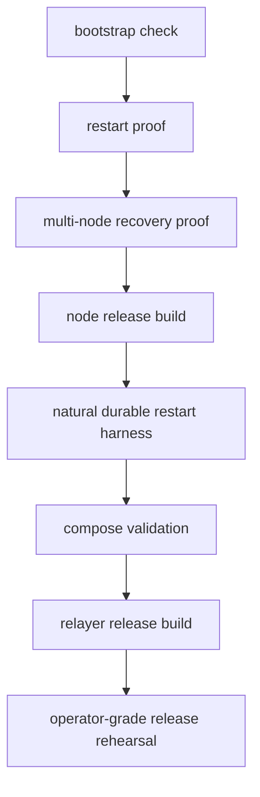
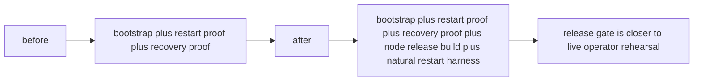
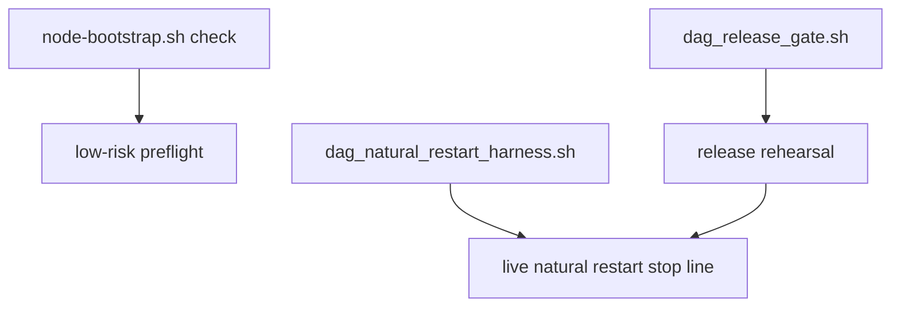
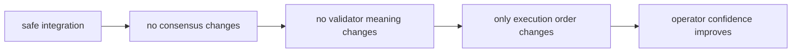
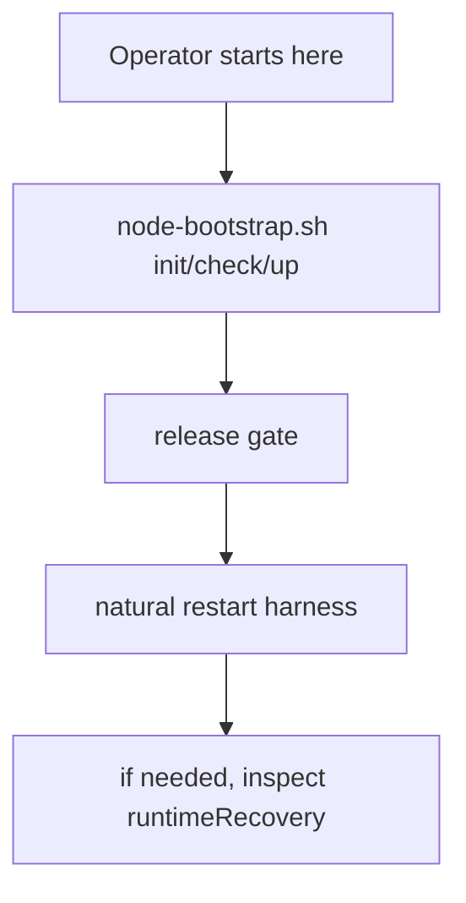

# Operator / Release Flow への natural restart harness 統合

## 目的

この文書は、`natural multi-node durable restart` の harness を
operator / release flow にどう安全に組み込むかをまとめたものです。

ここでのポイントは、

- `v5.1` の意味論は変えない
- ただし release rehearsal に live natural restart を足す
- operator が再起動と recovery を 1 本の流れで追えるようにする

ことです。

## 1ページ要約

## 何を追加したか

- `scripts/dag_release_gate.sh`
  - `scripts/dag_natural_restart_harness.sh` の shell preflight を追加
  - `restart proof` と `multi-node recovery proof` の後に live natural restart harness を追加
  - natural restart harness は node release binary を先に作ってから動かす
- `docs/node-bootstrap.md`
  - bootstrap rehearsal と live natural restart harness の役割を分けて説明
- `scripts/node-bootstrap.sh`
  - 既存の env preflight を維持
  - operator が誤った env を早めに検出できるようにしてある

## どういう位置づけか

- `node-bootstrap.sh check` は最初の低リスク rehearsal
- `dag_release_gate.sh` は release rehearsal
- `dag_natural_restart_harness.sh` は live natural restart stop line
- release gate では先に `misaka-node` release binary を作り、その成果物を harness に渡す

## 安全性

この統合は、意味論を変えずに「どこまで運用として閉じたか」を
release flow に持ち込むだけです。

## 検証

- `bash -n scripts/node-bootstrap.sh`
- `bash -n scripts/dag_release_gate.sh`
- `bash -n scripts/dag_natural_restart_harness.sh`
- `sh -n docker/node-entrypoint.sh`
- `docker compose --env-file scripts/node.env.example -f docker/node-compose.yml config`
- `scripts/node-bootstrap.sh check`

## 次の使い方

- 起動確認は `node-bootstrap.sh`
- release rehearsal は `dag_release_gate.sh`
- natural durable restart の stop line は `dag_natural_restart_harness.sh`
