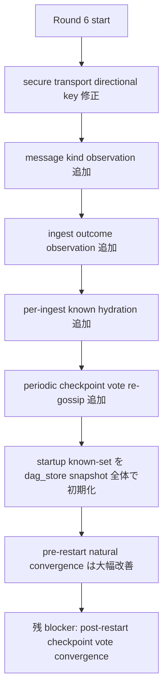
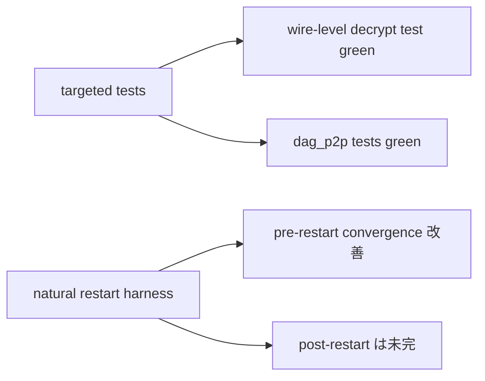
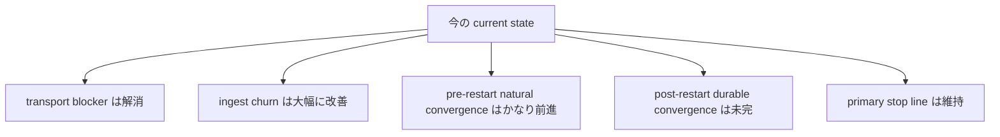
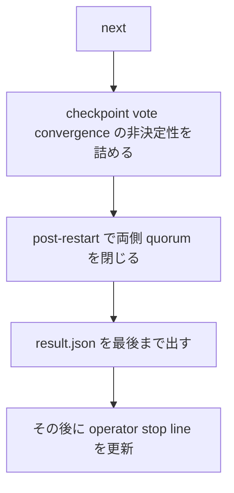

# Round 6: Natural Restart Closure の再切り分け

## 目的

この round の目的は、`natural multi-node durable restart` の残 blocker を
**transport / ingest / attestation / restart** のどこにあるか切り分けることでした。

結論として、問題はかなり絞れています。

- もともとの root cause は `DAG P2P first-frame decrypt` の不整合だった
- その後の本体は `ingestion known set` と `checkpoint vote convergence` だった
- 現在は **natural restart の最終閉鎖だけが未完** です

## 1ページ要約

## 実装したもの

### 1. Secure transport の directional key 修正

対象:
- `crates/misaka-p2p/src/secure_transport.rs`

内容:
- `send_key / recv_key` の導出を v4 側の正しい形に合わせた
- `initiator.send == responder.recv` になるように修正した

意味:
- これで `DAG P2P first frame decrypt failed` は解消した

### 2. DAG P2P の message kind 観測を追加

対象:
- `crates/misaka-node/src/dag_p2p_surface.rs`

内容:
- `last_message_kind`
- `by_message_kind`

を追加して、`GetBlockLocator / NewDagBlock / GetDagBlocks / DagBlockData` の
偏りを JSON から見えるようにした。

### 3. Ingest outcome 観測を追加

対象:
- `crates/misaka-node/src/dag_p2p_surface.rs`
- `crates/misaka-node/src/dag_p2p_network.rs`

内容:
- `ingest_attempts`
- `ingest_accepted`
- `ingest_rejected`
- `ingest_fetch_parents`
- `ingest_timed_out`
- `ingest_errors`
- `last_ingest_reject_reason`

を追加した。

意味:
- block を受けていないのか
- 受けたが `FetchParents` に落ちているのか
- duplicate / insert error なのか

を live JSON だけで切れるようになった。

### 4. Per-ingest known hydration を追加

対象:
- `crates/misaka-node/src/dag_p2p_network.rs`

内容:
- `dag_store` に既にある block は ingest を skip
- 親 block が `dag_store` にある場合は ingest 前に `known` へ注入

意味:
- `already in DAG store` な block/parent を
  `FetchParents` や duplicate insert error に落とし続ける経路を弱めた

### 5. Periodic checkpoint vote re-gossip を追加

対象:
- `crates/misaka-node/src/main.rs`

内容:
- local current checkpoint vote を 10 秒ごとに再送する task を追加

意味:
- peer が後から同じ checkpoint target に追いついた場合でも
  quorum を閉じる余地を作った

### 6. Startup known-set 初期化を `genesis only` から拡張

対象:
- `crates/misaka-node/src/main.rs`

内容:
- `IngestionPipeline::new()` を
  `dag_store.snapshot().all_hashes()` ベースへ変更

意味:
- restart 後に `dag_store` にはある block を
  pipeline が知らず、remote から取り直して churn する問題を抑える

## 検証で確認できたこと

### 1. Targeted DAG P2P tests

確認済み:
- `cargo test -p misaka-node --bin misaka-node test_tcp_handshake_allows_first_dag_frame_roundtrip --features qdag_ct --quiet`
- `cargo test -p misaka-node --bin misaka-node dag_p2p --features qdag_ct --quiet`
- `cargo build -p misaka-node --features qdag_ct --quiet`

### 2. Natural restart harness の改善

対象:
- `scripts/dag_natural_restart_harness.sh`

観測された改善:

- 初期状態では `total_messages = 0` だった段階から脱出
- その後 `message kind` と `ingest outcome` を見える化
- `node-a` 側の `fetch_parents / duplicate error churn` を特定
- さらに修正後、**pre-restart では natural convergence が通る run が出た**

代表例:
- pre-restart:
  - `node-a.latestCheckpoint = 46`
  - `node-b.latestCheckpoint = 46`
  - `voteCount = 2`
  - `quorumReached = true`
- その状態で restart 後はまだ timeout

### 3. 現在の残り方

最新 run では、pre-restart で

- `node-a.latestCheckpoint = 70`
- `node-b.latestCheckpoint = 70`

まで揃う一方、

- `node-a.voteCount = 2 / quorum = true`
- `node-b.voteCount = 1 / quorum = false`

という **片側 quorum 未成立** が残った。

つまり現在の問題は、

- relay が死んでいる
- block が届いていない
- first-frame が decrypt できない

ではなく、

**checkpoint vote が両側で確実に閉じるところまで、まだ deterministic に詰め切れていない**

という段階です。

## 現在の判断

平たく言うと、

- `natural multi-node durable restart` は **まだ未完**
- ただし、未知の黒箱ではなくなった
- 残りは `checkpoint vote / finality convergence after restart` の閉鎖にかなり絞れている

という状態です。

## 次にやること

次の具体項目:

1. `node-a / node-b` の `voteCount` 非対称がどこで起きるかを切る  
2. post-restart でも `voteCount=2 / quorum=true / finality visible` を両側で閉じる  
3. `dag_natural_restart_harness.sh` を最後まで green にする  
4. そこで初めて `natural multi-node durable restart` を primary stop line から外す
