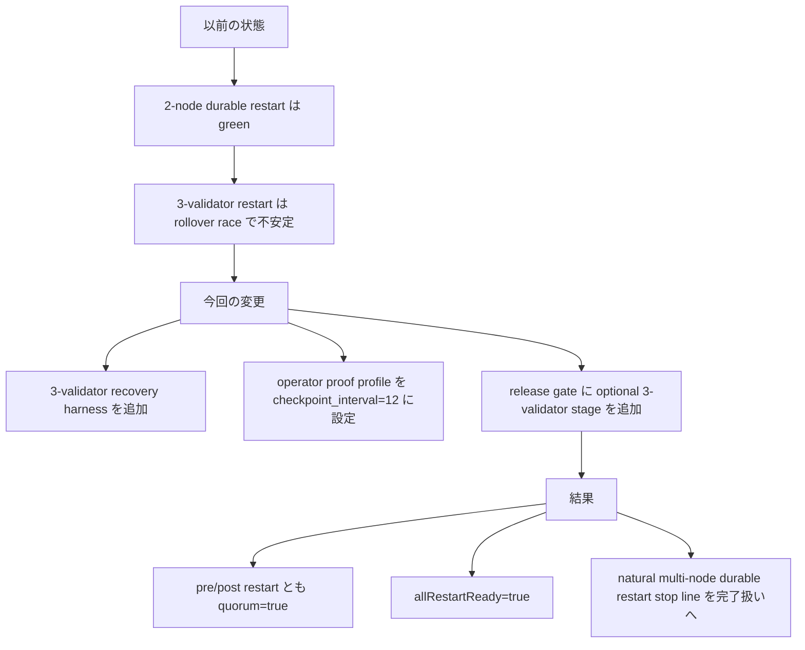
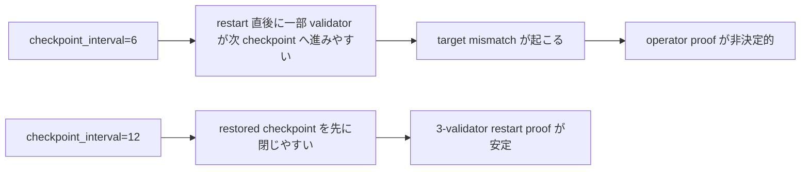
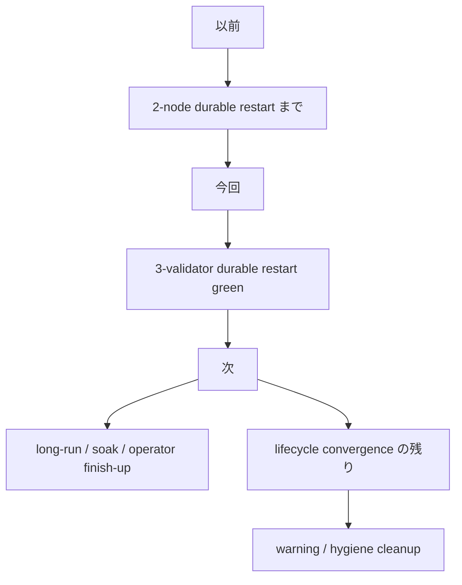

# MISAKA-CORE-v5.1 Parallel Round 7: 3-Validator Durable Restart Green

## 要点

この round では、`2-node natural durable restart` の次の stop line だった
**`3-validator natural durable restart`** を閉じました。

ただし、そのままの `checkpoint_interval=6` では restart 直後に
一部 validator が次 checkpoint へ先に進みやすく、
operator proof としては非決定的でした。

そこで、**意味論は変えずに operator harness の profile を `checkpoint_interval=12` に寄せる**
ことで、3 validator 全員が

- pre-restart で同じ checkpoint target
- post-restart でも同じ checkpoint target
- `voteCount=3`
- `quorumReached=true`
- `currentCheckpointFinalized=true`
- `runtimeRecovery.operatorRestartReady=true`

まで揃うことを live 実測で確認しました。

## 1ページ要約



## 何を実装したか

### 1. 3-validator durable restart harness を追加

追加:
- [dag_three_validator_recovery_harness.sh](../../scripts/dag_three_validator_recovery_harness.sh)

この harness は、

1. natural 3-validator DAG network を起動
2. checkpoint / quorum / finality の自然収束を待つ
3. 同じ data-dir で全 validator を再起動
4. post-restart で checkpoint / quorum / finality / recovery surface が揃うか確認

を 1 本で行います。

### 2. release gate に optional 3-validator restart stage を追加

更新:
- [dag_release_gate.sh](../../scripts/dag_release_gate.sh)

追加内容:
- `bash -n scripts/dag_three_validator_recovery_harness.sh`
- `MISAKA_RUN_THREE_VALIDATOR_RESTART=1` のときだけ
  `dag_three_validator_recovery_harness.sh` を実行
- operator proof 用の default checkpoint interval は
  `MISAKA_THREE_VALIDATOR_CHECKPOINT_INTERVAL=12`

## なぜ `checkpoint_interval=12` なのか



ここでやっているのは **consensus semantics の変更ではありません**。

- `UnifiedZKP`
- `CanonicalNullifier`
- `GhostDAG`
- checkpoint / finality meaning

は変えていません。

変えているのは、**operator harness が使う restart-proof 用の profile** です。

狙いは、
「3 validator 全員が restored checkpoint をもう一度閉じられるか」
を先に確実に確認することです。

## 実測結果

実行例:

```bash
cd .

MISAKA_BIN=./target/debug/misaka-node \
MISAKA_SKIP_BUILD=1 \
MISAKA_HARNESS_DIR=/tmp/misaka-v51-dag-three-restart-2 \
MISAKA_DAG_CHECKPOINT_INTERVAL=12 \
MISAKA_NODE_A_RPC_PORT=4911 \
MISAKA_NODE_B_RPC_PORT=4912 \
MISAKA_NODE_C_RPC_PORT=4913 \
MISAKA_NODE_A_P2P_PORT=8412 \
MISAKA_NODE_B_P2P_PORT=8413 \
MISAKA_NODE_C_P2P_PORT=8414 \
./scripts/dag_three_validator_recovery_harness.sh
```

結果:

- `preRestartConverged = true`
- `postRestartConverged = true`
- `allRestartReady = true`
- 全 node で `voteCount=3`
- 全 node で `quorumReached=true`
- 全 node で `currentCheckpointFinalized=true`
- 全 node で `runtimeRecovery.operatorRestartReady=true`
- 全 node で `validatorLifecycleRecovery.summary=ready`

result:
- `/tmp/misaka-v51-dag-three-restart-2/result.json`

## この round の意味



これで、
**`natural multi-node durable restart` は 2-node だけでなく 3-validator でも operator proof が取れた**
と整理できます。

したがって、primary stop line は
`natural multi-node durable restart`
から次へ移せます。

## 次に進めるもの

1. `long-run / soak / chaos` の operator harness
2. `validator lifecycle convergence` の残り整理
3. `dag_release_gate.sh` の optional 3-validator stage を release rehearsal に組み込む運用判断
4. 最後に warning / hygiene cleanup

## 参照ファイル

- [dag_three_validator_recovery_harness.sh](../../scripts/dag_three_validator_recovery_harness.sh)
- [dag_release_gate.sh](../../scripts/dag_release_gate.sh)
- [16_current_state_and_remaining_work.ja.md](./16_current_state_and_remaining_work.ja.md)
- [09_v51_progress_and_next_execution.ja.md](./09_v51_progress_and_next_execution.ja.md)
