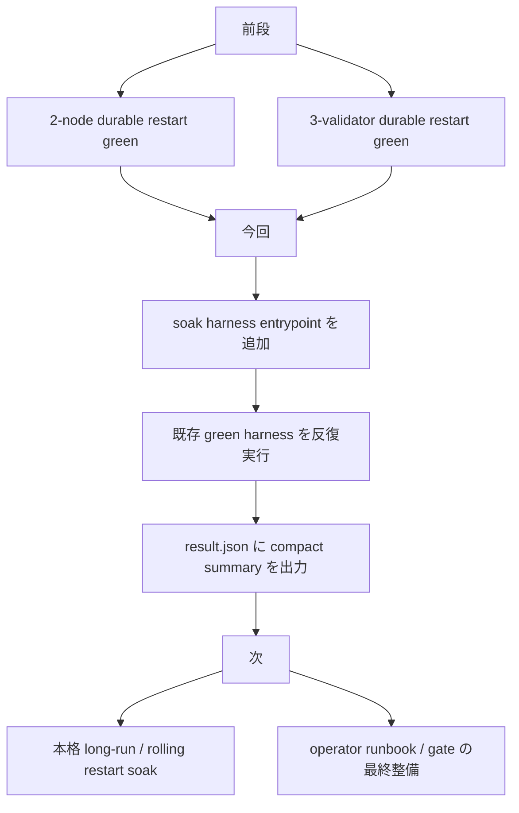
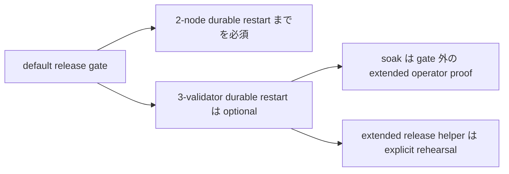
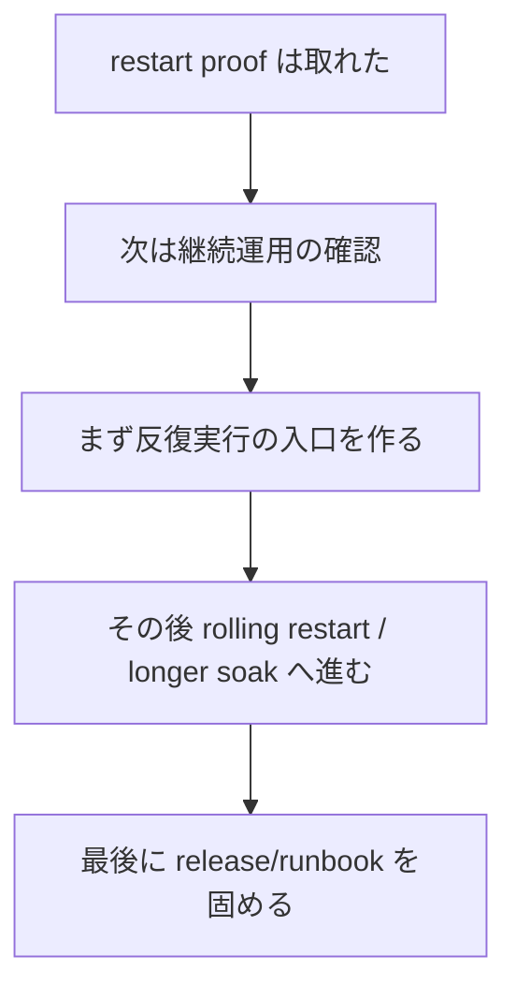

# MISAKA-CORE-v5.1 Parallel Round 8: Soak Entrypoint Added

## 要点

この round では、`natural durable restart` の次の stop line である
**`long-run / soak / operator finish-up`** に進むための入口を追加しました。

追加したのは、
- [dag_soak_harness.sh](../../scripts/dag_soak_harness.sh)

です。

この script は、既に green を取っている

- [dag_natural_restart_harness.sh](../../scripts/dag_natural_restart_harness.sh)
- [dag_three_validator_recovery_harness.sh](../../scripts/dag_three_validator_recovery_harness.sh)

を複数回まわし、operator 向けに compact な `result.json` を残します。

## 1ページ要約



## 何を追加したか

### 1. `dag_soak_harness.sh`

追加:
- [dag_soak_harness.sh](../../scripts/dag_soak_harness.sh)

役割:
- 2-validator durable restart harness を反復
- 必要なら 3-validator durable restart harness も反復
- 反復結果を operator 向け summary に落とす

主な env:
- `MISAKA_SOAK_ITERATIONS`
- `MISAKA_SOAK_RUN_THREE_VALIDATOR`
- `MISAKA_SOAK_RUN_ROLLING_RESTART`
- `MISAKA_SOAK_PROFILE=default|extended`
- `MISAKA_SOAK_BASE_RPC_PORT`
- `MISAKA_SOAK_BASE_P2P_PORT`
- `MISAKA_THREE_VALIDATOR_CHECKPOINT_INTERVAL`
- `MISAKA_ROLLING_RESTART_CYCLES`

### 2. 現時点での verify

確認したもの:

- `bash -n scripts/dag_soak_harness.sh`
- `./scripts/dag_soak_harness.sh --help`
- smoke:

```bash
cd .

MISAKA_BIN=./target/debug/misaka-node \
MISAKA_SKIP_BUILD=1 \
MISAKA_HARNESS_DIR=/tmp/misaka-v51-soak-smoke \
MISAKA_SOAK_ITERATIONS=1 \
MISAKA_SOAK_RUN_THREE_VALIDATOR=0 \
MISAKA_SOAK_BASE_RPC_PORT=5111 \
MISAKA_SOAK_BASE_P2P_PORT=8612 \
./scripts/dag_soak_harness.sh
```

結果:
- `allPassed = true`
- `entryCount = 1`
- `preRestartConverged = true`
- `postRestartConverged = true`
- `restartReady = true`
- `lifecycleSummary = "ready"`

result:
- [/tmp/misaka-v51-soak-smoke/result.json](/tmp/misaka-v51-soak-smoke/result.json)

## operator runbook の最小入口

```bash
# 軽い baseline
./scripts/dag_soak_harness.sh

# 明示的に長めの operator proof
./scripts/dag_soak_harness.sh extended

# release rehearsal で optional 3-validator stage も含めたい場合
./scripts/dag_release_gate_extended.sh
```

期待する見え方:

- `dag_soak_harness.sh` は `result.json` を残す
- `extended` は default より重い反復を使う
- `dag_release_gate_extended.sh` は default gate を変えずに
  optional 3-validator stage を明示的に有効化する

## release gate との関係



今の判断は次です。

- `dag_release_gate.sh` の default は重くしすぎない
- `3-validator durable restart` は optional stage にとどめる
- `soak` は nightly / extended operator proof として進める
- `dag_release_gate_extended.sh` は、default gate を変えずに
  optional stage を intentional に回す入口として使う

この整理が一番安全です。

## なぜこの順番なのか



ここで先にやるべきなのは、
新しい意味論ではなく
**既存の green path を何度回しても壊れないことを確認できる入口**
を作ることです。

## 次に進めるもの

1. `3-validator` を含む soak の live 実行
2. rolling restart 寄りの soak profile
3. `extended soak` と `extended release rehearsal` の運用手順固定
4. その後に warning / hygiene cleanup

## 参照

- [23_parallel_round_seven_three_validator_restart_green.ja.md](./23_parallel_round_seven_three_validator_restart_green.ja.md)
- [25_parallel_round_nine_rolling_restart_soak_green.ja.md](./25_parallel_round_nine_rolling_restart_soak_green.ja.md)
- [26_parallel_round_ten_extended_release_rehearsal.ja.md](./26_parallel_round_ten_extended_release_rehearsal.ja.md)
- [16_current_state_and_remaining_work.ja.md](./16_current_state_and_remaining_work.ja.md)
- [09_v51_progress_and_next_execution.ja.md](./09_v51_progress_and_next_execution.ja.md)
