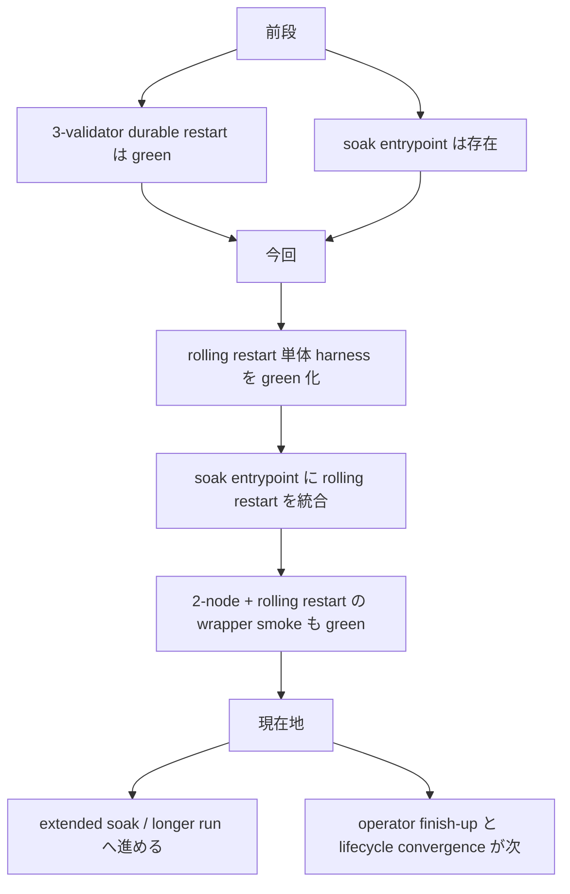
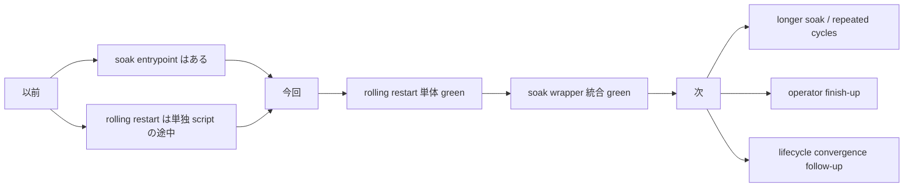

# MISAKA-CORE-v5.1 Parallel Round 9: Rolling Restart Soak Green

## 要点

この round では、前回追加した `soak` の入口を
**実際に rolling restart を含む operator proof** まで前に進めました。

今回 green を取ったのは次の 2 本です。

- [dag_rolling_restart_soak_harness.sh](../../scripts/dag_rolling_restart_soak_harness.sh)
- [dag_soak_harness.sh](../../scripts/dag_soak_harness.sh)

結論として、`3-validator` を

- 初期収束
- `nodeA -> nodeB -> nodeC` の順次 restart
- final convergence

まで通しても、

- `sameValidatorTarget=true`
- `voteCount=3`
- `quorumReached=true`
- `currentCheckpointFinalized=true`
- `runtimeRecovery.operatorRestartReady=true`

を維持できることを live 実測で確認しました。

## 1ページ要約

## 何を実装したか

### 1. rolling restart harness を green 化

更新:
- [dag_rolling_restart_soak_harness.sh](../../scripts/dag_rolling_restart_soak_harness.sh)

今回直した点:

- initial cluster を同時起動ではなく sequential start に変更
- `cycle=final` を扱えず落ちていた result 集計を修正

### 2. soak entrypoint に rolling restart を統合

更新:
- [dag_soak_harness.sh](../../scripts/dag_soak_harness.sh)

追加内容:

- `MISAKA_SOAK_RUN_ROLLING_RESTART=0|1`
- `three-validator-rolling-restart` scenario
- rolling restart result の compact summary 出力

default は軽いままにして、extended operator proof のときだけ
rolling restart を有効にできる形です。

## 実測結果

### 1. rolling restart 単体

結果:

- `allCyclesPassed = true`
- `rollingRestartCycles = 1`
- final entry で `sameValidatorTarget = true`
- final entry で全 node `voteCount = 3`
- final entry で全 node `quorumReached = true`
- final entry で全 node `currentCheckpointFinalized = true`
- final entry で全 node `lifecycleSummary = "ready"`

result:
- `/tmp/misaka-v51-rolling-soak-smoke-2/result.json`

### 2. soak wrapper 経由の smoke

結果:

- `allPassed = true`
- `entryCount = 2`
- `two-validator-durable-restart` が pass
- `three-validator-rolling-restart` も pass

result:
- `/tmp/misaka-v51-soak-rolling-smoke/result.json`

## この round の意味

ここで重要なのは、`soak` が単なる入口ではなく、
**rolling restart を含む operator proof の 1 cycle baseline**
まで来たことです。

## 次に進めるもの

1. `rolling restart cycles > 1` の extended soak
2. `2-node + 3-validator + rolling restart` を組み合わせた longer soak
3. optional 3-validator stage を含む release rehearsal 実行
4. `validator lifecycle convergence` の残り整理
5. 最後に warning / hygiene cleanup

## 参照

- [dag_rolling_restart_soak_harness.sh](../../scripts/dag_rolling_restart_soak_harness.sh)
- [dag_soak_harness.sh](../../scripts/dag_soak_harness.sh)
- [24_parallel_round_eight_soak_entrypoint.ja.md](./24_parallel_round_eight_soak_entrypoint.ja.md)
- [16_current_state_and_remaining_work.ja.md](./16_current_state_and_remaining_work.ja.md)
- [09_v51_progress_and_next_execution.ja.md](./09_v51_progress_and_next_execution.ja.md)
