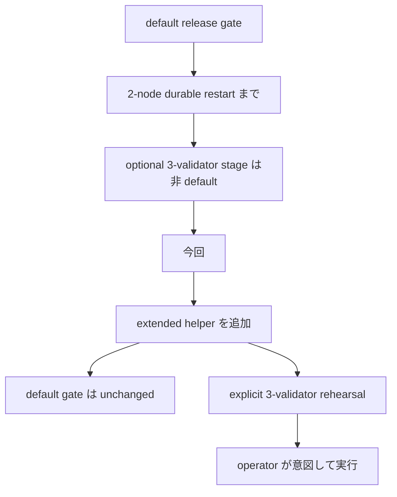
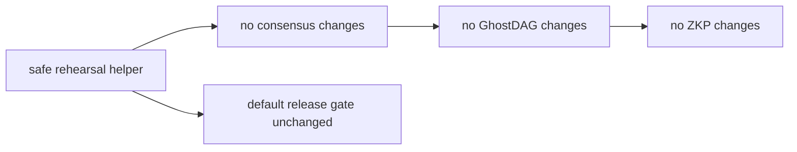
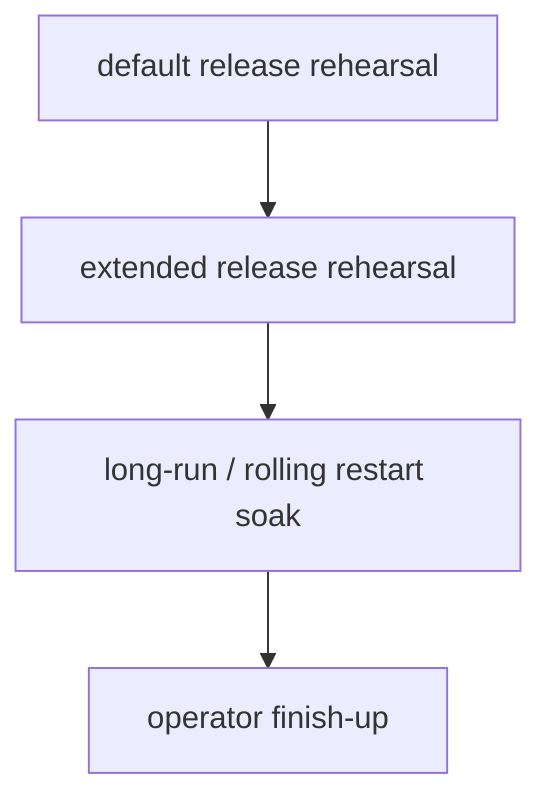

# MISAKA-CORE-v5.1 Parallel Round 10: Extended Release Rehearsal Helper

## 要点

この round では、default の release gate を変えずに、
**3-validator stage を明示的に起動する extended release rehearsal**
の入口を追加しました。

追加したのは、
- [dag_release_gate_extended.sh](../../scripts/dag_release_gate_extended.sh)

です。

この helper は、既存の

- [dag_release_gate.sh](../../scripts/dag_release_gate.sh)

をそのまま呼び出しつつ、
`MISAKA_RUN_THREE_VALIDATOR_RESTART=1` と
`MISAKA_THREE_VALIDATOR_CHECKPOINT_INTERVAL=12`
を明示して、optional な 3-validator durable restart stage を
intentional に実行できるようにします。

現在の extended path は、2-validator の natural prelude を
`MISAKA_SKIP_NATURAL_DURABLE_RESTART=1` で明示的に外し、
3-validator stage に operator rehearsal の焦点を合わせています。
`MISAKA_INITIAL_WAIT_ATTEMPTS` / `MISAKA_RESTART_WAIT_ATTEMPTS` も
gate から harness に forward するようにして、
wrapper の wait budget が実際に効くようにしました。

operator-safe profile としては、以下の環境変数も付与しています。

- `MISAKA_EXTENDED_HARNESS_DIR`
- `MISAKA_EXTENDED_CARGO_TARGET_DIR`
- `MISAKA_EXTENDED_POLL_INTERVAL_SECS`
- `MISAKA_EXTENDED_INITIAL_WAIT_ATTEMPTS`
- `MISAKA_EXTENDED_RESTART_WAIT_ATTEMPTS`

これにより、3-validator stage の replay を独立した working dir で回しつつ、
checkpoint interval / wait attempts / polling だけを profile 側で調整できます。
既定の polling は 3s に寄せてあり、観測の取り回しを少し穏やかにしています。

## 1ページ要約



## 何を追加したか

### 1. `dag_release_gate_extended.sh`

追加:
- [dag_release_gate_extended.sh](../../scripts/dag_release_gate_extended.sh)

役割:
- default の `dag_release_gate.sh` を実行
- optional 3-validator durable restart stage を明示的に有効化
- release rehearsal を accidental ではなく intentional にする

## 何を変えていないか



- default の `dag_release_gate.sh` はそのままです
- optional stage を default 化していません
- `UnifiedZKP`
- `CanonicalNullifier`
- `GhostDAG`
- checkpoint / finality semantics

は変えていません

## 使い方

```bash
./scripts/dag_release_gate_extended.sh
```

必要なら checkpoint interval は既存の env で上書きできます。

## 検証

- `bash -n scripts/dag_release_gate.sh`
- `bash -n scripts/dag_release_gate_extended.sh`

### 実行結果

`./scripts/dag_release_gate_extended.sh` を複数回試行しましたが、
最終的には 3-validator の initial convergence で停止しました。

観測した状態:
- natural prelude は extended path では skip される
- 3-validator stage の `before` スナップショットでは、3 node が
  `blueScore=24` まで進む一方、checkpoint target は別 hash のまま
- `voteCount` は各 node で `1` のまま、`currentCheckpointFinalized=false`

現在の harness 結果は以下です。
- `initial 3-validator natural convergence did not complete in time`

## 次の位置づけ



この helper は、release gate を重くしすぎずに
3-validator stage を明示的に使いたいときの入口です。

## 参照

- [21_operator_release_natural_restart_integration.ja.md](./21_operator_release_natural_restart_integration.ja.md)
- [23_parallel_round_seven_three_validator_restart_green.ja.md](./23_parallel_round_seven_three_validator_restart_green.ja.md)
- [24_parallel_round_eight_soak_entrypoint.ja.md](./24_parallel_round_eight_soak_entrypoint.ja.md)
- [25_parallel_round_nine_rolling_restart_soak_green.ja.md](./25_parallel_round_nine_rolling_restart_soak_green.ja.md)
