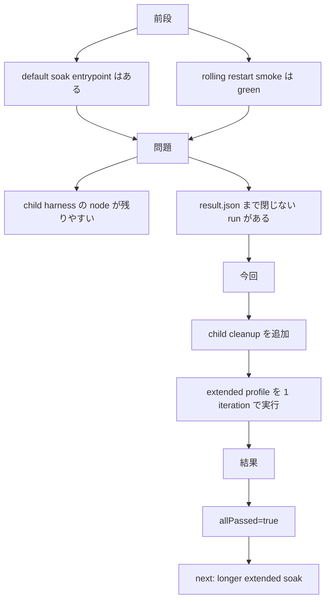

# MISAKA-CORE-v5.1 Parallel Round 11: Extended Soak Profile Green

## 要点

この round では、`dag_soak_harness.sh` の
**`extended` profile を実際に最後まで通し、green を確認**しました。

あわせて、wrapper が child harness の node process を残してしまい、
`result.json` まで閉じない問題も止血しています。

今回確認できたこと:

- `soakProfile = "extended"`
- `runThreeValidator = true`
- `runRollingRestart = true`
- `entryCount = 3`
- `allPassed = true`

つまり、`2-node durable restart`、`3-validator durable restart`、
`3-validator rolling restart` を **1 本の extended operator proof**
として回せるところまで来ています。

## 1ページ要約



## 何を変えたか

更新:
- [dag_soak_harness.sh](../../scripts/dag_soak_harness.sh)

変更点:

1. `extended` profile を operator-facing な profile として整理
2. child harness 実行後に `stop` を呼び、node process を残しにくくした
3. `result.json` に `soakProfile` を残す形を維持

## 実測結果

実行例:

```bash
cd .

MISAKA_BIN=./target/debug/misaka-node \
MISAKA_SKIP_BUILD=1 \
MISAKA_HARNESS_DIR=/tmp/misaka-v51-soak-extended-verify \
MISAKA_SOAK_PROFILE=extended \
MISAKA_SOAK_ITERATIONS=1 \
MISAKA_SOAK_BASE_RPC_PORT=5911 \
MISAKA_SOAK_BASE_P2P_PORT=9412 \
./scripts/dag_soak_harness.sh
```

結果:

- `allPassed = true`
- `soakProfile = "extended"`
- `entryCount = 3`
- `runThreeValidator = true`
- `runRollingRestart = true`

result:
- `/tmp/misaka-v51-soak-extended-verify/result.json`

## 次に進めるもの

1. `MISAKA_SOAK_PROFILE=extended` で複数 iteration
2. optional 3-validator stage を含む `dag_release_gate_extended.sh` の rehearsal
3. operator runbook の固定
4. `validator lifecycle convergence` の follow-up

## 参照

- [dag_soak_harness.sh](../../scripts/dag_soak_harness.sh)
- [24_parallel_round_eight_soak_entrypoint.ja.md](./24_parallel_round_eight_soak_entrypoint.ja.md)
- [25_parallel_round_nine_rolling_restart_soak_green.ja.md](./25_parallel_round_nine_rolling_restart_soak_green.ja.md)
- [26_parallel_round_ten_extended_release_rehearsal.ja.md](./26_parallel_round_ten_extended_release_rehearsal.ja.md)
- [16_current_state_and_remaining_work.ja.md](./16_current_state_and_remaining_work.ja.md)
