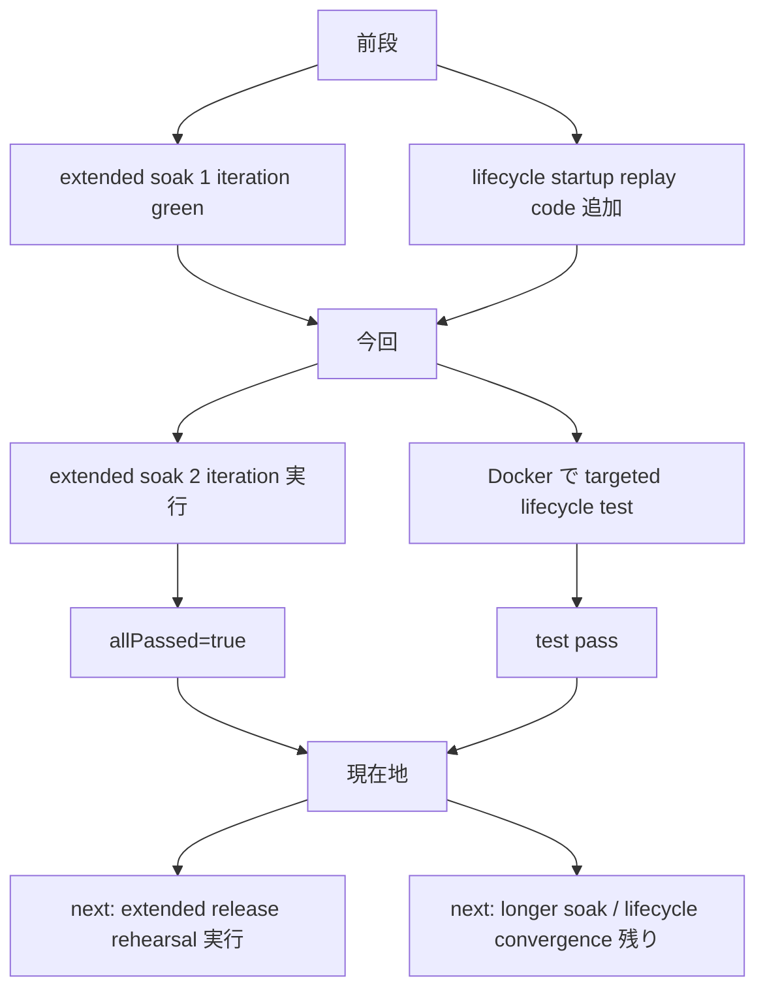
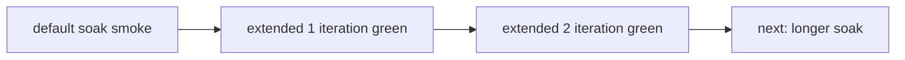
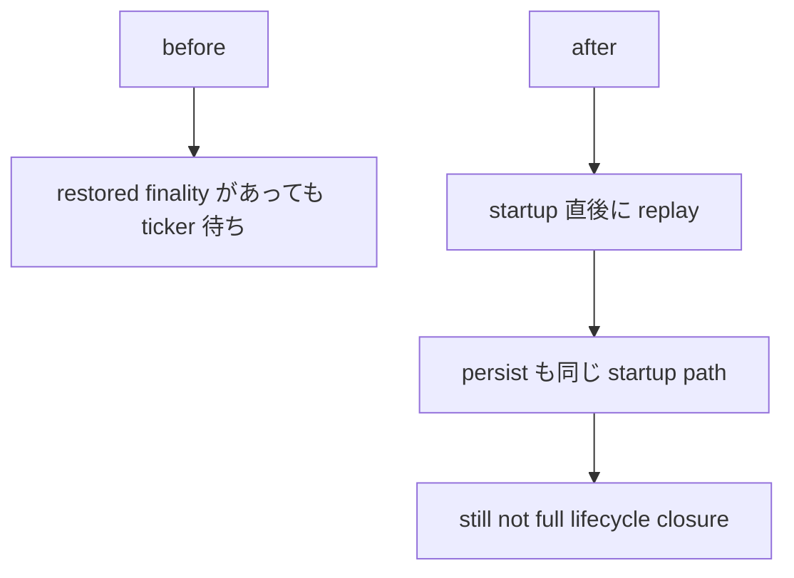
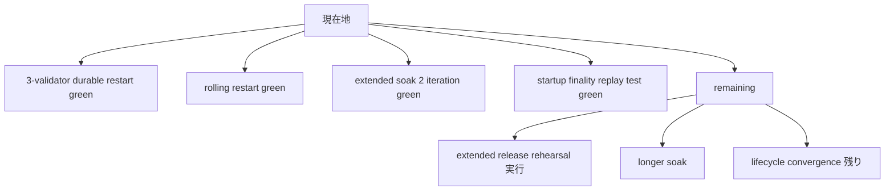

# MISAKA-CORE-v5.1 Parallel Round 12: Extended Soak 2-Iteration Green と Lifecycle Follow-up

## 要点

この round では、前回までに追加した operator proof の入口を
**1 段深く実証**しました。

今回確認したことは 2 つです。

1. `extended soak` を 2 iteration で通し、`allPassed=true` を確認
2. validator lifecycle の startup finality replay の targeted test を
   clean Docker で通過させた

つまり現在は、

- operator 側では `extended soak` を 2 周回せる
- lifecycle 側では restored finality を startup 直後に反映する実装が
  test でも確認できた

という状態です。

## 1ページ要約



## 1. Extended Soak 2 Iteration Green

実行例:

```bash
cd .

MISAKA_BIN=./target/debug/misaka-node \
MISAKA_SKIP_BUILD=1 \
MISAKA_HARNESS_DIR=/tmp/misaka-v51-soak-extended-2iter \
MISAKA_SOAK_PROFILE=extended \
MISAKA_SOAK_ITERATIONS=2 \
MISAKA_SOAK_BASE_RPC_PORT=6011 \
MISAKA_SOAK_BASE_P2P_PORT=9512 \
./scripts/dag_soak_harness.sh
```

結果:

- `soakProfile = "extended"`
- `iterations = 2`
- `runThreeValidator = true`
- `runRollingRestart = true`
- `entryCount = 6`
- `allPassed = true`

result:
- `/tmp/misaka-v51-soak-extended-2iter/result.json`

### 意味



ここまで来たので、次の論点は
「extended proof が通るか」ではなく
**「何 iteration / 何時間まで operator baseline にするか」**
です。

## 2. Validator Lifecycle Startup Replay Test

対象:
- [validator_lifecycle_persistence.rs](../../crates/misaka-node/src/validator_lifecycle_persistence.rs)
- [main.rs](../../crates/misaka-node/src/main.rs)

実装の意味:

- restart 後に restored finality が既に見えているなら
- 10 秒 ticker を待たず
- startup 直後に lifecycle progress を反映する

Docker verify:

```bash
docker run --rm \
  -v .:/work \
  -w /work \
  rust:1.89-bookworm \
  bash -lc '
    set -euo pipefail
    apt-get update -qq >/dev/null
    DEBIAN_FRONTEND=noninteractive apt-get install -y -qq \
      clang libclang-dev build-essential cmake pkg-config >/dev/null
    export CARGO_TARGET_DIR=/work/.tmp/docker-target-lifecycle
    export BINDGEN_EXTRA_CLANG_ARGS="-isystem $(gcc -print-file-name=include)"
    cargo test -p misaka-node --features qdag_ct \
      restored_finality_score_is_applied_immediately_on_startup -- --nocapture
  '
```

結果:

- `restored_finality_score_is_applied_immediately_on_startup ... ok`

### 意味



これは lifecycle convergence の small safe step です。
ただし、まだ **fully consensus-owned lifecycle closure** 完了ではありません。

## 現在地



## 次に進めるもの

1. [dag_release_gate_extended.sh](../../scripts/dag_release_gate_extended.sh) の実 rehearsal
2. `MISAKA_SOAK_PROFILE=extended` の longer soak
3. lifecycle convergence の残り整理
4. その後に warning / hygiene cleanup

## 参照

- [25_parallel_round_nine_rolling_restart_soak_green.ja.md](./25_parallel_round_nine_rolling_restart_soak_green.ja.md)
- [26_parallel_round_ten_extended_release_rehearsal.ja.md](./26_parallel_round_ten_extended_release_rehearsal.ja.md)
- [27_parallel_round_eleven_extended_soak_profile_green.ja.md](./27_parallel_round_eleven_extended_soak_profile_green.ja.md)
- [08_validator_lifecycle_checkpoint_epoch.md](./08_validator_lifecycle_checkpoint_epoch.md)
- [16_current_state_and_remaining_work.ja.md](./16_current_state_and_remaining_work.ja.md)
