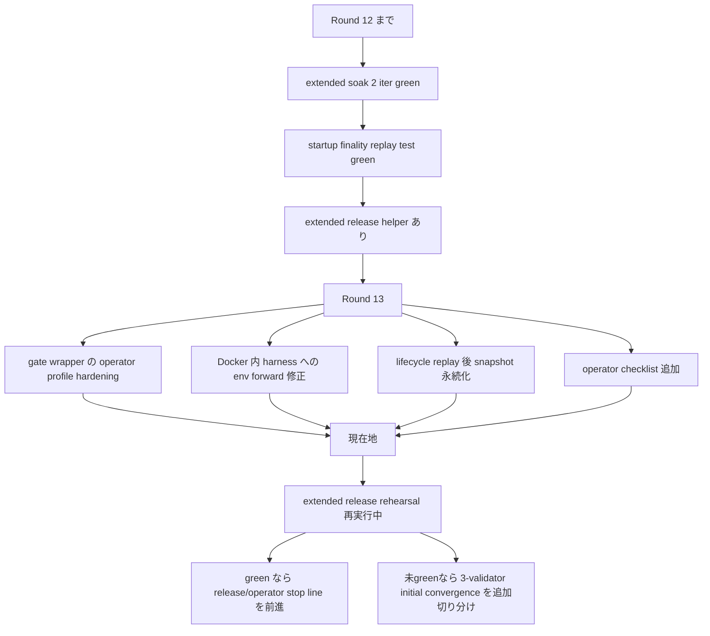
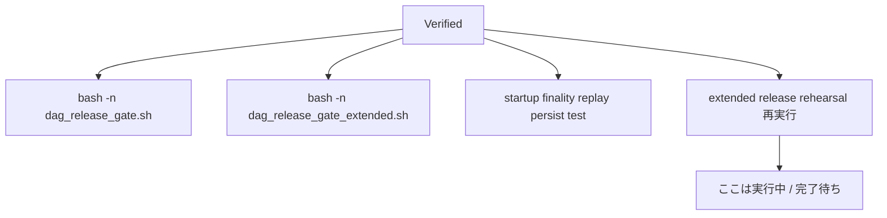

# Parallel Round 13: Extended Release Gate Hardening

## 目的

この round では、`extended release rehearsal` を green に近づけるために、
**意味論ではなく operator profile と gate/harness の受け渡し** を整えます。

対象は次です。

- `dag_release_gate.sh`
- `dag_release_gate_extended.sh`
- `validator lifecycle` の startup replay 後の永続化
- operator 向けの実行チェックリスト

`UnifiedZKP / CanonicalNullifier / GhostDAG / checkpoint / finality` の意味は変えません。

## 1ページ要約

## 何が問題だったか

`dag_release_gate_extended.sh` は存在していましたが、Docker 内で harness を実行する
`dag_release_gate.sh` の `run_cargo_step()` が、

- `MISAKA_HARNESS_DIR`
- `MISAKA_INITIAL_WAIT_ATTEMPTS`
- `MISAKA_RESTART_WAIT_ATTEMPTS`
- `MISAKA_POLL_INTERVAL_SECS`
- `MISAKA_NODE_*_RPC_PORT`
- `MISAKA_NODE_*_P2P_PORT`

のような operator profile の env を Docker コンテナへ渡していませんでした。

そのため、

- wrapper 側では extended profile を指定していても
- 実際の harness は Docker 内で default profile のまま動く

というズレがありました。

## 今回 landed したもの

### 1. gate -> Docker harness の env forward

`dag_release_gate.sh` の `run_cargo_step()` で、
operator profile に関わる env を Docker コンテナへ明示転送するようにしました。

### 2. extended helper の operator profile hardening

`dag_release_gate_extended.sh` では次を入れています。

- dedicated ports
  - RPC: `5711 / 5712 / 5713`
  - P2P: `9212 / 9213 / 9214`
- `checkpoint interval` の default を operator-safe に広げる
- `harness dir / cargo target dir` を extended rehearsal 専用に分離
- path default を relative にして、host / container の両方から同じ場所を見やすくする

### 3. lifecycle replay 後の即 persist

startup 時に restored finality を replay した直後、
同じ restart step の中で lifecycle snapshot を即保存する helper を追加しました。

### 4. operator checklist

operator が

- `release`
- `restart`
- `rolling restart`
- `soak`

をどの順で回し、どの `result.json` を見るべきかを、
1 本で追える checklist を追加しました。

参照:
- [29_operator_release_restart_soak_checklist.ja.md](./29_operator_release_restart_soak_checklist.ja.md)

## 検証済みのもの

確認できているもの:

- `bash -n scripts/dag_release_gate.sh`
- `bash -n scripts/dag_release_gate_extended.sh`
- startup replay persist の targeted test green
- `bash ./scripts/dag_release_gate_extended.sh` の再実行開始

## 現在地

現時点では、

- `extended release rehearsal` の即時失敗原因は 1 段つぶした
- operator profile の指定と Docker 内 harness 実行のズレもつぶした
- ただし **full green はまだ確認中**

という段階です。

## 次

1. 現在走っている `extended release rehearsal` の最終 pass/fail を確定する
2. green なら `release/operator stop line` を更新する
3. まだ失敗するなら `3-validator initial convergence` の operator profile を追加で切り分ける

## 参照

- [26_parallel_round_ten_extended_release_rehearsal.ja.md](./26_parallel_round_ten_extended_release_rehearsal.ja.md)
- [28_parallel_round_twelve_extended_soak_and_lifecycle_followup.ja.md](./28_parallel_round_twelve_extended_soak_and_lifecycle_followup.ja.md)
- [29_operator_release_restart_soak_checklist.ja.md](./29_operator_release_restart_soak_checklist.ja.md)
- [09_v51_progress_and_next_execution.ja.md](./09_v51_progress_and_next_execution.ja.md)
- [16_current_state_and_remaining_work.ja.md](./16_current_state_and_remaining_work.ja.md)
