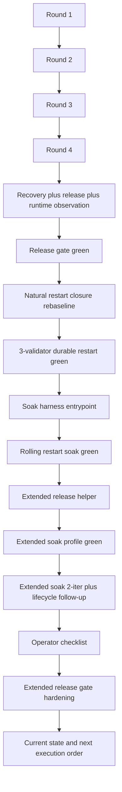

# MISAKA-CORE-v5.1 Review 2026-03-23

## Recommended Reading Order

- [32_current_share_status_summary.ja.md](./32_current_share_status_summary.ja.md)
- [30_current_operator_status_snapshot.ja.md](./30_current_operator_status_snapshot.ja.md)
- [16_current_state_and_remaining_work.ja.md](./16_current_state_and_remaining_work.ja.md)
- [09_v51_progress_and_next_execution.ja.md](./09_v51_progress_and_next_execution.ja.md)

## Entry Points

- [00_parallel_ai_workstream_map.md](./00_parallel_ai_workstream_map.md)
- [01_parallel_round_status.md](./01_parallel_round_status.md)
- [02_parallel_round_implementation_report.md](./02_parallel_round_implementation_report.md)
- [02_parallel_round_implementation_report.ja.md](./02_parallel_round_implementation_report.ja.md)
- [03_recovery_restart_proof.md](./03_recovery_restart_proof.md)
- [04_parallel_round_two_status.md](./04_parallel_round_two_status.md)
- [05_parallel_round_two_implementation_report.md](./05_parallel_round_two_implementation_report.md)
- [05_parallel_round_two_implementation_report.ja.md](./05_parallel_round_two_implementation_report.ja.md)
- [06_recovery_multinode_proof.md](./06_recovery_multinode_proof.md)
- [06_parallel_round_three_status.md](./06_parallel_round_three_status.md)
- [07_parallel_round_three_implementation_report.md](./07_parallel_round_three_implementation_report.md)
- [08_validator_lifecycle_checkpoint_epoch.md](./08_validator_lifecycle_checkpoint_epoch.md)
- [09_v51_progress_and_next_execution.md](./09_v51_progress_and_next_execution.md)
- [09_v51_progress_and_next_execution.ja.md](./09_v51_progress_and_next_execution.ja.md)
- [10_parallel_round_four_recovery_report.md](./10_parallel_round_four_recovery_report.md)
- [11_parallel_round_four_release_report.md](./11_parallel_round_four_release_report.md)
- [12_parallel_round_four_runtime_report.md](./12_parallel_round_four_runtime_report.md)
- [13_parallel_round_four_status.md](./13_parallel_round_four_status.md)
- [14_parallel_round_four_implementation_report.md](./14_parallel_round_four_implementation_report.md)
- [14_parallel_round_four_implementation_report.ja.md](./14_parallel_round_four_implementation_report.ja.md)
- [15_parallel_round_four_release_gate_green.md](./15_parallel_round_four_release_gate_green.md)
- [15_parallel_round_four_release_gate_green.ja.md](./15_parallel_round_four_release_gate_green.ja.md)
- [16_current_state_and_remaining_work.ja.md](./16_current_state_and_remaining_work.ja.md)
- [17_latest_upstream_recheck_3209e888.ja.md](./17_latest_upstream_recheck_3209e888.ja.md)
- [18_parallel_execution_rebaseline.ja.md](./18_parallel_execution_rebaseline.ja.md)
- [19_operator_onboarding_hardening.md](./19_operator_onboarding_hardening.md)
- [20_parallel_round_five_durable_restart_harness.ja.md](./20_parallel_round_five_durable_restart_harness.ja.md)
- [21_operator_release_natural_restart_integration.ja.md](./21_operator_release_natural_restart_integration.ja.md)
- [22_parallel_round_six_natural_restart_closure.ja.md](./22_parallel_round_six_natural_restart_closure.ja.md)
- [23_parallel_round_seven_three_validator_restart_green.ja.md](./23_parallel_round_seven_three_validator_restart_green.ja.md)
- [24_parallel_round_eight_soak_entrypoint.ja.md](./24_parallel_round_eight_soak_entrypoint.ja.md)
- [25_parallel_round_nine_rolling_restart_soak_green.ja.md](./25_parallel_round_nine_rolling_restart_soak_green.ja.md)
- [26_parallel_round_ten_extended_release_rehearsal.ja.md](./26_parallel_round_ten_extended_release_rehearsal.ja.md)
- [27_parallel_round_eleven_extended_soak_profile_green.ja.md](./27_parallel_round_eleven_extended_soak_profile_green.ja.md)
- [28_parallel_round_twelve_extended_soak_and_lifecycle_followup.ja.md](./28_parallel_round_twelve_extended_soak_and_lifecycle_followup.ja.md)
- [29_operator_release_restart_soak_checklist.ja.md](./29_operator_release_restart_soak_checklist.ja.md)
- [30_parallel_round_thirteen_extended_release_gate_hardening.ja.md](./30_parallel_round_thirteen_extended_release_gate_hardening.ja.md)
- [30_current_operator_status_snapshot.ja.md](./30_current_operator_status_snapshot.ja.md)
- [31_three_validator_operator_safe_initial_convergence.md](./31_three_validator_operator_safe_initial_convergence.md)
- [32_current_share_status_summary.ja.md](./32_current_share_status_summary.ja.md)

## Purpose

This review set is for the current `MISAKA-CORE-v5.1` codebase.

- `v5.1` design is authoritative.
- The goal here is to identify what can be progressed safely in parallel.
- Workstreams are split by dependency boundaries so multiple AI workers can move without stepping on each other.

