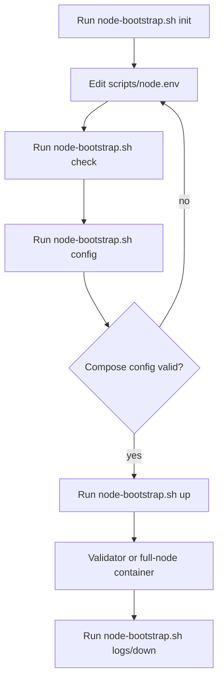

# Node Bootstrap

This path packages the existing `misaka-node` CLI into a Docker/Compose flow
without changing consensus semantics.

## Files

- [docker/node.Dockerfile](../docker/node.Dockerfile)
- [docker/node-compose.yml](../docker/node-compose.yml)
- [docker/node-entrypoint.sh](../docker/node-entrypoint.sh)
- [scripts/node.env.example](../scripts/node.env.example)
- [scripts/node-bootstrap.sh](../scripts/node-bootstrap.sh)

## Bootstrap Flow

1. Run `scripts/node-bootstrap.sh init` to create `scripts/node.env` from the
   example file.
2. Edit `scripts/node.env` to match the target node role and network layout.
3. Run `scripts/node-bootstrap.sh check` to validate that the bootstrap env can
   still render a valid Compose plan.
4. Run `scripts/node-bootstrap.sh config` when you want to inspect the resolved
   Compose plan directly.
5. Run `scripts/node-bootstrap.sh up` to build the image and start the node.

The script also supports `down` and `logs` for the usual operator loop.

## Validation and Safety

- `scripts/node-bootstrap.sh check` now validates the env file before Compose
  rendering.
- `NODE_MODE` must be one of `public`, `hidden`, `seed`, or `validator`.
- `NODE_VALIDATOR=true` or `NODE_MODE=validator` requires
  `MISAKA_VALIDATOR_PASSPHRASE`.
- `NODE_VALIDATOR_INDEX` must stay below `NODE_VALIDATORS`.
- Numeric settings such as ports, DAG size knobs, and peer limits are checked
  as integers before startup.
- Public or validator nodes now warn if `NODE_ADVERTISE_ADDR` is empty, since
  that usually means the node cannot be dialed from outside the local host.

## Full Node Versus Validator

- `NODE_MODE=hidden` is the usual full-node choice when you want outbound-only
  behavior without advertising your address.
- `NODE_MODE=public` is the normal public P2P mode.
- `NODE_MODE=seed` is for bootstrap nodes that should serve peer discovery.
- `NODE_VALIDATOR=true` turns on block production when the node is in an
  eligible mode and within the configured validator index range.
- `NODE_ADVERTISE_ADDR` should be set for validators and public nodes that
  need to be dialable from outside the local host.
- `scripts/node-bootstrap.sh check` is the low-risk rehearsal step.
  It does not start containers; it only proves that the selected env file can
  be validated and rendered by Compose.
- `scripts/dag_natural_restart_harness.sh` is the next-level live rehearsal:
  it closes the natural 2-validator restart path using the same operator
  surfaces that `runtimeRecovery` exposes.

## Operator Notes

- The node listens on `NODE_RPC_PORT` and `NODE_P2P_PORT` inside the container,
  and the Compose file publishes those same ports on the host.
- The Compose defaults now align with the example env for `NODE_DAG_K`,
  inbound peer count, and outbound peer count, so `init -> check -> up` stays
  consistent.
- Runtime state is stored in the named Docker volume `misaka-node-data`.
- The container exposes `/health` on the node RPC port for a basic readiness
  check.
- `scripts/node-bootstrap.sh config` uses the same environment file that
  `up`, `down`, and `logs` use, so one edited env file drives the whole flow.
- For the full natural restart stop line, use the dedicated harness in
  [scripts/dag_natural_restart_harness.sh](../../scripts/dag_natural_restart_harness.sh).

## Validation Surface

The node onboarding path is intentionally narrow:

- Docker Compose config must resolve cleanly before startup.
- The `check` command is the earliest operator rehearsal point and should pass
  before `up`.
- The entrypoint maps environment variables into the existing `misaka-node`
  CLI without changing consensus flags or DAG semantics.
- `scripts/dag_release_gate.sh` runs the shell, bootstrap, restart-recovery,
  and release build checks in one release rehearsal.
